<p align="center">
  
</p>
<h1 align="center">Tursora</h1>
<p align="center"><strong>A free and open-source macOS file manager. Native, simple, and versatile.</strong></p>
<p align="center"><strong>Free and open source · <a href="LICENSE">MIT licensed</a></strong></p>
<p align="center">
  <a href="https://github.com/zerolfx/Tursora/actions/workflows/build.yml"></a>
  
  
</p>
<p align="center">
  <a href="#installation"><strong>Install</strong></a> ·
  <a href="#features">Features</a> ·
  <a href="#terminal-and-zip">Terminal &amp; ZIP</a> ·
  <a href="#what-finder-still-does-that-tursora-doesnt">Finder differences</a> ·
  <a href="#get-tursora">Get Tursora</a> ·
  <a href="https://zerolfx.github.io/Tursora/">Website</a>
</p>

Tursora is a **free, open-source native macOS file manager** and an alternative to Finder, released under the [MIT license](LICENSE). Use it without a subscription, read the source, and adapt it to your workflow.

Browse, preview and organize files with familiar Mac controls, split panes, editable paths, an integrated terminal and ZIP browsing. Tursora does not yet cover every Finder feature; see the [current differences](#what-finder-still-does-that-tursora-doesnt).

<a id="installation"></a>

## Install Tursora

**macOS 14+ · Apple Silicon · Free and open source.** [Download the latest stable release](https://github.com/zerolfx/Tursora/releases/latest) · [中文安装指南](https://zerolfx.github.io/Tursora/zh.html#installation)

**[Download the latest release](https://github.com/zerolfx/Tursora/releases/latest).** Install it in four steps:

1. From the release page, download the **`Tursora-<version>-macOS-arm64.dmg`** asset. The same page includes `SHA256SUMS.txt` to verify the download.
2. Open the DMG.
3. Copy **Tursora.app** to a writable folder. The installer’s **Applications** shortcut points to `/Applications`; use `~/Applications` or another folder if you prefer or lack permission there.
4. Open the installed copy. If macOS cannot verify the app, use the [simple Terminal method](#first-launch) with its actual path. For a copy you own and can write, this normally needs no administrator password.

**Let an agent install it.** Paste this into an agent with access to your Mac:

```text
Read https://zerolfx.github.io/Tursora/install.md and install Tursora on this Mac. Choose a writable location, verify the download, and handle first launch for the installed copy.
```

**Prefer Homebrew?** Run these three commands in order: add the tap with the **entire repository URL**, trust the Tursora cask, then install:

```sh
brew tap zerolfx/tursora https://github.com/zerolfx/Tursora
brew trust --cask zerolfx/tursora/tursora
brew install --cask zerolfx/tursora/tursora
```

If an error says `zerolfx/homebrew-tursora` was not found, Homebrew used its default tap address. Run the first command above with the full URL before installing.

The trust command allows Homebrew to load this cask's installation code. The tap installs the published DMG with its verified SHA-256. See [Homebrew details](#homebrew) for updates and uninstalling, or [troubleshooting](#homebrew-troubleshooting) if installation fails.

For a different destination, add `--appdir="$HOME/Applications"` (or your chosen folder) to the third command. If Homebrew itself needs permissions you do not have, use the DMG instead. Both methods use the same [first-launch steps](#first-launch).

## Features

Quick Look, macOS sharing and familiar file operations meet Dolphin-inspired split panes, editable paths, instant filtering, recursive search and folder-specific view settings. The integrated terminal and Explorer-style ZIP navigation are enabled by default and can be turned off in Settings.

Tursora is an early project and does not yet cover everything Finder can do. The [differences below](#what-finder-still-does-that-tursora-doesnt) are part of the picture.

The features below are in the latest release. See the [version history](CHANGELOG.md) for released changes. Click a screenshot to view it at full size. Key combinations below are the defaults; customize application commands in **Settings → Shortcuts**.

<table>
  <thead>
    <tr><th align="left" width="42%">Feature</th><th align="left" width="58%">Screenshot</th></tr>
  </thead>
  <tbody>
    <tr>
      <td>
        <strong>Two folders, one workspace</strong>
        <p>Keep a source and destination side by side, each with its own editable path, history and selection. Copy or move files directly to the other pane.</p>
        <p>Reopen Tursora and return to your windows, ordered tabs and split panes, including their names, active side and layout. <strong>Settings → General → Reopen windows and tabs on launch</strong> is on by default; turning it off clears the saved workspace. Searches rerun their saved conditions.</p>
        <p>Click Split View or press <code>⇧⌘D</code>. <code>⌥Tab</code> switches panes; <code>⇧⌘C</code> copies to the other side.</p>
      </td>
      <td>
        <a href="docs/images/features/split-panes.png">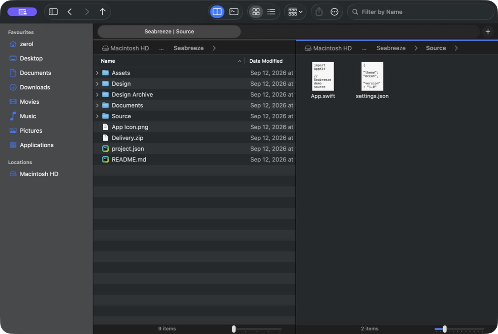</a>
        <a href="docs/images/features/workspace-restored.png">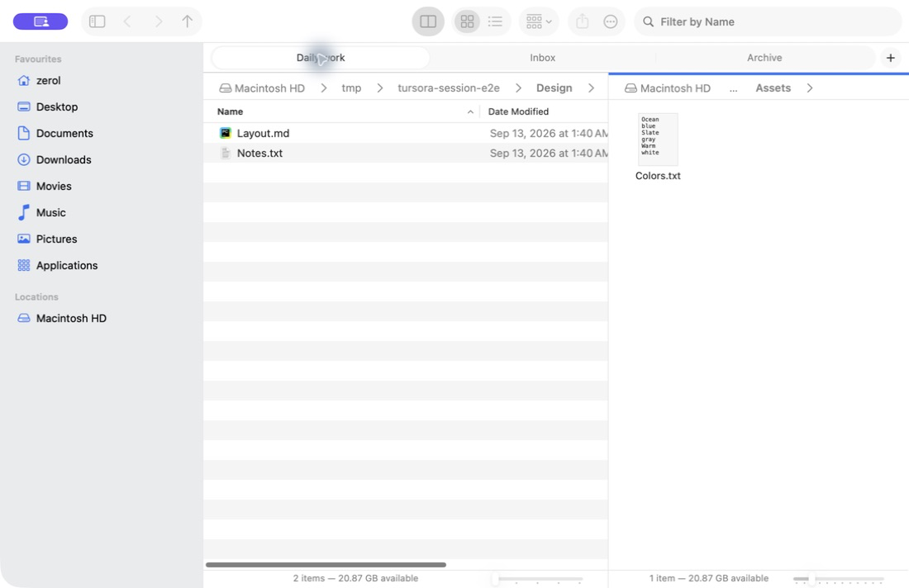</a>
      </td>
    </tr>
    <tr>
      <td>
        <strong>A path you can click—or type</strong>
        <p>Use either pane's breadcrumbs and folder menus, or press <code>⌘L</code> to type a path with completion. Back and Forward include history menus.</p>
        <p>Navigation stays in its pane. Switching panes or tabs dismisses an unfinished path edit without submitting it.</p>
      </td>
      <td><a href="docs/images/features/path-navigation.png">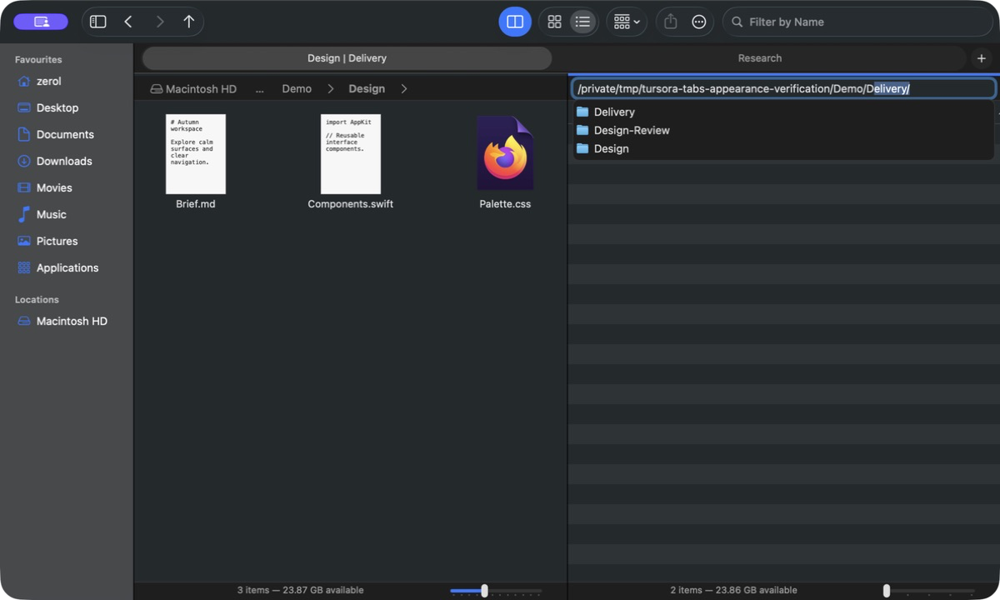</a></td>
    </tr>
    <tr>
      <td>
        <strong>Open a favorite where you need it</strong>
        <p>Right-click a Favorite to open it in a new tab or the other pane. <strong>Open in Other Pane</strong> creates a split when needed, keeping the original folder in place.</p>
      </td>
      <td><a href="docs/images/features/favorites.png">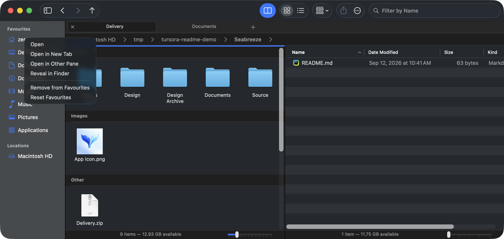</a></td>
    </tr>
    <tr>
      <td>
        <strong>See the folder hierarchy beside your favorites</strong>
        <p>Choose <strong>View → Show Folders</strong> or press <code>F7</code> for a separate folder tree below Favorites and Locations. Keep familiar places visible while exploring nested folders; drag the divider to adjust the two panels.</p>
        <p>The tree follows the active pane and loads folders as needed. Click a folder to navigate, or right-click to open it in a new tab or the other pane. Hidden-folder and Home-directory options are independent of the file view. Reopening the workspace restores the panel's visibility, size and options.</p>
      </td>
      <td><a href="docs/images/features/folders.png">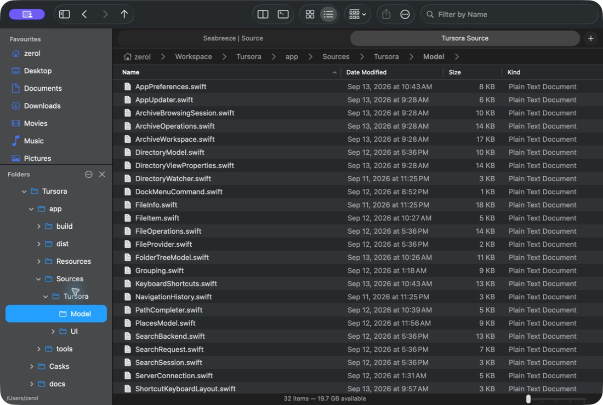</a></td>
    </tr>
    <tr>
      <td>
        <strong>Find a name without leaving the folder</strong>
        <p>Press <code>⌘F</code> and type part of a filename or a pattern such as <code>*.png</code>. The active folder filters immediately; other panes stay unchanged. Escape clears the filter. Customize the Filter command in Settings → Shortcuts.</p>
        <p><strong>Typing first filters the current folder.</strong> Search Options appears after you type and expands recursive search conditions.</p>
      </td>
      <td><a href="docs/images/features/name-filter.png">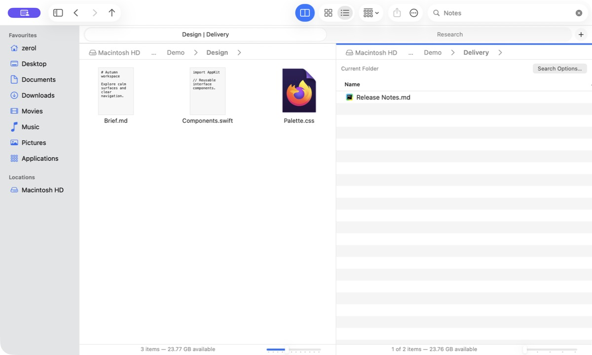</a></td>
    </tr>
    <tr>
      <td>
        <strong>Search across folders, then save the search</strong>
        <p>Choose Search Options or press <code>⇧⌘F</code>. Keep editing the same toolbar field to search subfolders or Home by filename, content, type and modification date. Search runs after a typing pause or on Return. Save named searches for later; each pane keeps its own query, cancellation and results.</p>
        <p>Name search works in unindexed folders. Content search depends on Spotlight's index and supported formats. Results retain their original locations and support file commands, Quick Look and Reveal in Enclosing Folder. ZIP contents are excluded.</p>
      </td>
      <td><a href="docs/images/features/search.png">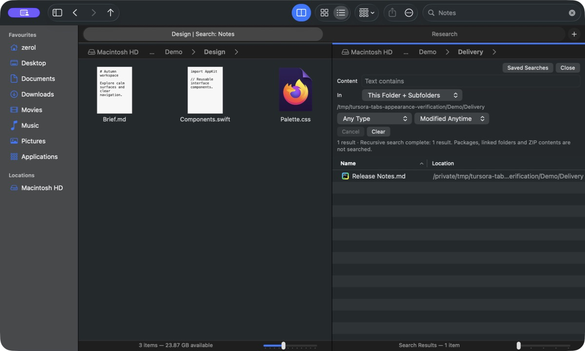</a></td>
    </tr>
    <tr>
      <td>
        <strong>A view that fits your files</strong>
        <p>Browse expandable lists or thumbnail grids; group, sort and zoom with the slider, a pinch or <code>⌘</code>-scroll. <code>⌥⌘1</code>, <code>⌥⌘2</code> and <code>⌥⌘3</code> switch between icons, list and columns. Folders remember their view, sorting, zoom, groups, hidden files and previews across restarts.</p>
        <p><strong>View → Folder View Settings</strong> chooses per-folder memory or one shared view, saves defaults and resets a folder. Memory uses Tursora's own path-based library, including for read-only folders. Existing panes pick up per-folder changes when revisited; renamed or moved folders use the new path's settings. ZIP views start from defaults and stay temporary. Search inherits the pane's view, keeps changes temporary, and restores the folder's saved view on closing.</p>
      </td>
      <td><a href="docs/images/features/folder-views.png">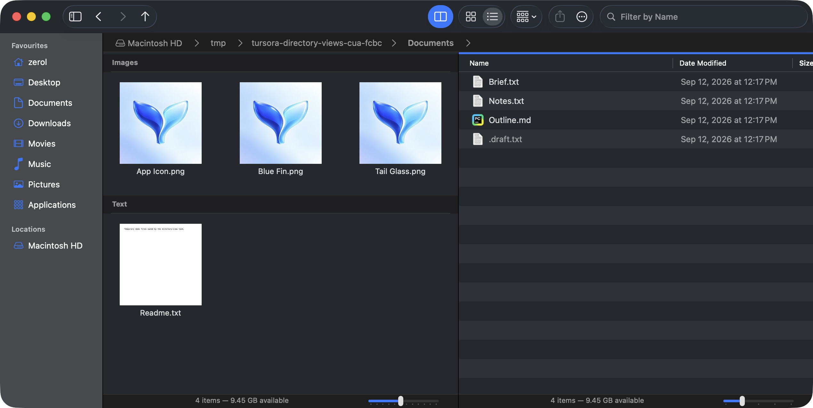</a></td>
    </tr>
    <tr>
      <td>
        <strong>Everyday operations, with a way back</strong>
        <p>Copy, cut, paste, rename, duplicate, drag or move files to Trash, with undo and redo for supported operations. Conflicts offer Keep Both, Skip, Replace or Merge where applicable, including batch choices.</p>
        <p><strong>Window → File Operations</strong> shows independent copy, move and duplicate tasks with pause, resume, cancel, transferred bytes, speed and remaining time. Each task handles its own conflicts; Replace preserves the old destination until the new copy completes. Preparation, atomic moves and finishing show their phase without a byte-based ETA. Undo recovery uses disk space while retained in the window's history.</p>
      </td>
      <td>
        <a href="docs/images/features/file-operation-tasks.png">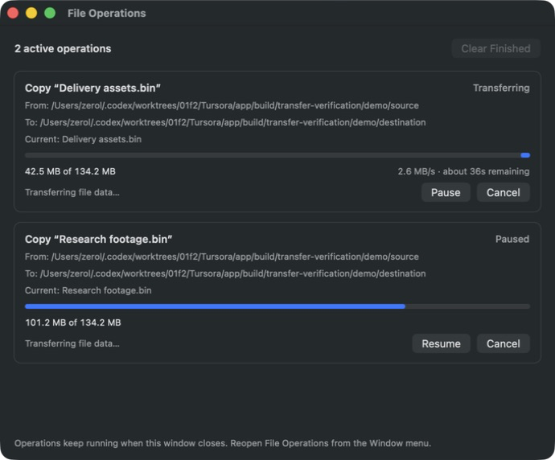</a>
        <br>
        <a href="docs/images/features/file-operations.png">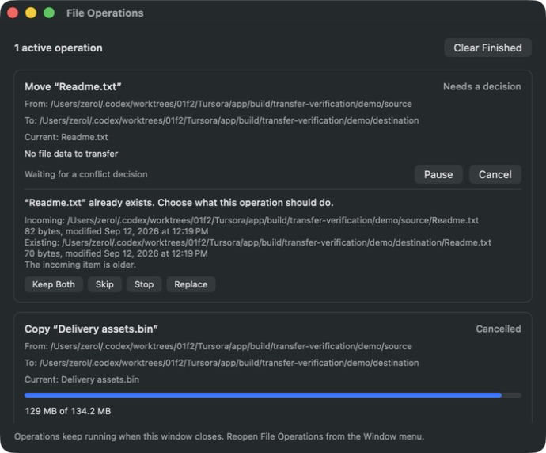</a>
      </td>
    </tr>
    <tr>
      <td>
        <strong>Compress a selection. Extract beside the original.</strong>
        <p>Create a ZIP from selected files, or extract one beside the original. Numbered names avoid overwrites; both actions support undo. Opening a ZIP uses <a href="#browse-zips-like-folders">ZIP browsing</a> by default. Choose Extract to unpack it, or turn off ZIP browsing to make Open extract instead.</p>
        <p>Supports ordinary ZIP archives. Password-protected ZIPs and other archive formats are not supported.</p>
      </td>
      <td><a href="docs/images/features/compress-extract.png">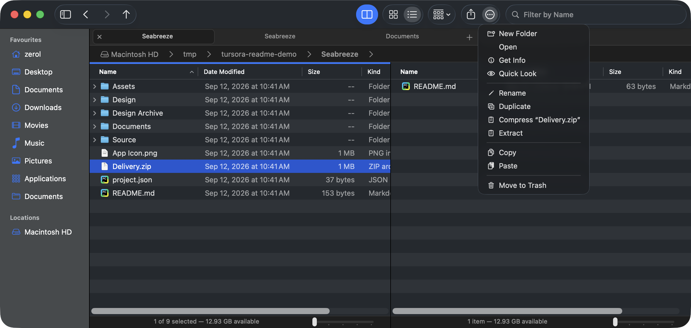</a></td>
    </tr>
    <tr>
      <td>
        <strong>Local folders and system-mounted servers</strong>
        <p><code>⌘K</code> opens Connect to Server for SMB, NFS, WebDAV and legacy AFP. macOS handles authentication and mounting; volumes appear under Locations and disconnect with Eject.</p>
        <p>The screenshot shows the connection interface. <strong>Real-server interoperability still needs testing.</strong> There is no custom SFTP/FTP backend, server discovery or automatic reconnection.</p>
      </td>
      <td><a href="docs/images/features/connect-server.png">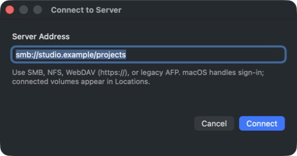</a></td>
    </tr>
    <tr>
      <td>
        <strong>macOS actions and sharing</strong>
        <p>The toolbar's More menu collects actions for the current selection. Share opens the system sharing picker, with services provided by macOS for the selected files.</p>
      </td>
      <td><a href="docs/images/features/share.png">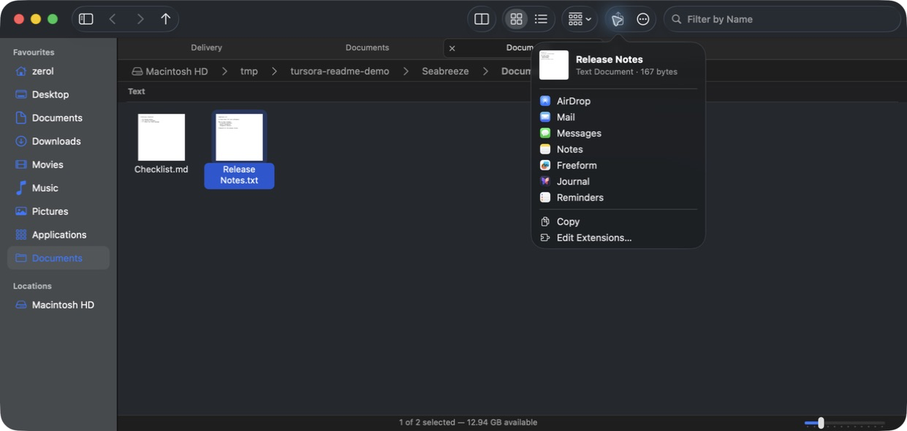</a></td>
    </tr>
    <tr>
      <td>
        <strong>Make the controls your own</strong>
        <p>Settings has General, Shortcuts, Terminal and Updates pages. General controls workspace restoration, folder views, extension display, terminal access and ZIP browsing. Shortcuts lets you search all application commands, record or clear a binding, and restore one command or all defaults. Conflicts name the command already using the binding; menus update immediately. Native text editing, selection, path completion and shell controls retain their normal behavior. Updates offers daily checks, optional automatic installation and a manual check.</p>
      </td>
      <td>
        <a href="docs/images/features/settings.png">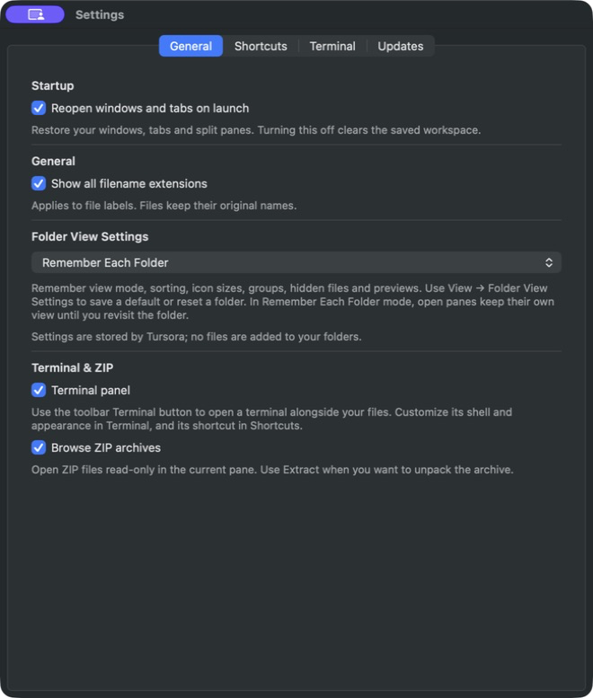</a>
        <a href="docs/images/features/shortcuts.png">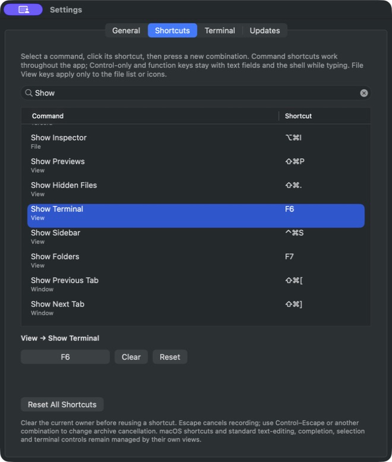</a>
        <a href="docs/images/features/updates.png">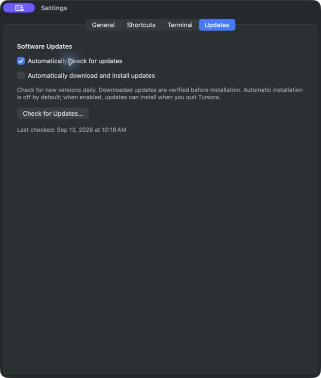</a>
      </td>
    </tr>
  </tbody>
</table>

<a id="experiments"></a>
<a id="terminal-and-zip"></a>

## Terminal & ZIP

Both features are **enabled by default**. Change them in **Tursora → Settings…** (`⌘,`). Existing saved choices are preserved.

<table>
  <thead>
    <tr><th align="left" width="42%">Feature</th><th align="left" width="58%">Screenshot</th></tr>
  </thead>
  <tbody>
    <tr>
      <td>
        <strong>A terminal in your workspace</strong>
        <p>Click the toolbar's <strong>Show Terminal</strong> button or press <code>F4</code> for an interactive <a href="https://github.com/migueldeicaza/SwiftTerm">SwiftTerm</a> terminal beneath the files. With zsh, it follows the active folder, even while hidden. Running commands, <code>read</code> and unfinished input are left intact; the latest folder change waits for a safe prompt. ZIP browsing uses the original archive's parent folder.</p>
        <p>Choose the system login shell or a custom executable in <strong>Settings → Terminal</strong>. Pick a monospaced font (8–36 pt), follow the system appearance, or use dark, light or custom text/background colors. Font and color changes apply to every retained terminal immediately; shell changes take effect when starting a new session or restarting. Defaults are the system login shell, System Monospaced at 12 pt, and Follow Appearance.</p>
        <p>A compact header provides restart and hide controls. Other custom shells can restart in the current folder manually. Hiding with the toolbar, <code>F4</code> or the panel's close button keeps its shell, output and running jobs; show it again to continue. Turning off terminal access in Settings also hides and retains existing sessions; re-enable access to show them again.</p>
        <p>Restarting, closing the window or quitting ends its terminal session. If foreground, background or stopped jobs are detected—or their status cannot be established—Tursora asks first, with <strong>Cancel</strong> selected by default. The header preserves output after a shell exits. Terminal sessions do not survive quitting the app.</p>
      </td>
      <td>
        <a href="docs/images/features/terminal.png">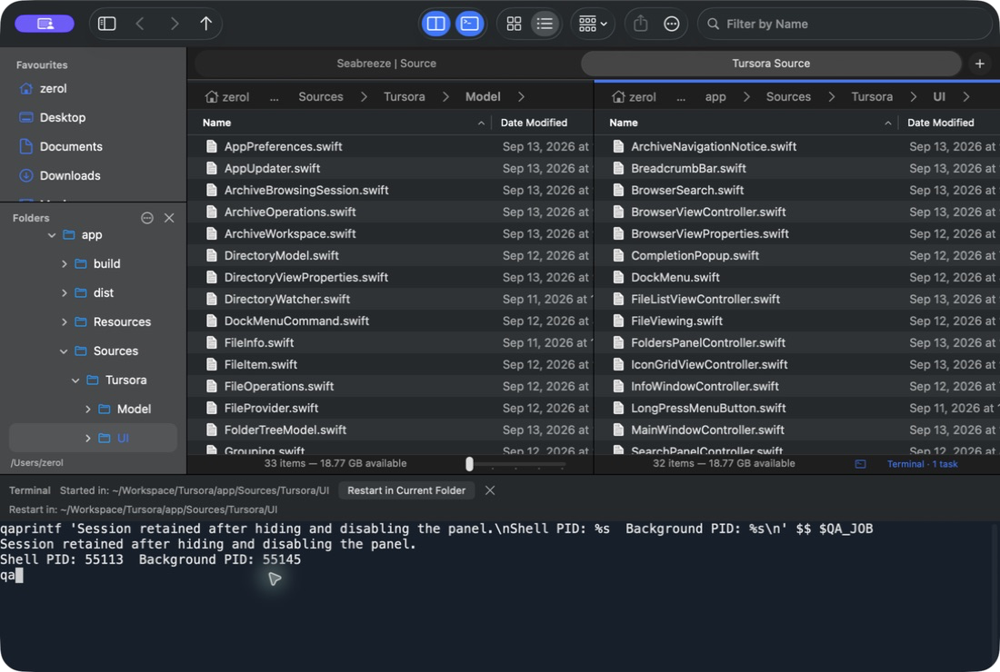</a>
        <a href="docs/images/features/terminal-settings.png">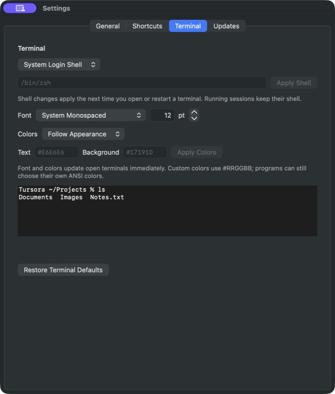</a>
      </td>
    </tr>
    <tr>
      <td>
        <a id="browse-zips-like-folders"></a><strong>Browse ZIPs like folders</strong>
        <p>Open a ZIP in the current pane and navigate with the address bar, Back, Forward and Up. Use split panes, list or icon views, sorting, grouping and filtering. Cancel while a ZIP opens; if opening fails, retry or return to its enclosing folder. Preview, open, share, copy or drag members into regular folders.</p>
        <p><strong>Archives are read-only.</strong> Opened files are temporary copies kept until quit; edits do not update the ZIP, so use Save As to keep them. Nested ZIPs open in the default app. Disabling ZIP browsing restores extraction for new opens; existing archive pages stay read-only. Explicit Extract remains available on the original ZIP.</p>
      </td>
      <td><a href="docs/images/features/zip-browsing.png">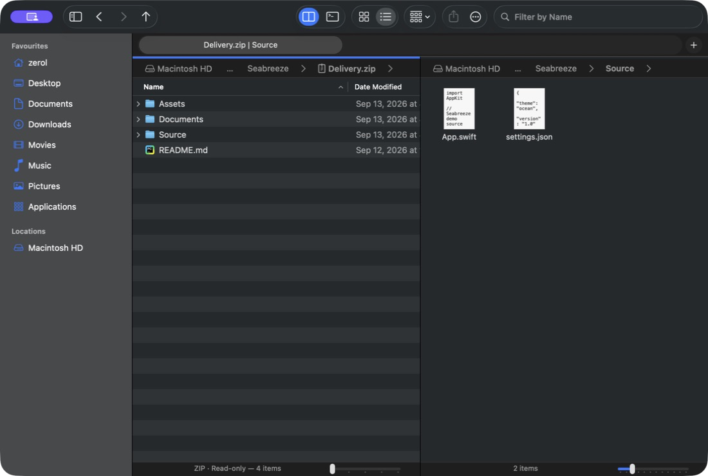</a></td>
    </tr>
  </tbody>
</table>

## What Finder still does that Tursora doesn't

These are current gaps, not promises of complete Finder parity:

| Area | Not available in Tursora today |
|---|---|
| Views | Gallery view, free icon placement |
| Search | Finder Smart Folder interoperability, Tags / rating conditions, ZIP contents |
| Organization | Batch rename, New Folder with Selection, Make Alias / Show Original, Show Package Contents |
| Trash | Browsing Trash, Put Back, emptying Trash; moving files to Trash and undoing that move are supported |
| Customization | Finder's full View Options dialog, column-layout memory and toolbar customization |
| System integration | Quick Actions, Services and FinderSync cloud status badges |
| File information | Full ACL editing, owner/group changes and recursive permission application |

**Outside the design:** file tags and Import from iPhone. These are intentionally excluded, rather than items waiting to be implemented.

Tursora currently has an English interface. Workspace restoration keeps locations and layout; filters, selection, scroll position, navigation history, closed tabs, terminal sessions, transfers and undo history do not survive quitting. Missing folders remain at their original paths with an inline error; restoration does not reconnect servers. Implementation and verification are tracked in the [workspace session record](docs/research/workspace-sessions.md). See the [Finder comparison](docs/gaps/GAP-vs-FINDER.md), [Dolphin comparison](docs/gaps/GAP-vs-DOLPHIN.md) and [roadmap](docs/ROADMAP.md) for the detailed status.

## Get Tursora

Requires **macOS 14 or later**. Downloadable builds currently target **Apple Silicon** and are **ad-hoc signed, not notarized**.

1. **Download** from the [latest stable release](https://github.com/zerolfx/Tursora/releases/latest). Public downloads need no GitHub account; the same release includes `SHA256SUMS.txt` for checking your download.
2. **Install:** open the DMG and copy **Tursora.app** to your chosen writable folder. The screenshot's Applications shortcut targets `/Applications`; `~/Applications` or another folder also works. For a personal Applications folder, create it with `mkdir -p "$HOME/Applications"`, then open it in Finder and copy the app there.
3. **Launch the installed copy.** If macOS blocks the first launch, follow the steps below. Copy the app out of the read-only DMG before using it.

**Development builds:** successful [Build runs](https://github.com/zerolfx/Tursora/actions/workflows/build.yml) contain a DMG and checksum inside GitHub's artifact ZIP. Unpack that outer ZIP, open the DMG and copy Tursora to a writable folder. Older runs contain the previous application ZIP. Artifacts are kept for 14 days. See the [changelog](CHANGELOG.md) for version history.

<p><a href="docs/images/features/installation.png">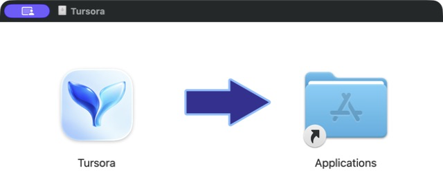</a></p>

### Homebrew

The repository includes a Homebrew cask for the published Apple Silicon DMG. Run all three commands in order, continuing only after each succeeds:

```sh
brew tap zerolfx/tursora https://github.com/zerolfx/Tursora
brew trust --cask zerolfx/tursora/tursora
brew install --cask zerolfx/tursora/tursora
```

To choose another destination, replace the third command with `brew install --cask --appdir="$HOME/Applications" zerolfx/tursora/tursora`, substituting your preferred folder if needed. This only changes the app's destination: your account must also be able to use Homebrew's own directories. If it cannot, use the DMG without installing or changing Homebrew. See the [complete installation guide for agents](https://zerolfx.github.io/Tursora/install.md).

The explicit repository URL is required on the first line. Without it, an untapped install looks for `zerolfx/homebrew-tursora`, which is not this repository. Update with `brew update` followed by `brew upgrade --cask --greedy zerolfx/tursora/tursora`; `--greedy` includes versions that also have the in-app updater. Uninstall with `brew uninstall --cask zerolfx/tursora/tursora`; your settings and workspace remain intact.

This project maintains its own tap. An Apple Developer Program membership is not required to distribute it this way; **the downloaded app remains ad-hoc signed and not notarized**, and the [first-launch instructions](#first-launch) still apply. The cask keeps Homebrew's normal download quarantine and verifies the pinned SHA-256. Homebrew's official cask repository has separate [Gatekeeper acceptance requirements](https://docs.brew.sh/Acceptable-Casks#platform-compatibility-and-macos-security-protections).

See [Homebrew maintenance and verification](docs/research/homebrew.md) for release checks and isolated installation results.

#### Homebrew troubleshooting

If Homebrew reports `untrusted tap`, check that the second command in the installation block completed successfully, then retry the third. `brew trust --cask` grants trust to the Tursora installation definition only. See [Homebrew's Tap Trust documentation](https://docs.brew.sh/Tap-Trust).

### First launch

Current builds are ad-hoc signed and **not notarized by Apple**. If macOS cannot verify Tursora, first confirm that it came from [this repository's official release](https://github.com/zerolfx/Tursora/releases/latest) and matches that release's `SHA256SUMS.txt` (Homebrew checks the pinned SHA-256 automatically).

**Use the installed app's actual path.** For `/Applications/Tursora.app`, run:

```sh
xattr -dr com.apple.quarantine "/Applications/Tursora.app"
```

For a personal installation, use `"$HOME/Applications/Tursora.app"` instead. **Any other location:** type `xattr -dr com.apple.quarantine` followed by a space in Terminal, drag your installed `Tursora.app` into Terminal to insert its path, then press Return. Open that copy afterward.

This removes only the app bundle's download-quarantine attribute. It normally needs **no `sudo` or administrator settings change when you own and can write the copy**. If you get `Permission denied` or `Operation not permitted`, check that the path points to your installed copy outside the DMG. Use a folder you can write; do not add `sudo` or change system protections. A managed Mac may enforce additional restrictions that require your organization's approval.

Local builds usually lack the quarantine attribute attached by downloaders, which explains why a downloaded copy may encounter an extra check. Removing that attribute does not notarize the app or repair damaged files. See [Apple's explanation of download quarantine](https://developer.apple.com/forums/thread/813858).

**Prefer the graphical route?** Try opening the app, then use **System Settings → Privacy & Security → Open Anyway** if your account is allowed to approve it, as described in [Apple's first-launch guidance](https://support.apple.com/en-us/102445). This is an alternative, not a required step before the Terminal method.

For a damaged-app message, redownload and verify the checksum first. A warning that the app contains malware or will damage your computer is a different issue: stop and follow Apple's guidance above.

### Software updates

Since 0.2.0 Tursora has **Tursora → Check for Updates…** and **Settings… → Updates**. Automatic checks are enabled by default and run daily; you can turn them off and still check manually. **Automatically download and install updates** is a separate option, disabled by default. When enabled, verified updates can install when you quit. Turning off automatic checks disables that control while preserving its saved choice; changing these options does not cancel an update already downloaded or scheduled to install on quit.

Stable releases can update through the app. The update feed offers the latest stable release with its signed DMG. Each release has its own verification record, listed in [the documentation index](docs/README.md).

### Build locally

Use Apple's Command Line Tools with Swift 6.2+ and the macOS 26 SDK. The verified development setup is Swift 6.2.4 / SDK 26.2. No Xcode project is required.

```bash
git clone https://github.com/zerolfx/Tursora.git
cd Tursora/app
tools/make-app.sh
open build/Tursora.app
```

Swift Package Manager fetches pinned SwiftTerm 1.15.0 and Sparkle 2.9.6 dependencies on the first build. The packaging script assembles the complete application bundle, including Sparkle's updater helpers. Software updates run only from the packaged app; the bare debug executable and smoke tests do not start the updater.

To build the drag-to-install disk image, run `tools/make-dmg.sh` after `make-app.sh` from `app/`. This step needs Python 3.10+; set `TURSORA_PYTHON` to its executable if your default Python is older. The script installs pinned, hash-verified `dmgbuild` dependencies into `app/.build/dmg-tools` and writes `app/dist/Tursora-<version>-macOS-arm64.dmg`.

### Build and release automation

**Build** runs on pushes to `main`, pull requests and manual requests. It builds the release app on macOS, validates the bundle and signature, creates and verifies the DMG's mounted contents and installer layout, then uploads the DMG and SHA-256 checksum as an Actions artifact.

**Release is manual only.** In **Actions → Release → Run workflow**, select `main`, enter a new version without `v`, and optionally mark it as a prerelease. The workflow builds that exact commit, creates its version tag and publishes the DMG directly with its checksum. Stable releases also require the update-signing secret, increasing version/build values and an `appcast.xml` carrying the verified DMG signature; prereleases stay outside the stable update feed. Existing tags are not overwritten; pushing a tag does not publish a release.

**Pages** validates the product page on relevant pull requests and deploys changes to the site or its source screenshots when they reach `main`. The workflow publishes the configured [website](https://zerolfx.github.io/Tursora/) after merging; check [Pages runs](https://github.com/zerolfx/Tursora/actions/workflows/pages.yml) for the current deployment result. [Site instructions and status](site/README.md) distinguish local checks from live publication.

### Development and verification

```bash
cd app
swift build
for run in 1 2 3; do
  TURSORA_SMOKE_TEST=1 .build/debug/Tursora || exit 1
done
```

The in-app smoke suite exercises real models and controllers in a macOS desktop session. Run it three times before committing, then inspect the packaged application. GitHub Actions validates packaging; it does not replace those UI checks.

[Shortcuts](docs/SHORTCUTS.md) · [Specification](docs/SPEC.md) · [Architecture](docs/ARCHITECTURE.md) · [Development guide](docs/DEVELOPMENT.md) · [Changelog](CHANGELOG.md) · [Contributing rules](AGENTS.md)

The [product page](https://zerolfx.github.io/Tursora/) presents address navigation, split panes and ZIP browsing with real application screenshots. Its [source and preview instructions](site/README.md) describe the static build and Pages deployment. Release preparation, update signing and changelog maintenance are documented in [Releasing](docs/RELEASING.md).

Tursora began with an audit of porting Dolphin and KIO to macOS. That research led to a native implementation, borrowing useful behavior rather than the entire stack. The two-pane tail-fin mark reflects those roots. [Read the original audit](docs/audit/PHASE-0-REPORT.md).
