<p align="center">
  
</p>
<h1 align="center">Tursora</h1>
<p align="center"><strong>Finder's familiar workflows. Useful ideas from Dolphin and Explorer.</strong></p>
<p align="center">
  <a href="https://github.com/zerolfx/Tursora/actions/workflows/build.yml"></a>
  
  
</p>
<p align="center">
  <a href="#features">Features</a> ·
  <a href="#experiments">Experiments</a> ·
  <a href="#what-finder-still-does-that-tursora-doesnt">Finder differences</a> ·
  <a href="#get-tursora">Get Tursora</a>
</p>

Tursora is a native macOS file manager built around a simple goal: **keep what feels familiar in Finder, then add the file-management ideas that make Dolphin and Windows File Explorer useful.**

That means Quick Look, macOS sharing, familiar file operations and a native AppKit interface—with Dolphin-inspired split panes, editable paths and instant filtering. Optional experiments add an integrated terminal and Explorer-style ZIP navigation in the same pane.

Tursora is an early project, and it does not yet cover everything Finder can do. The [differences below](#what-finder-still-does-that-tursora-doesnt) are part of the picture.

## Features

### Two folders, one workspace

Put your source on the left and its destination on the right. Each tab has its own folders and can switch between one and two panes. Copy or move a selection directly to the other side, and reopen a closed tab with its split layout intact.

**Try it:** click the toolbar’s Split View button or press `⇧⌘D` to split the view. `⌥Tab` switches panes, and `⇧⌘C` copies to the other pane. Tabs retain their own history, selection, scroll position, sorting, grouping and filters during the session.

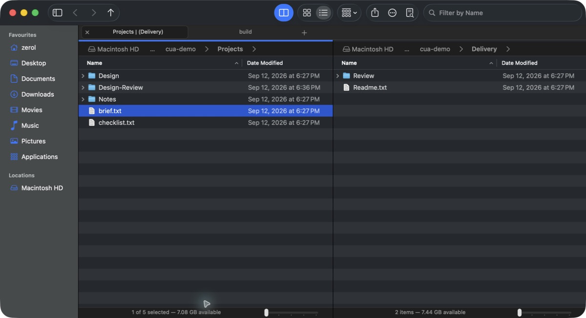

### A path you can click—or type

Click a breadcrumb, choose a subfolder from its menu, or press `⌘L` to edit the full path with completion. Favorites keep frequent destinations nearby; Back and Forward include history menus.

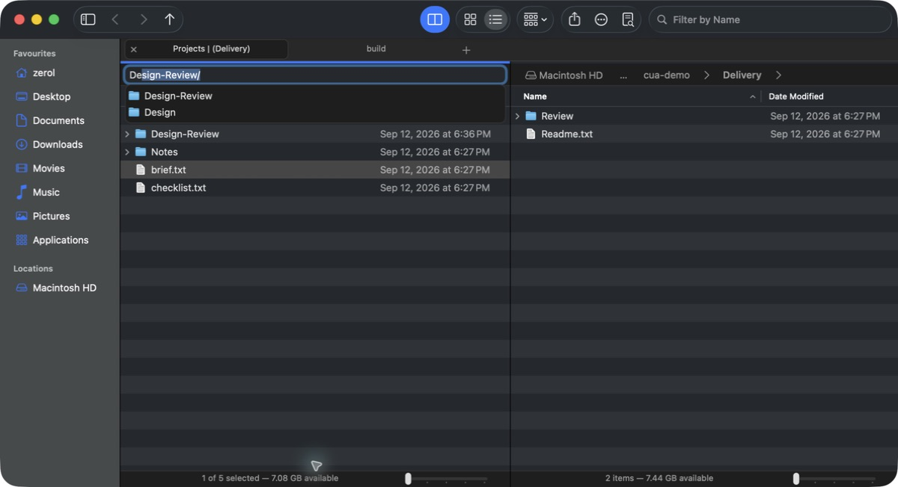

### Open a favorite where you need it

Right-click a Favorite to open it in a new tab or the other pane. If the current tab has one pane, **Open in Other Pane** creates a split while keeping your original folder in place.


### Find a name without leaving the folder

Press `⌘F` and type part of a filename or a pattern such as `*.png`. Results update immediately in the active pane, while the other pane stays as it was. Escape clears the filter; its shortcut can be changed in Settings.

**This is current-folder name filtering.** Use the separate Search command for recursive results.

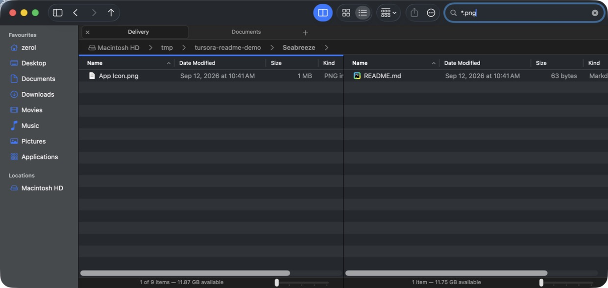

### Search across folders, then save the search

Press `⇧⌘F` or click Search. Search this folder and its subfolders, or your Home folder, combining filename, content, type and modification-date conditions. Save a named search and open it again after restarting. Each pane owns its query, cancellation and results.

Filename search works in ordinary unindexed folders. Content search uses Spotlight and depends on its index and supported document formats; the interface explains that limit. Results show their original location and support Quick Look, file commands and Reveal in Enclosing Folder. ZIP contents are excluded.

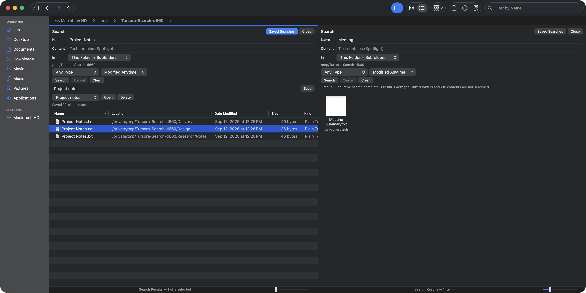

### A view that fits your files

Expand folders in a details list, or browse thumbnails in an icon grid. Group by kind, name, size or dates, sort within the view, and zoom using the slider, a pinch or `⌘`-scroll. Switch between Icons and List with `⌥⌘1` and `⌥⌘2`.

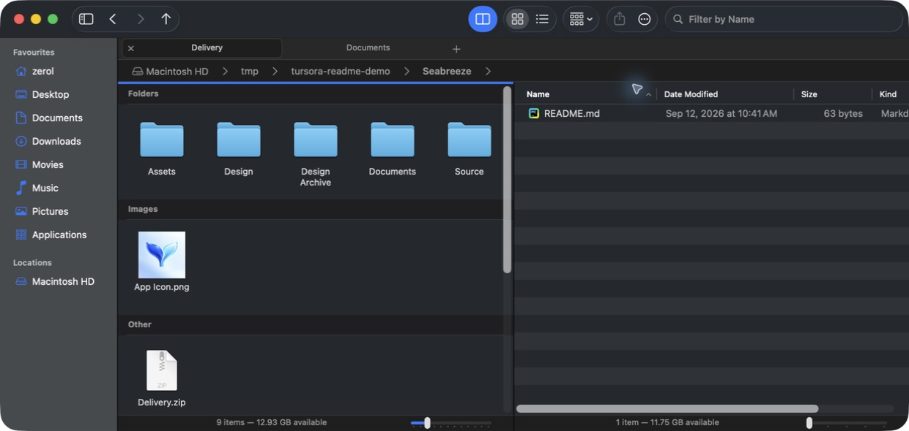

### Preview first, open when you need to

Press Space for Quick Look. `⌘I` opens Get Info, while `⌥⌘I` opens an Inspector that follows the selection. File information includes metadata, previews, comments, default applications and basic permissions.

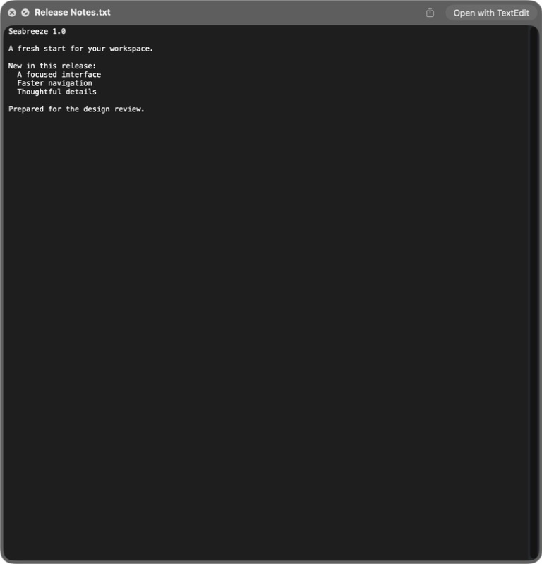

### Everyday operations, with a way back

Copy, cut, paste, rename, duplicate, drag files between folders, or move them to the system Trash. Undo and redo cover supported file operations. When names collide, choose Keep Both, Skip, Replace or Merge where applicable, including a choice for the remaining batch.

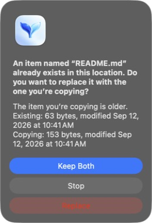

### Compress a selection. Extract beside the original.

Create a ZIP from one file or several, or extract a ZIP into its containing folder. Numbered output names avoid overwriting existing files, and both actions support undo. By default, opening a ZIP extracts it; the [ZIP browsing experiment](#browse-zips-like-folders) changes that behavior.

**Supported today:** ordinary ZIP archives. Password-protected ZIPs and other archive formats are not supported.


### Local folders and system-mounted servers

`⌘K` opens Connect to Server for SMB, NFS, WebDAV and legacy AFP. macOS handles authentication and mounting. Connected volumes appear under Locations and can be browsed with the same panes and file operations; Eject disconnects them.

The screenshot shows the connection interface, not a verified server session. **Real-server interoperability still needs testing.** Tursora has no custom SFTP/FTP backend, server discovery or automatic reconnection.

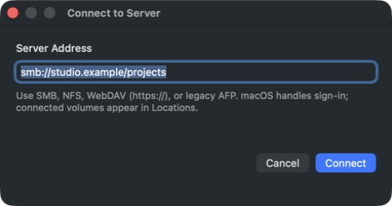

### macOS actions and sharing

The toolbar's More menu collects common actions for the current selection. Share opens the system sharing picker, so available services come from macOS and the selected files.

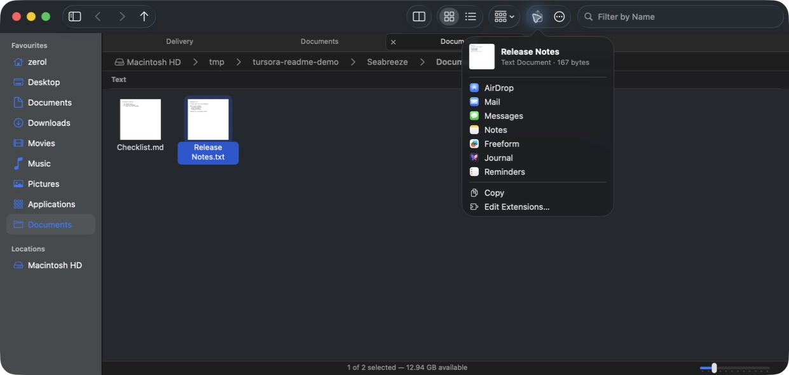

### A few useful preferences

Show or hide filename extensions, record a shortcut for name filtering, or opt into experiments. Shortcut recording checks conflicts. Hiding extensions changes their display; renaming still exposes the full filename.

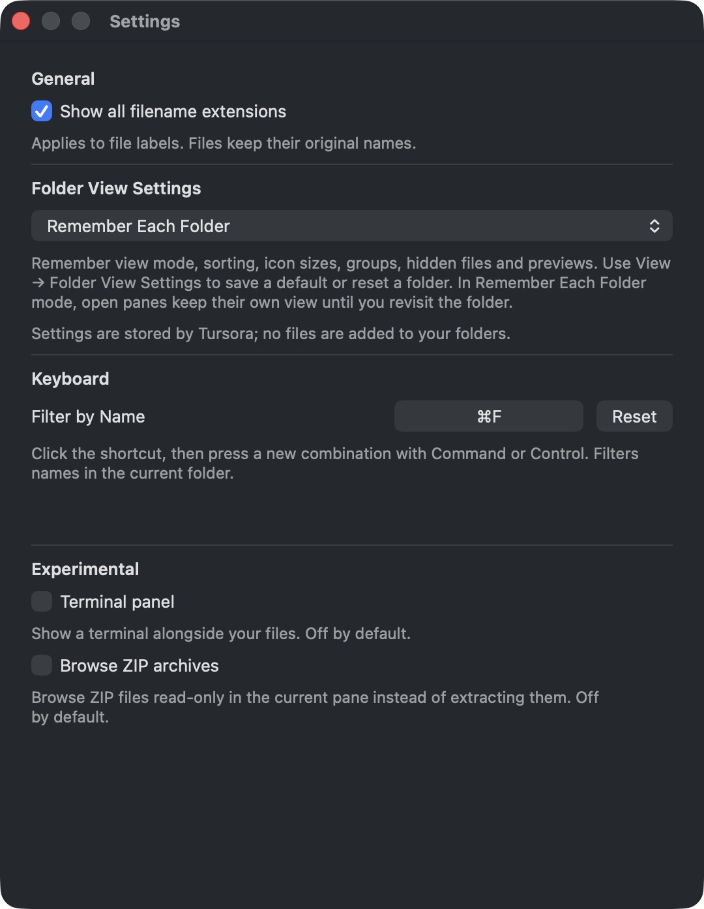

## Experiments

Both experiments are **off by default**. Enable them in **Tursora → Settings…** (`⌘,`).

### A terminal in your workspace

Press `F4` to reveal an interactive terminal below your files, powered by [SwiftTerm](https://github.com/migueldeicaza/SwiftTerm). It starts in the active folder—or beside the original ZIP when browsing an archive.

Navigating elsewhere updates the target of **Restart in Current Folder**; it does not inject commands into a running shell. Restarting, hiding the panel, closing the window or disabling the experiment ends its shell session.

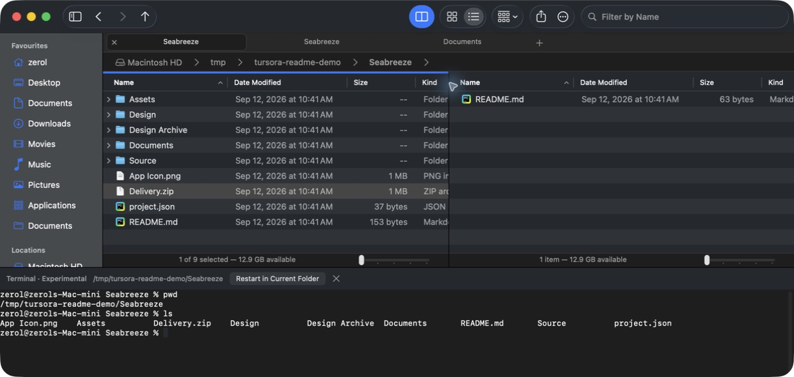

### Browse ZIPs like folders

Open a ZIP **in the current pane**, then navigate its folders using the same address bar, Back, Forward and Up controls. Keep using tabs, split panes, list or icon views, sorting, grouping and filtering. Preview members, open them in their default app, share them, or copy and drag them into a regular folder.

**Archive contents are read-only.** Opened files are temporary copies retained until Tursora quits; external edits do not update the ZIP. Use Save As to keep those edits. Nested ZIP files open in the default application. Turn the experiment off to restore extraction for newly opened ZIPs; existing archive pages remain read-only. Explicit Extract is still available when selecting the ZIP in its containing folder.

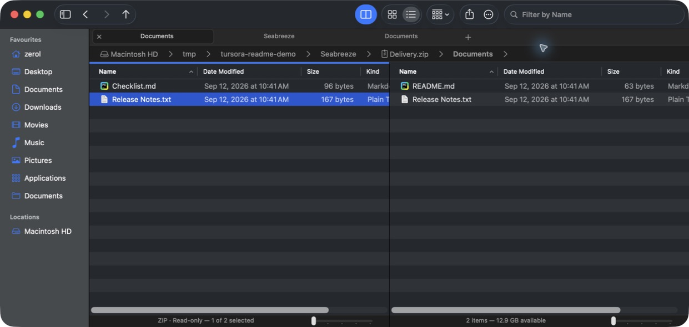

## What Finder still does that Tursora doesn't

These are current gaps, not promises of complete Finder parity:

| Area | Not available in Tursora today |
|---|---|
| Views | Column view, Gallery view, a fixed preview sidebar, free icon placement |
| Search | Finder Smart Folder interoperability, Tags / rating conditions, ZIP contents |
| Organization | Batch rename, New Folder with Selection, Make Alias / Show Original, Show Package Contents |
| Trash | Browsing Trash, Put Back, emptying Trash; moving files to Trash and undoing that move are supported |
| Customization | Per-folder persistent view options and toolbar customization |
| System integration | Quick Actions, Services and FinderSync cloud status badges |
| File information | Full ACL editing, owner/group changes and recursive permission application |

**Outside the design:** file tags and Import from iPhone. These are intentionally excluded, rather than items waiting to be implemented.

Tursora currently has an English interface and does not restore tabs after quitting. See the [Finder comparison](docs/gaps/GAP-vs-FINDER.md), [Dolphin comparison](docs/gaps/GAP-vs-DOLPHIN.md) and [roadmap](docs/ROADMAP.md) for the detailed status.

## Get Tursora

Requires **macOS 14 or later**. Downloadable builds currently target **Apple Silicon** and are **ad-hoc signed, not notarized**.

- **Development builds:** open a successful [Build workflow run](https://github.com/zerolfx/Tursora/actions/workflows/build.yml) and download its artifact ZIP. Unpack that artifact, then unpack the application ZIP inside it. Artifacts are kept for 14 days.
- **Versioned releases:** available from [Releases](https://github.com/zerolfx/Tursora/releases) when a maintainer publishes one. Unzip the download and move `Tursora.app` to Applications.

### Build locally

Use Apple's Command Line Tools with Swift 6.2+ and the macOS 26 SDK. The verified development setup is Swift 6.2.4 / SDK 26.2. No Xcode project is required.

```bash
git clone https://github.com/zerolfx/Tursora.git
cd Tursora/app
tools/make-app.sh
open build/Tursora.app
```

Swift Package Manager fetches the pinned SwiftTerm dependency on the first build. The packaging script assembles the complete application bundle.

### Build and release automation

**Build** runs on pushes to `main`, pull requests and manual requests. It builds the release app on macOS, validates the bundle and signature, then uploads a ZIP and SHA-256 checksum.

**Release is manual only.** In **Actions → Release → Run workflow**, select `main`, enter a new version without `v`, and optionally mark it as a prerelease. The workflow builds that exact commit, creates its version tag and publishes the application with its checksum. Existing tags are not overwritten; pushing a tag does not publish a release.

### Development and verification

```bash
cd app
swift build
for run in 1 2 3; do
  TURSORA_SMOKE_TEST=1 .build/debug/Tursora || exit 1
done
```

The in-app smoke suite exercises real models and controllers in a macOS desktop session. Run it three times before committing, then inspect the packaged application. GitHub Actions validates packaging; it does not replace those UI checks.

[Shortcuts](docs/SHORTCUTS.md) · [Specification](docs/SPEC.md) · [Architecture](docs/ARCHITECTURE.md) · [Development guide](docs/DEVELOPMENT.md) · [Changelog](CHANGELOG.md) · [Contributing rules](AGENTS.md)

The [product page](site/README.md) presents address navigation, tabs, split panes and ZIP browsing with real application screenshots. It builds into a standalone static site for local preview or hosting.

Tursora began with an audit of porting Dolphin and KIO to macOS. That research led to a native implementation, borrowing useful behavior rather than the entire stack. The two-pane tail-fin mark reflects those roots. [Read the original audit](docs/audit/PHASE-0-REPORT.md).
