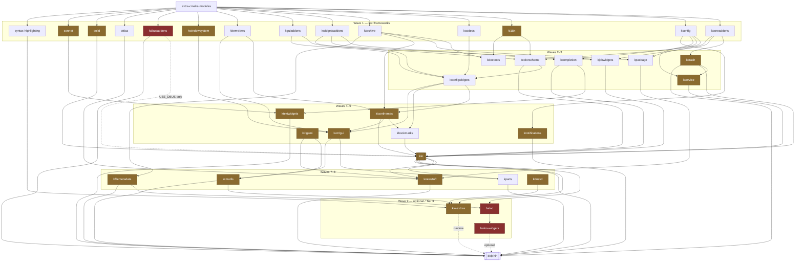

# Phase 0 — Source Audit Report

**Dolphin for macOS** — native macOS port of KDE Dolphin
*"Finder Pro powered by Dolphin / KDE KIO"*

| | |
|---|---|
| Audit date | 2026-08-19 |
| Dolphin | v26.11.70 (master), commit `5e457ee9` |
| KIO | KF 6.30.0 dev, commit `3c6ae8bf` |
| kio-extras | v26.11.70, commit `6ddac496` |
| craft-blueprints-kde | commit `11b07503` |
| Target | Apple Silicon (arm64) only, macOS 26.x, Qt 6.11.1, KF6 ≥ 6.29.0 |
| Host verified on | macOS 26.5.2, Apple clang 21.0.0, Homebrew 6.0.15 |

**Method.** Eleven parallel deep-dive audits over the pinned checkouts. Findings the author
verified first-hand are in [00-ground-truth.md](00-ground-truth.md); the raw audit sections are in
[sections/](sections/). This report is the synthesis.

**Confidence, stated plainly.** All 61 blocker/major claims were re-checked by an independent
agent instructed to *refute* them, and the most decision-relevant survivors were re-checked again
by the author against freshly cloned `solid`, `extra-cmake-modules` and `kcoreaddons`. Blockers
fell from **14 to 4** ([VERIFICATION.md](VERIFICATION.md)). Three claims were refuted outright and
one citation was found to be fabricated.

**One gap remains and is not claimed as closed:** five qtbase-dependent claims — the split
responder chain, `NSApp.mainMenu` ownership, the `processEvents` pump, embedded popup positioning,
and `winId()` semantics — **could not be verified**, because Qt is not installed on this machine.
They underpin §7.5's embedding design, and they are exactly what the Phase-2 spikes (§9 R1/R4) must
settle before that design is committed to. Treat §7.5 as a well-reasoned proposal, not a verified
one.

---

## Table of contents

1. [Architecture overview](#1-architecture-overview)
2. [Dependency graph](#2-dependency-graph)
3. [macOS compatibility matrix](#3-macos-compatibility-matrix)
4. [Build blockers](#4-build-blockers)
5. [Required code changes](#5-required-code-changes)
6. [Files likely requiring modification](#6-files-likely-requiring-modification)
7. [Proposed macOS architecture](#7-proposed-macos-architecture)
8. [Phase 1 implementation plan](#8-phase-1-implementation-plan)
9. [Risk list](#9-risk-list)
10. [Engineering effort](#10-engineering-effort)

---

## 0. Executive summary

**The project is viable, and materially less risky than it looks from the outside.** Three
findings drive that conclusion, all verified directly against the source:

1. **D-Bus — the presumed structural blocker — is already solved upstream.** KIO sets
   `USE_DBUS_DEFAULT OFF` on Apple (`kio:CMakeLists.txt:107-111`) and guards the consequences
   across 28 source files. KDE's own Craft blueprint for Dolphin says so out loud: *"skip dbus
   for macOS and Windows, we don't use it there and it only leads to issues"*
   (`craft-blueprints:kde/applications/dolphin/dolphin.py`).
2. **KIO already contains Objective-C++ and links AppKit.** `kio:src/kiod/kiod_agent.mm` sets
   `LSUIElement`/`NSApplicationActivationPolicyAccessory`; `kio_trash` links
   `-framework DiskArbitration`. There is in-tree precedent for the exact bridging this port needs.
3. **Dolphin's model layer is cleanly separable from its view layer.** `KFileItemModel` derives
   from `KItemModelBase : QObject` with a **4-line** total QtWidgets contact surface across the
   whole model half, and the render half has **zero** references back to the model. The entire
   model→view contract is **nine signals** connected in `KItemListView::setModel()`. Best of all,
   upstream already proves it: `src/tests/kfileitemmodeltest.cpp:128` constructs a bare
   `new KFileItemModel()` with no view and drives it with `QSignalSpy` ✔ verified. Phase 3's
   `NSCollectionView`/`NSTableView` can be driven by the real Dolphin model.

**But the same de-D-Busing that makes the port possible silently removes load-bearing
functionality**, and this is the central theme of the audit:

| Turning D-Bus off also removes | Consequence |
|---|---|
| `kpasswdserver` (`kio:src/CMakeLists.txt:23-26`) | `openPasswordDialogV2()` returns `NoError` **with empty credentials** → sftp/smb workers spin in an unbounded retry loop |
| credential caching (`slavebase.cpp:1274-1332`) | every remote operation re-prompts |
| `KDirNotify` | remote directory views never refresh after a write |
| `KDynamicJobTracker` | **no copy progress dialog, percentage, or cancel button** |
| `kssld` | "accept this certificate forever" silently does nothing |
| `filenamesearch` worker (`kio-extras:CMakeLists.txt:213`, excluded on APPLE) | combined with Baloo being Linux-only, **the search bar has no backend at all** |
| `smb`, `mtp` workers (`kio-extras:CMakeLists.txt:230,217`) | no SMB browsing |

None of these is fatal, and each has a concrete fix in §5 — but they are the difference between
"it compiles" and "it is a file manager". A plan that budgets only for compilation will fail.

**Recommended build strategy:** a checked-in CMake superbuild (`ExternalProject_Add` × ~26)
pinned to KF6 `v6.29.0`, over a Homebrew base layer (`qtbase`, `extra-cmake-modules`, `karchive`,
`ki18n`, `kdoctools`, and all leaf C libraries). **Not** KDE Craft — it would install a second Qt
and put our patches inside a foreign build system. Details and the rejected alternatives in §2.6.

**Recommended embedding strategy:** Qt owns the event loop (`QApplication::exec()`, which bottoms
out in `[NSApp run]`), AppKit objects are created normally around it, and Dolphin's
`DolphinViewContainer` is hosted in a native `NSSplitViewController` pane via
`QWindow::fromWinId()`. Details and the two rejected models in §7.2.

**The single riskiest unknown** is the split responder chain: Qt's `NSMenuItem`s use
`target=nil` + `-qt_itemFired:` resolved through `-supplementalTargetForAction:`, so Qt menu items
grey out whenever a native sidebar has focus, and vice versa. This is solvable — Chromium solved
exactly this — but it must be spiked in week 1 of Phase 2, not discovered in month 3.

---

## 1. Architecture overview

### 1.1 What Dolphin actually is

Dolphin is **77.5k LOC** (169 `.cpp` + 151 `.h`, including 10.9k LOC of tests) sitting on top of
roughly 30 KDE Frameworks. Its own code is a thin-ish shell around three heavier things it does
*not* own: **KIO** (all I/O, local and remote), **KFileItem/KCoreDirLister** (the directory
abstraction), and **KConfig** (all persistence).

Upstream already ships the codebase as four CMake targets, and the split is close to the seam a
macOS port wants (`dolphin:src/CMakeLists.txt`):

| Target | Line | Contents | Port disposition |
|---|---|---|---|
| `dolphinvcs` (SHARED, installed, exported) | 24 | `KVersionControlPlugin` — the VCS plugin ABI | **keep as-is** |
| `dolphinprivate` (SHARED, installed) | 59 | the whole `kitemviews/` framework, `DolphinView`, `ViewProperties`, roles updater, DnD helper, new-file menu, 8 generated `KConfigSkeleton`s | **split**: model half → core, render half → Phase-2-only |
| `dolphinpart` (MODULE) | 263 | KParts embedding for Konqueror | **drop** |
| `dolphinstatic` (STATIC) | 285 | the shell: main window, tabs, panels, settings, search, statusbar | **replace with AppKit** |
| `dolphin` (executable) | 511 | `main.cpp` + `dbusinterface.cpp` | **replace** |

### 1.2 Where the weight sits

| Area | Files | LOC | Fate |
|---|---|---|---|
| `kitemviews/` + `private/` | 70 | **25,153** | model half (~9.0k) **reused**; render half (~17.5k) **discarded in Phase 3** |
| top-level (main window, tabs, bars) | 50 | 13,319 | replaced by AppKit |
| `tests/` | 24 | 10,942 | kept — 6 suites run headless and are the Phase-1 acceptance gate |
| `views/` (+tooltips, vcs) | 32 | 9,308 | `DolphinView` (4,003 LOC) **reused**; the rest replaced |
| `settings/` | 50 | 5,240 | `KConfigSkeleton`s reused; dialogs replaced |
| `panels/` | 20 | 3,816 | places/folders replaced; terminal **dropped**; information replaced |
| `search/` | 22 | 2,907 | `DolphinQuery` reused; UI replaced; **backend must be built** |
| `statusbar/` | 12 | 1,608 | observers reused; widgets replaced |
| `selectionmode/` | 13 | 1,753 | **dropped** (touch/phone feature) |
| others | — | ~3,400 | trash, filterbar, itemactions, admin, userfeedback |

`kitemviews/` alone is ~32% of non-test code. **Keeping its model half while replacing its render
half is the single highest-leverage architectural decision in this project.**

### 1.3 The layering we are targeting

```
┌─────────────────────────────────────────────────────────┐
│  macOS Native UI          AppKit / SwiftUI              │
│  NSWindow · NSToolbar · NSSplitViewController           │
│  NSOutlineView · NSCollectionView · QLPreviewPanel      │
└───────────────────────────┬─────────────────────────────┘
                            │  Objective-C++ (.mm)
┌───────────────────────────▼─────────────────────────────┐
│  DolphinBridge            opaque C++ facade             │
│  UiDelegate · DirectoryModel · NavigationController     │
│  TabModel · FileOperations · PlacesDataSource           │
└───────────────────────────┬─────────────────────────────┘
                            │  pure C++/Qt
┌───────────────────────────▼─────────────────────────────┐
│  libDolphinCore   (~13.1k LOC lifted from upstream)     │
│  KFileItemModel · KFileItemModelRolesUpdater            │
│  KItemListSelectionManager · ViewProperties             │
│  DolphinQuery · VersionControlObserver · observers      │
└───────────────────────────┬─────────────────────────────┘
                            │
┌───────────────────────────▼─────────────────────────────┐
│  KDE Frameworks 6         KIOCore · KIOGui · KCoreAddons│
│                           KConfig · KService · Solid    │
└───────────────────────────┬─────────────────────────────┘
                            │
┌───────────────────────────▼─────────────────────────────┐
│  Local APFS · SFTP · SMB · WebDAV · trash · previews    │
└─────────────────────────────────────────────────────────┘
```

The load-bearing claim is that `libDolphinCore` is reachable **without QtWidgets**. It is: the
entire model half's QtWidgets contact surface is four lines
(`kfileitemmodel.cpp:292`, `kfileitemmodelrolesupdater.cpp:980,1092`, and
`kfileitemclipboard.cpp`'s `QApplication::clipboard()`), all trivially replaceable and all
upstreamable.

`DolphinView` (4,003 LOC) stays a `QWidget` and is deliberately **not** fought: it is the
file-operation orchestrator, and its only coupling to the widget world is 12 dialog-parent sites.
Those get routed through an injected `UiDelegate`. In Phase 3 it is instantiated with a `nullptr`
parent and never shown.

---

## 2. Dependency graph

### 2.1 Direct dependencies declared by Dolphin

Qt 6 (`dolphin:CMakeLists.txt:57-67,144-147`) — floor **6.4.0**, but KIO raises the effective
floor to **6.9.0** (`kio:CMakeLists.txt:98`):

| Module | Status | Needed by |
|---|---|---|
| `Core`, `Gui`, `Widgets`, `Concurrent` | REQUIRED | everything |
| **`DBus`** | **REQUIRED** | `dbusinterface.cpp`, `qt_add_dbus_*` (`src/CMakeLists.txt:477-480`), KIOFuse call in the terminal panel |
| `GuiPrivate` | REQUIRED when Qt ≥ 6.10 | `find_package` is unconditional; only *linked* under `HAVE_X11` — but KIOWidgets links it unconditionally |
| `Multimedia`, `MultimediaWidgets` | REQUIRED **iff** Baloo found | information panel's media widget |
| `Test` | tests only | 21 `ecm_add_test` targets |

KF6 — **21 REQUIRED** components (`dolphin:CMakeLists.txt:73-94`) plus `KF6FileMetaData` as
`TYPE REQUIRED` (`:120-125`). Optional: `DocTools`, `UserFeedback`, `PackageKitQt6`, `Baloo`,
`BalooWidgets`.

> ⚠️ **Latent fragility:** `KF6::XmlGui` is *linked* (`src/CMakeLists.txt:653,668`) but never
> appears in any `find_package(KF6 … COMPONENTS)`. It resolves only transitively via
> `KF6Parts`/`KF6KCMUtils`. Trimming either would break the build in a confusing way.

### 2.2 Transitive closure and build order

The full closure is **~30 source repos across 10 waves**. Waves are internally parallel-safe.

| Wave | Repos |
|---|---|
| W0 | `extra-cmake-modules` |
| W1 | `kcoreaddons`, `kconfig`, `ki18n`, `kcodecs`, `karchive`, `kwidgetsaddons`, `kguiaddons`, `kitemviews`, `kwindowsystem`, `kdbusaddons`, `attica`, `solid`, `sonnet`, `syntax-highlighting` |
| W2 | `kcrash`, `kcolorscheme`, `kcompletion`, `kjobwidgets`, `kdoctools`, `kpackage` |
| W3 | `kconfigwidgets`, `kservice` |
| W4 | `kiconthemes`, `ktextwidgets`, `knotifications`, `kirigami` |
| W5 | `kbookmarks`, `kxmlgui` |
| **W6** | **`kio`** |
| W7 | `kparts`, `kcmutils`, `kfilemetadata` |
| W8 | `knewstuff`, `kuserfeedback`*, `kdnssd`* |
| W9 | `baloo`*, `baloo-widgets`*, `kio-extras` |
| W10 | **`dolphin`** |

\* optional. Also required at runtime: **`breeze-icons`** (icon theme) and the **`breeze`** widget
style — which `dolphin:src/main.cpp:88-90` explicitly requests *on macOS specifically*.



### 2.3 What Homebrew actually provides

Measured, not assumed — 56 candidate formula names checked via `brew info --json=v2`:

| Available | Version | Note |
|---|---|---|
| `qt` | 6.11.1 | meta-formula over 38 split formulae incl. `qtbase` |
| `extra-cmake-modules` | 6.29.0 | **exactly** KIO's floor — zero headroom |
| `karchive` | 6.29.0 | arm64 bottle |
| `ki18n` | 6.29.0 | arm64 bottle |
| `kdoctools` | 6.29.0 | arm64 bottle |

**All other ~51 KF6 names are absent.** KDE apps on macOS (`kdenlive`, `kde-connect`) ship as
Homebrew **casks** — prebuilt Craft bundles — not formulae.

> ⚠️ **Trap:** `brew info solid` resolves to an unrelated 3-D collision-detection library
> (dtecta/solid3 v3.5.8), **not** KF6 Solid. Any script that naively `brew install`s framework
> names will silently install the wrong package.

### 2.4 Third-party dependencies

| Dep | Needed for | Homebrew (arm64) | Verdict |
|---|---|---|---|
| `libssh` 0.12.2 | `kio_sftp` | ✅ | floor 0.9.8 met; `HAVE_SFTP_AIO` will enable |
| `qcoro6` 0.13.0 | `kio_sftp` (hard req) | ✅ | |
| `samba` 4.24.6 | `kio_smb` | ⚠️ bottle exists | whether it ships `libsmbclient.h` is **unverified** |
| **`kdsoap-ws-discovery-client`** | `kio_smb` (REQUIRED) | ❌ **absent** | additional from-source KDE repo; Linux/FreeBSD-only in CI |
| `exiv2`, `taglib`, `openexr`, `ffmpeg`, `poppler-qt6` | thumbnails / kfilemetadata | ✅ | taglib is 2.x vs CMake's `find_package(Taglib 1.11)` — **compat unverified** |
| `libimobiledevice`, `libplist` | `kio_afc` (Apple File Conduit) | ✅ | **not** D-Bus gated — the one worker *more* relevant on macOS than Linux |
| `shared-mime-info` 2.5.1 | `QMimeDatabase` at runtime | ✅ | |
| `gettext`, `iso-codes` | KI18n | ✅ / ⚠️ no bottle | `iso-codes` builds from source |
| TIRPC | `kio_nfs` | ❌ | macOS has RPC in libc; NFS worker likely unbuildable |
| PackageKitQt6 | service-menu installer | ❌ | Linux-only by nature; stays off |
| LMDB, KIdleTime | Baloo | n/a | Baloo is out of scope |

### 2.5 KDE's own macOS coverage

| Repo | Declares macOS in `.kde-ci.yml`? | Runs a macOS CI job? |
|---|---|---|
| dolphin | ✅ `macOS/Qt6` (`:5`) | ❌ none |
| kio | ✅ `macOS` (`:4-22`) | ❌ none |
| kio-extras | ❌ Linux/FreeBSD/Windows only | ❌ none |

Three conclusions:

1. Dolphin's macOS dependency manifest is **aspirational metadata, not a green build**.
2. **Inconsistency:** Dolphin's `.kde-ci.yml` requires `kio-extras` on `macOS/Qt6`, but
   kio-extras has no macOS target at all.
3. Craft *does* have working macOS blueprints (§0), but no repo here references a
   `craft-macos-*` CI template. A Craft path would be blazing a trail, not following one.

**We should expect to be the first to compile this stack on macOS 26/arm64, and to hit build
errors that no CI has ever surfaced.** Budget for it (§10).

### 2.6 Build strategy — recommendation

**Recommended: a checked-in CMake superbuild over a Homebrew base layer.**

```
third_party/superbuild/CMakeLists.txt   # ExternalProject_Add × ~26, DEPENDS = §2.2 wave order
third_party/versions.cmake              # KF6_TAG "v6.29.0"
patches/{kio,dolphin,kio-extras}/*.patch
Brewfile                                # qt ecm libssh qcoro6 exiv2 taglib openexr
                                        # libimobiledevice libplist shared-mime-info
                                        # gettext iso-codes docbook-xsl gperf
toolchain-macos-arm64.cmake             # CMAKE_OSX_ARCHITECTURES=arm64 + CMAKE_PREFIX_PATH
```

Rejected alternatives:

- **KDE Craft.** It builds *its own* Qt, giving two Qt stacks on disk and real mixed-Qt link risk
  once we also need Homebrew-only libs (`libssh`, `qcoro6`, `libimobiledevice`). Its patch story
  is a per-blueprint Python `patch()`, which buries our patches in a foreign build system. Its one
  genuine advantage — `craft --package` producing a signed `.dmg` — is a Phase-4 concern reachable
  with `macdeployqt` + an `install_name_tool` pass. **Re-evaluate for Phase 4 packaging only.**
- **Pure Homebrew.** Non-starter: 51 of 56 formulae missing, and `brew edit` diffs are not
  reviewable artifacts.
- **Pure from-source.** Wasteful: Homebrew already gives arm64 bottles for qtbase, ECM, and the
  entire leaf-C-library layer.

**Decisive axis: carrying local patches.** We *will* need them (§5).
`ExternalProject_Add(… PATCH_COMMAND git apply ${CMAKE_SOURCE_DIR}/patches/…)` keeps every patch a
reviewable file in our repo that rebases against a pinned tag and can be submitted upstream verbatim.

**Pin the whole KF6 stack at ≥ 6.29.0** — non-negotiable, because `kio:CMakeLists.txt:4` sets
`KF_DEP_VERSION 6.29.0` and `:9` requires `ECM 6.29.0`.

**Build ladder — start narrow, prove the toolchain, then widen:**

| Step | Scope | Frameworks | Proves |
|---|---|---|---|
| 1 | `-DKIOCORE_ONLY=ON` (`kio:CMakeLists.txt:40`) | ~8 | KIO lists a directory on macOS |
| 2 | full KIO, `USE_DBUS=OFF` (the Apple default) | ~20 | jobs, workers, previews |
| 3 | Dolphin with `KCMUtils`/`NewStuff` **patched out** | ~25 | **removes Kirigami + KPackage + Attica + the entire Qt Quick branch** for 3 `KCModule` subclasses and one button |
| 4 | reconsider KCMUtils/NewStuff/Baloo | — | only if the AppKit shell still wants them |

Step 3 is worth emphasising: `KCMUtils` and `KNewStuff` drag the whole `qtdeclarative`/Qt Quick
stack into a file manager that will not display a single QML surface on macOS.

---

## 3. macOS compatibility matrix

Legend: ✅ works as-is · 🟡 builds but degraded/wrong · 🔧 needs our work · ❌ absent/unbuildable

### 3.1 Framework tiers

| Tier | Frameworks | Meaning |
|---|---|---|
| **1 — portable** ✅ | ECM, kcoreaddons, kconfig, kcodecs, karchive, kwidgetsaddons, kguiaddons, kitemviews, attica, kcolorscheme, kcompletion, kjobwidgets, kdoctools, kpackage, kconfigwidgets, kbookmarks, syntax-highlighting, kparts | pure Qt, no reachable platform paths |
| **2 — builds, Linux-leaning** 🟡 | ki18n, kwindowsystem, solid, kcrash, kservice, kiconthemes, sonnet, ktextwidgets, knotifications, kxmlgui, kirigami, kcmutils, knewstuff, kfilemetadata, kdnssd, **kio**, kio-extras | compiles; runtime behaviour needs adaptation |
| **3 — Linux/Plasma-specific** ❌ | **kdbusaddons**, baloo, baloo-widgets, packagekit-qt, konsolepart | no useful macOS backend |

Tier-2 detail worth knowing:

| Framework | macOS reality |
|---|---|
| `ki18n` | catalogs resolve via `XDG_DATA_DIRS`, **which does not exist on macOS** — see §3.3 |
| `kwindowsystem` | largely a stub; `main.cpp:195-197` branches only on Wayland/X11, so window activation silently no-ops |
| `solid` | has an **IOKit backend**, but it is incomplete — see §3.4 |
| `kservice` | KSycoca scans `.desktop` files under XDG dirs; macOS has no system `applications/` tree |
| `kiconthemes` | without a bundled `breeze-icons`, `KIconTheme::initTheme()` (`main.cpp:73`) yields a **blank UI** |
| `knotifications` | Linux backend is the FDO D-Bus service; macOS needs `UNUserNotification`, which requires a **signed `.app`** |
| `kcrash` | Linux path hands off to DrKonqi; macOS must fall back to the plain handler |
| `kio` | **already macOS-aware** (§0), but `USE_DBUS=OFF` drops four components (§3.2) |

### 3.2 The D-Bus cliff — what disappears at `USE_DBUS=OFF`

This is the most important table in the audit.

| Component | Gate | Lost capability | Severity |
|---|---|---|---|
| `kpasswdserver` | `kio:src/CMakeLists.txt:23-26` | **credential prompting** — `openPasswordDialogV2()` returns `NoError` with an *untouched* `AuthInfo` (`slavebase.cpp:926-935`); workers read that as "user supplied credentials" and retry forever | 🔴 **blocker** |
| credential cache | `slavebase.cpp:1274-1332` | `checkCachedAuthentication()` hard-returns `false`; `cacheAuthentication()` is a no-op that still returns `true` | 🔴 blocker |
| `kioexec` | `kio:src/CMakeLists.txt:23-26` | "open remote file in a local app" (download → launch → upload back) | 🟠 major |
| `kssld` / `KSslCertificateManager` | `ksslcertificatemanager.cpp` (9 `#ifdef` sites) | "accept this certificate permanently" **silently does nothing** | 🟠 major |
| `KDirNotify` | `kcoredirlister_p.h`, `simplejob.cpp` | remote directory views **never refresh** after a write from the same app | 🟠 major |
| `KDynamicJobTracker` | D-Bus-gated | **no progress dialog, no percentage, no cancel button** for any copy/move | 🟠 major |
| `kio_smb` | `kio-extras:CMakeLists.txt:230` (`SAMBA_FOUND AND USE_DBUS`) | no SMB browsing | 🟠 major |
| `kio_mtp` | `kio-extras:CMakeLists.txt:217` | no MTP devices | 🟢 minor |
| `kio_filenamesearch` | `kio-extras:CMakeLists.txt:213` (`NOT APPLE AND USE_DBUS`) | **the only non-Baloo search backend** | 🔴 blocker |
| `remote:/` worker | `kio:src/kioworkers/remote/CMakeLists.txt:1` | the "Network" place | 🟢 minor |
| `kio_activities`, `recentlyused` | `kio-extras:CMakeLists.txt:96` | recent-files place | 🟢 minor |

Dolphin's own D-Bus surface, by contrast, is **not** gated at all: `KF6DBusAddons` and `Qt6::DBus`
are unconditional `REQUIRED` (`dolphin:CMakeLists.txt:62,73,79`), and `KDBusService` is constructed
on all three code paths in `main.cpp:184,186,234`. **This asymmetry — KIO optional-off, Dolphin
mandatory-on — is the sharpest single inconsistency in the dependency graph**, and patch 0006 (§5)
exists to fix it.

### 3.3 Filesystem & path semantics

| Concern | macOS reality | Status |
|---|---|---|
| `QStandardPaths::GenericDataLocation` | Qt's macOS backend **never** returns the bundle's `Contents/Resources` for this location and **ignores `XDG_DATA_DIRS` entirely** | 🔴 everything KF6 installs into `share/` becomes invisible inside a bundle: icon themes, `.mo` catalogs, KService `.desktop` scanning, servicemenus, `bookmarks.xml`, KXmlGui's `ui_standards.rc` |
| APFS case-insensitivity | dir/item caches compare paths case-sensitively | 🟡 rename-to-different-case can fail; duplicate cache entries |
| Unicode NFD vs NFC | APFS surfaces NFD-ish names; Qt/KIO assume NFC | 🟡 breaks `QUrl`-keyed model lookup, filtering, sort tie-breakers |
| `~/.Trash` | KIO writes a freedesktop.org layout into `~/.Trash/**KDE.trash**` | 🔴 Finder-invisible, no Put Back, Empty Trash desyncs both ways |
| Hidden files | Dolphin is dotfile-only | 🟡 macOS `UF_HIDDEN` items (`Icon\r`, `/usr`, `.fseventsd`) show up as clutter |
| `KDirWatch` | falls back to **`QFSWatch`**, which Qt backs with FSEvents on macOS ✎ *corrected* | 🟡 **not** stat-polling as first reported. Real gap is semantic: the code itself notes *"inotify supports delete+recreate+modify, which QFSWatch doesn't support"* (`kcoreaddons:kdirwatch.cpp:104`), plus one watch per counted subdirectory |
| `getxattr` per entry | KIO probes every directory entry for a Linux `ntfs-3g` attribute | 🟡 one pointless syscall per file — measurable on 100k-file directories |
| `KMountPoint` | re-reads the entire mount table on every `currentMountPointForPath` call | 🟡 no cache on Darwin |
| ACLs / BSD flags | macOS ACLs + `uchg`/`hidden` flags differ from POSIX mode bits | 🟡 permissions UI is incomplete, not wrong |
| Finder Tags | `com.apple.metadata:_kMDItemUserTags` xattr | 🔧 Phase 3; `kfilemetadata` already has a macOS xattr backend to build on |

### 3.4 Devices & volumes (Solid)

Solid **does** have an IOKit backend, but the audit found it substantially incomplete:

| Capability | State | Evidence |
|---|---|---|
| Enumerate volumes at startup | ✅ works | |
| `StorageAccess::setup()` / `teardown()` | ❌ **stubs returning `false`** | `solid:src/solid/devices/backends/iokit/iokitstorageaccess.cpp:78-88` |
| Hot-plug `deviceAdded` / `deviceRemoved` | ❌ **never emitted** — `IOServiceAddMatchingNotification` is never called | `solid:…/iokit/iokitmanager.cpp:99-111` |
| `propertyChanged` | ❌ declared, never emitted | `iokitdevice.h:52` |
| `storageAccessFromPath()` | 🟡 full IORegistry scan + `DASessionCreate` per call | |

Net effect on Dolphin: **"Safely Remove" is a silent no-op** (the row stays, the menu item stays
enabled, nothing unmounts), and the Places device list is **frozen at construction time** — plug a
USB drive in and it never appears.

Neither is a Phase-1 blocker (MVP browses local paths), but both are Phase-2 must-fixes, and both
are ~120 LOC of DiskArbitration work inside Solid that is **upstreamable**.

### 3.5 Remote filesystems

All gates below were read first-hand in `kio-extras/CMakeLists.txt` ✔ verified.

| Worker | Builds on macOS? | Gate | Notes |
|---|---|---|---|
| **sftp** | ✅ **yes — no platform gate at all** | `:207-211` `if (libssh_FOUND)` | libssh floor 0.9.8, Homebrew has 0.12.2 → the **AIO** path compiles (`HAVE_SFTP_AIO`). **QCoro6 is a hard requirement** (`find_package(QCoro6 REQUIRED)` at `:208`) with no `#ifdef` escape — `QCoro::Generator` is the transfer pipeline type in both branches |
| **webdav / davs, ftp, http** | ✅ in KIO core | — | not in kio-extras |
| `filter` (gzip/bz2/xz/zstd) | ✅ | `:198` ungated | needs KF6Archive (Homebrew ✓) |
| `archive` (ar/7z/tar/zip) | ✅ | `:200` ungated | also builds the public `kioarchive6` lib; needed for browse-into-archive |
| `thumbnail` | ✅ | `:206` ungated | ~15 thumbcreator plugins, most optional |
| `fish` | ✅ | `:201-205` `NOT WIN32` | needs an `md5sum`/`md5` binary — **`/sbin/md5sum` exists on this machine** ✔ verified. Superseded by sftp |
| `man` | ✅ **will build** | `:221-224` `NOT WIN32 AND Gperf_FOUND` | **`/usr/bin/gperf` exists** (Xcode CLT) ✔ verified, so this builds and pulls in KF6Codecs — turn it off deliberately |
| `info` | ✅ | `:199` ungated | GNU texinfo; useless on macOS but harmless |
| `kcms` (trash/webshortcuts/proxy) | ✅ by default | `:190-192` `BUILD_KCMS` default ON | Plasma System Settings modules — **useless in a macOS shell. Set `-DBUILD_KCMS=OFF`** |
| **smb** | ❌ **no** | `:230-233` `SAMBA_FOUND AND USE_DBUS` | **triple-blocked**: D-Bus gate, plus `find_package(KF6 … DNSSD)` **REQUIRED** *inside* the gate (`:231`), plus `KDSoapWSDiscoveryClient` REQUIRED — no Homebrew formula |
| `afc` (Apple File Conduit) | ❌ | `:235-237` `IMobileDevice_FOUND AND PList_FOUND` | deps are in Homebrew; **not** D-Bus gated. iOS device browsing — *more* relevant on macOS than Linux, and cheap to enable |
| `mtp` | ❌ | `:217-219` `Libmtp_FOUND AND USE_DBUS` | |
| `filenamesearch` | ❌ | `:213-215` `NOT WIN32 AND **NOT APPLE** AND USE_DBUS` | the only subdirectory with an explicit `NOT APPLE` |
| `nfs` | ❌ | `:225-227` `TIRPC_FOUND` | libtirpc absent on macOS |
| `activities`, `recentlyused` | ❌ | `:194` (`BUILD_ACTIVITIES` never defined on APPLE) | ⚠️ **footgun**: forcing `-DBUILD_ACTIVITIES=ON` reaches the `add_subdirectory` but its `find_package(PlasmaActivities REQUIRED)` never ran → confusing hard configure error |

**Good news on sftp auth that the D-Bus analysis missed:** host-key verification is **D-Bus-free**.
`kio_sftp.cpp:842-892` uses `SlaveBase::messageBox`, which travels over the worker socket
(`INF_MESSAGEBOX` / `CMD_MESSAGEBOXANSWER`, `kio:src/core/slavebase.cpp:942-958`) — not the session
bus. And `ssh_options_parse_config(mSession, nullptr)` at `kio_sftp.cpp:708-712` means
**`~/.ssh/config` is honoured**. So the only broken piece of the sftp auth story is the password
prompt itself (§4.2 R-1) — which makes patch P9 higher-leverage than it first appeared.

**For SMB, the realistic macOS answer is not `kio_smb`.** Mounting via `mount_smbfs`/NetFS and
treating the result as a local path gives every app access to the share, matches Finder's model,
and sidesteps both the D-Bus gate and the missing KDSoap dependency. Recommend a **hybrid policy**:
KIO workers for sftp/webdav (Dolphin-only, no admin rights, instant), native mounts for SMB/NFS
(system-wide, Finder-consistent).

### 3.6 Dolphin features against the MVP list

| MVP requirement | Phase 1 (Qt UI) | Notes |
|---|---|---|
| Open/browse local directories | ✅ | the core case works once the stack builds |
| Copy / Move | 🟡 works, **no progress UI** | `KDynamicJobTracker` is D-Bus-gated |
| Rename | ✅ | plus a case-only-rename bug on APFS |
| Delete / Trash | 🔴 wrong location | writes `~/.Trash/KDE.trash` |
| Drag & Drop (in-app) | ✅ | |
| Drag & Drop (to Finder) | 🔧 | remote files need `NSFilePromiseProvider` |
| Tabs | ✅ | |
| Split view | ✅ | |
| Places | 🟡 | static device list, no eject |
| SFTP | 🔴 | blocked on credential provider |
| SMB | ❌ | see §3.5 |
| Quick Look | 🔧 | Space is triple-bound in Dolphin today |
| Native toolbar / sidebar / menu bar | 🔧 | Phase 2 |
| SF Symbols | 🔧 | Phase 2 |

**Read this table as the definition of Phase 1's real scope.** "Dolphin launches on macOS" is
achievable quickly; "Dolphin is usable on macOS" requires the 🔴 rows, and those are the ones §8
schedules first.

---

## 4. Build blockers

Ninety candidate findings were produced across the audits: 14 blocker, 47 major, 29 minor.
**All 61 blocker/major claims were then re-checked by an independent agent instructed to refute
them**, and the most decision-relevant survivors were re-checked again by the author. Result:

| | original | after verification |
|---|---|---|
| blocker | 14 | **4** |
| major | 47 | 25 |
| minor | 29 | 23 |
| info / not-an-issue | 0 | 9 |

**The raw audit output was roughly 3.5× too alarmist at the top of the severity scale.** Full
verdict table, refutations, and the author's re-verification: **[VERIFICATION.md](VERIFICATION.md)**.

> ⚠️ **Still unverified:** the five qtbase-dependent claims (responder chain, `NSApp.mainMenu`
> ownership, `processEvents` pump, popup positioning, `winId()` semantics) could not be checked —
> Qt is not installed on this machine. They are exactly the claims the Phase-2 spikes in §9 must
> settle before the embedding architecture is committed to.

### 4.1 Configure/compile/link blockers

| # | Blocker | Evidence | Fix | Size |
|---|---|---|---|---|
| B1 | **26 of ~30 required KF6 frameworks have no Homebrew formula** — the stack must be built from source ✔ verified | `dolphin:CMakeLists.txt:73-94,120-125`; 56 formula names checked via `brew info --json=v2`, only ECM/karchive/ki18n/kdoctools present | pinned `ExternalProject_Add` superbuild (§2.6) | **L** (~10–14 d) |
| B2 | **Dolphin hard-requires D-Bus** while KIO and kio-extras both default it off on Apple ✔ verified | `dolphin:CMakeLists.txt:62,73,79`; `src/main.cpp:184,186,234`; `src/CMakeLists.txt:221,477-480,513-517` vs `kio:CMakeLists.txt:107-111` | patches P1–P2 (§8.2) | M |
| B3 | `KCMUtils` + `KNewStuff` are REQUIRED, dragging Kirigami + KPackage + Attica + the entire Qt Quick stack in for **3 `KCModule` subclasses and one button** | `dolphin:CMakeLists.txt:73-95`; consumers are `settings/kcm/*`, `settings/trash/trashsettingspage.cpp:18`, `settings/contextmenu/contextmenusettingspage.cpp:24,67` | patch P5 | S |
| B4 | `find_package(Qt6GuiPrivate … REQUIRED)` is unconditional for Qt ≥ 6.10, though its only Dolphin consumer is `HAVE_X11`; **KIOWidgets links it unconditionally** | `dolphin:CMakeLists.txt:65-67`; `kio:src/widgets/CMakeLists.txt:130` | wrap in `if(HAVE_X11)`; **verify the Homebrew `qtbase` bottle ships `Qt6GuiPrivateConfig.cmake` before writing the superbuild** | S |
| B5 | `KDECMakeSettings` sets `CMAKE_MACOSX_BUNDLE ON` globally, turning console helpers into `.app` directories | `dolphin:CMakeLists.txt:32`; affects `dolphin_25.04_update_*`, `dolphin_update_splitviewsettings`, `kfileitemmodelbenchmark` | `ecm_mark_nongui_executable()` on each | S |
| B6 | `KF6::XmlGui` is linked but never `find_package`d — it resolves only transitively via Parts/KCMUtils, so trimming either (which B3 does) breaks the build confusingly | `dolphin:src/CMakeLists.txt:653,668` | add it to the components list | S |
| B7 | *(downgraded to major — a project risk, not a build stop)* **No repo in the stack has a working macOS CI job.** Dolphin's `.kde-ci.yml` declares `macOS/Qt6` and requires kio-extras there — but kio-extras has no macOS target at all, and Solid's IOKit backend is built by no CI anywhere | `dolphin:.kde-ci.yml:5` vs `.gitlab-ci.yml:5-19`; `kio-extras:.kde-ci.yml:6` | stand up our own macOS CI at M1; budget contingency (§10) | M |

**B1 and B2 are the only true hard stops**, and both have known, bounded fixes. Everything else in
this table is a half-day to two-day patch.

### 4.2 Runtime blockers — builds, but the product does not work

| # | Blocker | Evidence | Impact |
|---|---|---|---|
| R-1 | **Auth returns success with empty credentials.** `openPasswordDialogV2()` compiles to `return KJob::NoError` at `:931-933` without ever assigning the caller's `AuthInfo`; workers read that as "user supplied credentials" and retry ✔ **upheld verbatim** | `kio:src/core/slavebase.cpp:907,925-933`; `kio-extras:sftp/kio_sftp.cpp:976` | every authenticated protocol fails. ✎ *Corrected:* the sftp `for(;;)` **does** exit at `:1013-1015` on `SSH_AUTH_ERROR`, so this is a clean-ish auth failure, **not** the unbounded CPU-burning hang originally claimed |
| R-2 | **Credential caching is a hard no-op.** `checkCachedAuthentication()` returns `false`; `cacheAuthentication()` does nothing but returns `true` ✔ verified | `kio:src/core/slavebase.cpp:1274-1332` | every remote operation re-prompts |
| R-3 | **No search backend at all.** Baloo is Linux-only; `filenamesearch` is excluded on APPLE; nothing guards the path with `KProtocolInfo::isKnownProtocol` | `kio-extras:CMakeLists.txt:213-215`; `dolphin:src/search/dolphinquery.cpp:232-250,44-64` | search bar yields *"Invalid protocol 'filenamesearch'"* |
| R-4 | **Trash goes to `~/.Trash/KDE.trash`** — a freedesktop.org layout nested inside the real Trash ✔ verified | `kio:src/kioworkers/trash/trashimpl.cpp:172-179,1076-1112` | Finder shows a `KDE.trash` folder, not the files; no Put Back; Empty Trash desyncs both directions |
| R-5 | **No job progress UI.** `KDynamicJobTracker` is D-Bus-gated | `kio:src/widgets/kdynamicjobtracker.cpp` | copies and moves have no progress, no percentage, **no cancel** |
| R-6 | **Bundle data paths are invisible.** `QStandardPaths::GenericDataLocation` never returns `Contents/Resources`, and Qt's macOS backend ignores `XDG_DATA_DIRS` | icon themes, `.mo` catalogs, KService scanning, servicemenus, `bookmarks.xml`, `ui_standards.rc` | app launches with **no icons and no menus** |
| R-7 | **Empty bundle identity.** No `MACOSX_BUNDLE_*` variable is set anywhere in Dolphin's CMake ✔ verified | `dolphin:src/CMakeLists.txt:511`; grep for `MACOSX` returns only `CMakeLists.txt:69` | empty `CFBundleIdentifier` ⇒ no TCC grant ⇒ **cannot read `~/Documents`, `~/Desktop`, `~/Downloads`**; cannot be signed or notarized |
| R-8 | **Non-relocatable install names.** ECM sets `CMAKE_INSTALL_NAME_DIR` to the absolute lib dir (`KDECMakeSettings.cmake:152`) ✔ verified; nothing lands in `Contents/Frameworks`; KIO workers are `dlopen`ed so `macdeployqt` misses them | `extra-cmake-modules/kde-modules/KDECMakeSettings.cmake`; `dolphin:src/CMakeLists.txt:52,257` | app cannot be moved, signed, or notarized |
| R-9 | **Solid cannot unmount and never sees hot-plug.** `setup()`/`teardown()` are literally `// TODO?  return false;`; `IOServiceAddMatchingNotification` appears **0 times across all 14 iokit backend files** ✔ verified | `solid:…/iokit/iokitstorageaccess.cpp:78-88`; `…/iokit/iokitmanager.cpp:99-111` | "Safely Remove" is a **silent** no-op; Places device list frozen at construction |
| R-10 | ⚠️ *unverified — qtbase not installed* **Split responder chain.** Qt's `NSMenuItem`s use `target=nil` + `-qt_itemFired:` resolved via `-supplementalTargetForAction:` | `qtbase:src/plugins/platforms/cocoa/qcocoamenuitem.mm`, `qnsview_menus.mm` | Qt menu items grey out when a native pane has focus, and vice versa |
| R-11 | **No remote directory refresh.** `KDirNotify` is D-Bus-gated | `kio:src/core/kcoredirlister_p.h`, `simplejob.cpp` | sftp/smb/archive views go stale after a write |

### 4.3 UX blockers

| # | Blocker | Evidence | Why it is a blocker, not a nit |
|---|---|---|---|
| U-1 | **The delete key navigates Back.** Apple's `delete` key emits `Qt::Key_Backspace`, which Dolphin **prepends** to the Back shortcuts (`backShortcuts.prepend(QKeySequence(Qt::Key_Backspace))`); `Qt::Key_Delete` (fn+delete) is Move to Trash; ⌘⌫ is unbound ✔ verified | `dolphin:src/dolphinmainwindow.cpp:2119-2121`; `views/dolphinviewactionhandler.cpp:118-134` | user selects a file, presses delete, and **the folder navigates away** — it reads as data loss |
| U-2 | **Space cannot reach Quick Look.** `setDefaultShortcut(toggleSelectionModeAction, Qt::Key_Space)` *and* in-view selection, already arbitrated by a `ShortcutOverride` hack ✔ verified | `dolphin:src/dolphinmainwindow.cpp:1993,602-613`; `kitemviews/kitemlistcontroller.cpp:456-484` | Space/Quick Look is the single most-used Finder interaction |
| U-3 | **Menu bar hidden by default**, commands routed through a hamburger button | `dolphin:src/dolphinmainwindow.cpp:224,243,1327` | on macOS the menu bar is the *system* bar — the app ships looking broken |
| U-4 | Ctrl+H/M/I/S land on ⌘H/⌘M/⌘I/⌘S, shadowing Hide/Minimise and other core commands; F3–F12 collide with system keys | `dolphin:src/dolphinui.rc`, `setupActions()` | |
| U-5 | Return **opens** in Dolphin but **renames** in Finder | `dolphin:src/kitemviews/kitemlistcontroller.cpp` | a dangerous inversion; must be a deliberate documented choice |

### 4.4 Corrections made during verification

| Claim | Verdict |
|---|---|
| *"KIO's entire macOS trash implementation is gated on the deprecated `Q_OS_OSX` and may silently compile out"* | **✎ corrected — severity major → minor.** Qt 6.11 **still defines** `Q_OS_OSX` (`qtbase:src/corelib/global/qsystemdetection.h:172`, inside `#ifdef Q_OS_MACOS`). The trash path does **not** vanish. What is real: the macro carries `#pragma clang deprecated(Q_OS_OSX, "use Q_OS_MACOS instead")`, so all 19 KIO sites will emit deprecation diagnostics, and the macro is a future-removal risk. Carry a one-line sed patch to `Q_OS_MACOS`; do not treat it as a blocker. |
| *"No KF6 formulae exist in Homebrew"* | **✎ refined.** Four do: `extra-cmake-modules`, `karchive`, `ki18n`, `kdoctools` (all 6.29.0, arm64 bottles). The conclusion is unchanged — the other ~51 are absent — but the superbuild should consume these four rather than rebuild them. |
| *"`brew install solid` provides KF6 Solid"* | **✎ trap confirmed.** `brew info solid` resolves to an unrelated 3-D collision-detection library (dtecta/solid3 v3.5.8). |

---

## 5. Required code changes

Changes are grouped by *where* they land, because that determines who reviews them and whether
they can go upstream. Classes: **(a)** upstreamable refactor that benefits KDE too · **(b)** macOS
`#ifdef`/CMake gate · **(c)** new additive code with no upstream conflict surface.

### 5.1 Dolphin — de-D-Busing (Phase 1, class b)

Dolphin is the only repo in the stack that hard-requires D-Bus. KIO and kio-extras both default
`USE_DBUS` OFF on Apple; Dolphin must learn the same pattern.

| Change | Location |
|---|---|
| Add a `USE_DBUS` option defaulting OFF on APPLE; wrap `Qt6::DBus` + `KF6::DBusAddons` | `CMakeLists.txt:57-94` |
| Guard `KDBusService` construction on all three paths | `src/main.cpp:184,186,234` |
| Guard `MainWindowAdaptor` | `src/dolphinmainwindow.cpp:142` |
| Guard `attachToExistingInstance` / `dolphinGuiInstances` and replace with an NSApplication single-instance path | `src/global.cpp:141-166` |
| Gate `qt_generate_dbus_interface` + 3× `qt_add_dbus_*` and `dbusinterface.cpp` out of the target | `src/CMakeLists.txt:477-480,513-517` |
| Drop the unconditional `Qt6::DBus` from `dolphinprivate` | `src/CMakeLists.txt:221` |
| Guard the KIOFuse D-Bus call (a **blocking** 25 s-timeout call on the GUI thread) | `src/views/draganddrophelper.cpp:44-49`, `src/core/desktopexecparser.cpp` |

### 5.2 Dolphin — Linux-only subsystems (Phase 1, class b)

| Change | Location | Why |
|---|---|---|
| `HAVE_TERMINAL FALSE` on APPLE | `CMakeLists.txt:153-157` | today TRUE on every non-Windows platform, so the terminal panel compiles and always fails to load — there is no Konsole KPart on macOS |
| Gate out `panels/terminal/` | `src/CMakeLists.txt` | ditto |
| Gate out `admin/` | `src/CMakeLists.txt` | needs kio-admin + polkit; macOS equivalent is Authorization Services (Phase 4 at the earliest) |
| Extend `if(NOT WIN32)` → `NOT WIN32 AND NOT APPLE` for `settings/kcm/` and `servicemenuinstaller` | `src/CMakeLists.txt:561,578` | precedent already exists |
| Patch out `KCMUtils` + `KNewStuff` | `CMakeLists.txt:73-94`, `settings/contextmenu/contextmenusettingspage.cpp:24,67` | removes Kirigami + KPackage + Attica + the entire Qt Quick stack, for 3 `KCModule` subclasses and one button |
| Suppress the hamburger menu and force the menu bar visible | `src/dolphinmainwindow.cpp:224,243,1327` | Dolphin hides its menu bar on first run; on macOS that means an almost-empty *system* menu bar |
| Handle the phantom Baloo columns and the orphaned information-panel dock when `HAVE_BALOO=0` | `src/views/dolphinviewactionhandler.cpp`, `src/dolphinmainwindow.cpp` | ~30 metadata columns stay selectable and permanently blank; the info-panel `QDockWidget` is constructed but never added to a dock area |

### 5.3 Dolphin — macOS bundle (Phase 1, class c)

| Change | Location |
|---|---|
| `Info.plist.in` — `CFBundleIdentifier`, `CFBundleName`, version strings from `RELEASE_SERVICE_VERSION`, `CFBundleDocumentTypes` for `public.folder`, `LSApplicationCategoryType`, `LSMinimumSystemVersion`, `NSHighResolutionCapable` | new `src/Info.plist.in` + `src/CMakeLists.txt:511` |
| Install `share/` into `Contents/Resources`; seed KF6's data search and `addLibraryPath(Contents/PlugIns)` at startup | install rules + `src/main.cpp` |
| `@rpath` install names, `Contents/Frameworks`, post-install copy of Qt/KF6 dylibs, KF6 plugins **and KIO workers** | `src/CMakeLists.txt:52,257` + new script |
| Mark console helpers non-GUI so `CMAKE_MACOSX_BUNDLE ON` (set globally by `KDECMakeSettings`) does not turn them into `.app` directories | `src/CMakeLists.txt:650,662` |

> `CFBundleIdentifier` is not cosmetic: macOS 26 keys TCC grants (Files and Folders, Full Disk
> Access), Launch Services registration, `NSUserDefaults` domains, notifications, codesigning and
> notarization off it. **A file manager that cannot obtain a Files-and-Folders TCC grant cannot
> read `~/Documents`, `~/Desktop` or `~/Downloads`.**

### 5.4 KIO — authentication (Phase 1, classes a + c)

The highest-value change in the whole plan.

| Change | Location | Class |
|---|---|---|
| **Stop-gap:** non-D-Bus branch returns `ERR_USER_CANCELED` instead of `NoError`, so workers fail cleanly instead of retrying forever | `src/core/slavebase.cpp:926-935` | (a) — one line |
| Add an `INF_AUTHREQUEST` / `CMD_AUTHANSWER` command pair, modelled on the existing `CMD_MESSAGEBOXANSWER` | `src/core/commands_p.h:20-55` | (a) |
| In-process credential provider replacing `KPasswdServerClient`'s three methods (`checkAuthInfo`/`queryAuthInfo`/`addAuthInfo`), backed by a native sheet + **Keychain** (`KIO::AuthInfo` maps ≈1:1 onto `kSecClassInternetPassword`) | `src/core/slavebase.cpp:1274-1332` + new | (b)/(c) |

### 5.5 KIO — trash (Phase 1–2, class a/b)

`kio_trash` deliberately nests a freedesktop.org `{files,info}` layout inside the real `~/.Trash`
under a folder named **`KDE.trash`** (`src/kioworkers/trash/trashimpl.cpp:172-179`; per-volume
variant at `:1076-1112`). Finder therefore shows a `KDE.trash` folder instead of the trashed items,
Put Back is unavailable, Finder's Empty Trash removes the folder wholesale leaving Dolphin's
`trashrc` stale, and Dolphin's Empty Trash ignores anything Finder trashed.

Replace with `-[NSFileManager trashItemAtURL:resultingItemURL:error:]` for trashing, and enumerate
`~/.Trash` plus `/Volumes/*/.Trashes/<uid>` for the `trash:/` listing. **Do not try to synthesise
Apple's Put Back metadata by hand.**

Note `kio_trash` already links `-framework DiskArbitration -framework CoreFoundation` on APPLE
(`src/kioworkers/trash/CMakeLists.txt:60-62`), and its macOS branch is gated on the **deprecated**
`Q_OS_OSX` macro — worth fixing to `Q_OS_MACOS` while we are there.

### 5.6 KIO — job progress, refresh, TLS (Phase 1–2, class a)

| Change | Why |
|---|---|
| Restore a non-D-Bus `KJob` tracker | `KDynamicJobTracker` is D-Bus-gated, so macOS builds have **no progress dialog, no percentage, no cancel** for any copy or move |
| In-process `KDirNotify` replacement | without it, remote directory views never refresh after a write from the same app |
| Non-D-Bus certificate-exception storage | "accept this certificate forever" silently does nothing |

### 5.7 KIO — filesystem semantics (Phase 1, class a)

| Change | Location |
|---|---|
| Cache the mount table instead of re-reading it on every `currentMountPointForPath` | `src/core/kmountpoint.cpp` |
| Fix the O(n²) `DirItem::insertSortedItems` | `src/core/kcoredirlister.cpp` |
| Skip the per-entry `getxattr(2)` probe for the Linux ntfs-3g hidden attribute on macOS | `src/kioworkers/file/file_unix.cpp` |
| Normalize NFD↔NFC and handle case-insensitive comparison at the dir/item cache boundary | `src/core/kcoredirlister.cpp`, `kcoredirlister_p.h` |
| Honour `UF_HIDDEN` and `.hidden` in addition to dotfiles | `src/kioworkers/file/file_unix.cpp`, `src/core/kfileitem.h` |

### 5.8 kio-extras — workers (Phase 1–2, class a/b)

| Change | Location |
|---|---|
| Port `kio_filenamesearch`: delete its two D-Bus lines, drop `KF6::DBusAddons`, skip the `kded` subdirectory, relax the APPLE exclusion. The rest is portable Qt plus an optional `rg` subprocess | `CMakeLists.txt:213`, `filenamesearch/kio_filenamesearch.cpp:20,85-86`, `filenamesearch/CMakeLists.txt:9` |
| Decide SMB policy — recommend **native `mount_smbfs`/NetFS**, not un-gating `kio_smb` (which additionally needs the unavailable `kdsoap-ws-discovery-client`) | `CMakeLists.txt:230` |

### 5.9 Solid — DiskArbitration (Phase 2, class a)

| Change | Location |
|---|---|
| Implement `setup()`/`teardown()` on `DADiskMountWithArguments`/`DADiskUnmount`, with a `DASession` bound to the main queue, emitting `setupDone`/`teardownDone` | `src/solid/devices/backends/iokit/iokitstorageaccess.cpp:78-88` |
| Register `IOServiceAddMatchingNotification` for `kIOMatchedNotification`/`kIOTerminatedNotification` on `IOServiceMatching("IOMedia")` and emit `deviceAdded`/`deviceRemoved` | `src/solid/devices/backends/iokit/iokitmanager.cpp:99-111` |
| Drive `accessibilityChanged` from `DARegisterDiskDescriptionChangedCallback` | same |

≈120 LOC, fully upstreamable, and it fixes KDE's macOS story for every Solid consumer, not just us.

### 5.10 Dolphin — decoupling refactors (Phase 2, class a)

These are the patches worth submitting upstream first, because each is independently justifiable:

| # | Change | Size |
|---|---|---|
| U1 | `KItemListSelectionManager`: make `setModel()` public, self-connect to `KItemModelBase::itemsInserted/Removed/Moved`, drop `friend class KItemListView` | ~25 ln |
| U2 | Delete the stale `#include "dolphintabwidget.h"` from `views/dolphinview.h:12` — it makes `dolphinprivate` compile against a header owned by a target it does not link | 1 ln |
| U3 | `views/viewproperties.h`: replace `#include "views/dolphinview.h"` with a standalone enum — today it drags QWidget + KParts + `KIO::StatJob` into every consumer | ~30 ln |
| U4 | `dolphinvcs`: link `Qt6::Gui` not `Qt6::Widgets` (`src/CMakeLists.txt:34`) — it only needs `QAction` | 1 ln |
| U5 | Explicit `setDialogParent(QWidget*)` instead of `qobject_cast<QWidget*>(parent)`; `QGuiApplication::clipboard()`; settable window pointer instead of `qApp->activeWindow()` | ~15 ln |
| U9 | `DolphinView::setUiDelegate()` routing the 12 dialog sites — also makes delete/rename paths testable headlessly, which they are not today | ~120 ln |

### 5.11 UX / input mapping (Phase 2, class b)

| Change | Why |
|---|---|
| Unbind Backspace from Back; bind Move to Trash to **⌘⌫**; permanent delete to **⌘⌥⌫** | On Apple keyboards the `delete` key emits `Qt::Key_Backspace`. Today, selecting a file and pressing delete **navigates away from the folder** — the file appears to vanish. ⌘⌫ does nothing. |
| Free **Space** for Quick Look: drop the `toggle_selection_mode` Space binding and the in-view selection use | Space is triple-claimed today (`dolphinmainwindow.cpp:1993`, `kitemlistcontroller.cpp:456-484`, plus a `ShortcutOverride` hack at `:602-613`) |
| Reconsider Return: Dolphin **opens**, Finder **renames** | a dangerous inversion; pick one deliberately and document it |
| Remap Ctrl+H/M/I/S which land on ⌘H/⌘M/⌘I/⌘S | they shadow Hide, Minimise, and other core macOS commands |
| Drop F3–F12 panel shortcuts | collide with macOS system keys |

---

## 6. Files likely requiring modification

Derived from the evidence citations across all audits. Severity: 🔴 blocker · 🟠 major · 🟡 minor.

### 6.1 Dolphin (~30 files touched in Phases 1–2)

| File | Why | Phase |
|---|---|---|
| `CMakeLists.txt` 🔴 | `USE_DBUS` option, `HAVE_TERMINAL`, KCMUtils/NewStuff trimming, Qt6GuiPrivate | 1 |
| `src/CMakeLists.txt` 🔴 | D-Bus adaptor gating, bundle target, install names, subsystem gating, non-GUI helpers | 1 |
| `src/main.cpp` 🔴 | `KDBusService`, `KCrash`, style/icon-theme init, bundle data paths | 1 |
| `src/dolphinmainwindow.cpp` 🟠 | `MainWindowAdaptor`, menu-bar visibility, hamburger, Space/Backspace shortcuts, orphan info dock | 1–2 |
| `src/global.cpp` 🟠 | single-instance path | 1 |
| `src/dbusinterface.{cpp,h}` 🔴 | excluded from the macOS build | 1 |
| `src/views/dolphinviewactionhandler.cpp` 🟠 | delete/trash shortcuts, phantom Baloo columns | 1–2 |
| `src/views/dolphinview.{cpp,h}` 🟠 | `UiDelegate` injection (12 dialog sites), stale include | 2 |
| `src/views/viewproperties.h` 🟡 | drop the `dolphinview.h` include; macOS `.directory` store | 2 |
| `src/views/draganddrophelper.cpp` 🟠 | blocking KIOFuse D-Bus call; file-promise DnD | 1–3 |
| `src/kitemviews/kfileitemmodel.cpp` 🟡 | explicit dialog parent; NFD/case handling | 1–2 |
| `src/kitemviews/kfileitemmodelrolesupdater.cpp` 🟡 | settable window pointer | 2 |
| `src/kitemviews/kitemlistselectionmanager.{cpp,h}` 🟠 | C1 — self-sync with the model | 2–3 |
| `src/kitemviews/private/kfileitemclipboard.cpp` 🟡 | `QGuiApplication::clipboard()` | 2 |
| `src/kitemviews/kfileitemlistview.cpp` 🟠 | C3 — extract the roles-updater drive loop | 3 |
| `src/search/dolphinquery.cpp` 🔴 | protocol guard; Spotlight backend seam | 1–3 |
| `src/settings/contextmenu/contextmenusettingspage.cpp` 🟠 | remove the `KNSWidgets::Button` | 1 |
| `src/settings/trash/trashsettingspage.cpp` 🟠 | drops `KCModuleLoader` | 1 |
| `src/panels/terminal/*` 🟠 | excluded | 1 |
| `src/admin/*` 🟠 | excluded | 1 |
| `src/settings/kcm/*` 🟠 | excluded | 1 |
| `src/dolphinui.rc` 🟡 | menu restructuring for macOS conventions | 2 |
| **new** `src/Info.plist.in` 🔴 | bundle identity | 1 |
| **new** `macos/**` | the entire AppKit frontend | 2 |

### 6.2 KIO (~15 files)

| File | Why | Phase |
|---|---|---|
| `src/core/slavebase.cpp` 🔴 | auth branch stop-gap + credential provider (`:926-935`, `:1274-1332`) | 1 |
| `src/core/commands_p.h` 🔴 | new auth command pair | 1 |
| `src/kioworkers/trash/trashimpl.{cpp,h}` 🔴 | native `~/.Trash`; `Q_OS_OSX` → `Q_OS_MACOS` | 1–2 |
| `src/kioworkers/trash/kio_trash.cpp` 🟠 | listing `~/.Trash` + per-volume `.Trashes` | 2 |
| `src/core/kcoredirlister.cpp` + `_p.h` 🟠 | O(n²) insert; NFD/case; `KDirNotify` replacement | 1 |
| `src/core/kmountpoint.cpp` 🟠 | cache the mount table on Darwin | 1 |
| `src/kioworkers/file/file_unix.cpp` 🟠 | per-entry `getxattr`; `UF_HIDDEN` | 1 |
| `src/widgets/kdynamicjobtracker.cpp` 🟠 | non-D-Bus progress tracker | 1 |
| `src/core/ksslcertificatemanager.cpp` 🟠 | non-D-Bus exception storage | 2 |
| `src/core/desktopexecparser.cpp` 🟠 | blocking KIOFuse call on the GUI thread | 2 |
| `src/CMakeLists.txt` / `CMakeLists.txt` 🟡 | selectively build `kpasswdserver`/`kioexec` without D-Bus | 1 |

### 6.3 kio-extras (~4 files)

| File | Why | Phase |
|---|---|---|
| `CMakeLists.txt` 🔴 | `filenamesearch` APPLE exclusion (`:213`); SMB gate (`:230`) | 1 |
| `filenamesearch/kio_filenamesearch.cpp` 🔴 | remove two D-Bus lines (`:20,85-86`) | 1 |
| `filenamesearch/CMakeLists.txt` 🔴 | drop `KF6::DBusAddons` | 1 |
| `sftp/kio_sftp.cpp` 🟠 | bound the `for(;;)` auth retry loop (`:975-1019`) | 1 |

### 6.4 Solid (~3 files, all upstreamable)

| File | Why | Phase |
|---|---|---|
| `src/solid/devices/backends/iokit/iokitstorageaccess.cpp` 🔴 | implement `setup()`/`teardown()` (`:78-88`) | 2 |
| `src/solid/devices/backends/iokit/iokitmanager.cpp` 🔴 | hot-plug notifications (`:99-111`) | 2 |
| `src/solid/devices/backends/iokit/iokitdevice.cpp` 🟠 | emit `propertyChanged` | 2 |

### 6.5 Our own repo (new code)

```
third_party/superbuild/CMakeLists.txt   Brewfile   toolchain-macos-arm64.cmake
patches/{dolphin,kio,kio-extras,solid}/*.patch
cmake/DolphinCore.cmake
macos/{main,AppDelegate,MainWindowController,QtHostView,DolphinBridge,
       CommandDispatcher,PlacesDataSource,QuickLookController,ToolbarItems}.mm
.github/workflows/macos.yml            ← the macOS CI nobody upstream has
```

---

## 7. Proposed macOS architecture

### 7.1 `libDolphinCore` — the reuse boundary

**Principle:** `libDolphinCore` is everything that is `QObject`-or-plainer. `DolphinView` sits in a
thin layer above it and stays a `QWidget` — fighting that buys nothing and costs a 4k-line fork.

**Moves into core (~13.1 k LOC, measured):**

```
kitemviews/kitemmodelbase.{cpp,h}            kitemviews/kitemset.{cpp,h}
kitemviews/kitemrange.h                      smallhash.h
kitemviews/kfileitemmodel.{cpp,h}            kitemviews/kfileitemlisttostring.{cpp,h}
kitemviews/kfileitemmodelrolesupdater.{cpp,h}
kitemviews/kitemlistselectionmanager.{cpp,h}
kitemviews/private/kfileitemmodelfilter.{cpp,h}
kitemviews/private/kfileitemmodelsortalgorithm.h
kitemviews/private/kfileitemclipboard.{cpp,h}
kitemviews/private/kdirectorycontentscounter{,worker}.{cpp,h}
kitemviews/private/kitemlistkeyboardsearchmanager.{cpp,h}
views/viewproperties.{cpp,h}                 views/zoomlevelinfo.{cpp,h}
views/dolphinnewfilemenuobserver.{cpp,h}
views/versioncontrol/{versioncontrolobserver,updateitemstatesthread,kversioncontrolplugin}.{cpp,h}
search/dolphinquery.{cpp,h}                  trash/dolphintrash.{cpp,h}
statusbar/{mountpointobserver,mountpointobservercache,spaceinfoobserver}.{cpp,h}
settings/dolphin_*.kcfgc                     (all generated KConfigSkeletons)
global.{cpp,h}                               (minus the D-Bus half)
+ NEW core/uidelegate.h
+ NEW views/draganddrophelper_core.{cpp,h}
```

**Target graph:**

```
libDolphinCore     → Qt6::{Core,Gui,Concurrent}
                     KF6::{KIOCore,KIOGui,CoreAddons,ConfigCore,I18n,
                           FileMetaData,GuiAddons,IconThemes,Codecs}
                     NO QtWidgets · NO QtDBus · NO KXmlGui
libDolphinVcs      → Qt6::Gui                       (today: Qt6::Widgets — patch U4)
libDolphinViewCore → libDolphinCore + Qt6::Widgets + KF6::{KIOWidgets,KIOFileWidgets,WidgetsAddons}
libDolphinQtUi     → libDolphinViewCore + KF6::{Parts,XmlGui,Bookmarks,…}   [Phase 2 only]
Dolphin.app        → libDolphinViewCore (+ libDolphinQtUi in Phase 2) + AppKit
```

**Stays in the Qt UI layer (Phase 2 only, ~17.5 k LOC):** the entire render half of `kitemviews/`,
`DolphinViewContainer`, `DolphinMainWindow`, `DolphinTabWidget/Page/Bar`, `DolphinContextMenu`,
`DolphinViewActionHandler`, all `panels/`, `search/` widgets, `settings/` dialogs, `statusbar/`
widgets, `filterbar/`, `views/tooltips/`.

**Dropped entirely:** `dolphinpart*`, `userfeedback/`, `panels/terminal/` (needs the Konsole
KPart), `admin/` (needs kio-admin + polkit), `settings/kcm/`, `servicemenuinstaller`,
`dbusinterface.cpp`, `selectionmode/` (touch feature).

### 7.2 The three coupling points that stand between us and native views

Model↔view separation in `kitemviews/` is clean *by construction* — it is a port of Trolltech's
"Itemviews NG". Two independent audits reached this conclusion separately (see
[sections/08](sections/08-core-decoupling.md) and
[sections/11](sections/11-core-decoupling-second-opinion.md)), and the second identified the
decisive artifact: the whole model→view contract is **nine signals** wired in
`KItemListView::setModel()` — `itemsChanged`, `itemsInserted`, `itemsRemoved`, `itemsMoved`,
`groupsChanged`, `groupRoleChanged`, `sortRoleChanged`, `sortOrderChanged` and the loading signals.
A native view must reproduce those nine and nothing else.

Exactly three things need work:

**C1 — the selection manager is synced by the *view*, not the model.**
`KItemListSelectionManager::itemsInserted/Removed/Moved` are private, called only from
`KItemListView` via `friend` (`kitemlistselectionmanager.h:90-91`; call sites
`kitemlistview.cpp:1322,1444,1472`). Without a `KItemListView`, **selections silently corrupt on
any directory change**.
*Fix (~20 lines, upstreamable):* make `setModel()` public and self-connect to
`KItemModelBase::itemsInserted/Removed/Moved`. Strictly better than the friend hack.

**C2 — `KItemListController` cannot exist without a view** (`kitemlistcontroller.cpp:75-79` calls
`view->grabGesture()` five times in the constructor).
*Fix:* none needed — Phase 3 does not use the controller; input handling becomes native. But this
is *why* C1 must be fixed: the selection manager has to be constructible standalone.

**C3 — the roles-updater drive loop lives in `KFileItemListView`**
(`kfileitemlistview.cpp:243-460`): ~150 lines of policy (pause during transactions, recompute on
icon-size change) driving `setVisibleIndexRange(int,int)`.
*Fix:* re-implement against `NSCollectionView.visibleRect`. **Not a blocker — a port task.**

### 7.3 Why keeping `KFileItemModelRolesUpdater` matters

It is the async engine, and a native view absolutely should keep it. It asynchronously fills back
into the model: `iconPixmap` (via `KIO::PreviewJob`), `iconName` (MIME resolution), `iconOverlays`
(`KOverlayIconPlugin`), `hoverSequencePixmaps`, directory `count`/`size` (threaded counter). It is
throttled, paused during scrolling, and resolves only visible ± margin items — **exactly the
semantics `NSCollectionViewDataSource` wants.** Its entire public API is index- and size-based;
no view type appears anywhere in it. The only bridge friction is `QPixmap` → `NSImage`.

### 7.4 Bridge API sketch

The bridge should not see Qt types in its headers. Key inversion is the `UiDelegate`:

```cpp
// DolphinCore/UiDelegate.h — implemented by a QWidget shim in Phase 2, by AppKit in Phase 3
namespace DolphinCore {
class UiDelegate {
public:
    virtual ~UiDelegate() = default;
    enum class Answer { Primary, Secondary, Cancel };
    virtual Answer confirm(const QString &title, const QString &text,
                           const QString &primary, const QString &secondary,
                           const QString &dontAskAgainKey = {}) = 0;
    virtual void showError(const QString &text) = 0;
    virtual void beginRename(const KFileItemList &, std::function<void(const QList<QUrl>&)> done) = 0;
    virtual QWidget *jobParent() = 0;   // anchor for KIO job UI
};
}
// DolphinView gains setUiDelegate(); its 12 dialog sites become m_ui->confirm() / m_ui->jobParent().
```

`DirectoryModel` wraps `KFileItemModel` + roles updater + selection, and its signals map 1:1 onto
AppKit batch updates — `itemsInserted/Removed/Moved` → `-performBatchUpdates:`,
`itemsChanged(ranges, {"iconPixmap"})` → `-reloadItemsAtIndexPaths:`. `NavigationController` wraps
KIO's own `KCoreUrlNavigator` (which is already a widget-free `QObject` — history is **not** welded
to the breadcrumb widget). `TabModel`, `ViewState`, `FileOperations`, `VcsObserver` complete the
façade. Full header sketches in [sections/08-core-decoupling.md](sections/08-core-decoupling.md).

### 7.5 Qt ↔ AppKit integration — the decisive engineering choices

**Event loop: Qt owns it.** `QCocoaEventDispatcher` is *already CFRunLoop-based* — it installs two
`CFRunLoopSourceRef`s and a `CFRunLoopObserverRef` in `kCFRunLoopCommonModes`, and
`QApplication::exec()` ultimately calls **`[NSApp run]`**. Qt timers and `postEvent` are delivered
by the CFRunLoop, not a Qt-private loop. So "Qt owns the loop" *is* "AppKit owns the loop".

> **The tempting alternative is a trap.** Driving Qt from an `NSTimer`/observer calling
> `QEventLoop::processEvents()` hits a deliberate guard: `postedEventsSourceCallback` disables
> itself while a *manual* `processEvents()` is in flight, because manual calls never set
> `EventLoopExec`. You would end up gating **every Qt posted event — including every KIO signal —**
> on your own poll rate. Do not do this.

This choice also matters because KIO's widgets layer contains many nested `QEventLoop`s
(`kio:src/widgets/paste.cpp:48`, `kpropertiesdialogbuiltin_p.cpp` ×10, `trashimpl.cpp:357`). Under
Qt-owns-the-loop these take Qt's supported `[NSApp run]`/`runModalSession:` path. Under
AppKit-owns-the-loop they take the rarely-exercised manual path.

**View embedding: `QWindow::fromWinId`, not `addSubview:`.**

```objc
QWindow *hostQWindow = QWindow::fromWinId(reinterpret_cast<WId>(hostView));
container->winId();                                  // force native backing
container->windowHandle()->setParent(hostQWindow);
container->windowHandle()->setGeometry(hostView.bounds);
container->show();
```

`QCocoaIntegration` implements foreign windows explicitly (`createForeignWindow`,
`hasCapability(ForeignWindows) → true`). Raw `addSubview:` of `winId()` leaves `QCocoaWindow`
believing it is still a top-level, with inconsistent `isEmbedded()` state and no geometry/DPR
bookkeeping.

Embed at the **`DolphinViewContainer`** granularity: it has **zero** references to
`DolphinMainWindow`, its constructor is `(const QUrl &, QWidget *parent)`, and its only main-window
coupling is one *injected* `KActionCollection*` parameter. It is genuinely free-standing — and
`DolphinTabPage`/`DolphinTabWidget` above it are exactly what we want to replace with
`NSSplitViewController` + native tabs.

Helpfully, the whole container collapses into **one `QNSView`**: Dolphin's file view is a
`QAbstractScrollArea` over a `QGraphicsView`/`QGraphicsScene`, pure raster — **no `QOpenGLWidget`,
no `QQuickWidget` anywhere** under `kitemviews/`. That is the ideal embedding case.

**Load-bearing ordering constraint** in `main.mm`:

```
1. KIconTheme::initTheme()                    // MUST precede QApplication (mirrors main.cpp:73)
2. [NSApplication sharedApplication]
3. NSApp.delegate = [[AppDelegate alloc] init]   // ← BEFORE step 4, so Qt reflects to it
4. QApplication app(argc, argv)                  // Qt wraps our delegate as reflectionDelegate
5. KStyleManager::initStyle() / setStyle("breeze")
6. … KAboutData, QCommandLineParser …
   (SKIP KCrash::initialize, KDBusService, DBusInterface, MainWindowAdaptor)
7. MainWindowController → NSWindow + NSToolbar + NSSplitViewController
8. [window makeKeyAndOrderFront:] — window must be on screen BEFORE Qt reparents into it
9. bridge->embedViewContainer(new DolphinViewContainer(url, nullptr), contentPaneView)
10. return app.exec();                            // → [NSApp run]
```

**Menus: let Qt own `NSApp.mainMenu`.** Qt already synthesises a real `NSMenu` from Dolphin's
KXmlGui `QMenuBar`, with correct key equivalents. Hand-building the menu means fighting
`NSApp.mainMenu = newMainMenu;` on every menu-bar update.

**The one hard problem — the split responder chain.** Qt's `NSMenuItem`s carry `target = nil` and
rely on AppKit resolving `-qt_itemFired:` through the responder chain, where the only responder
that can answer is a helper attached to Qt's `QNSView`:

| First responder | Qt-originated menu items | Native menu items |
|---|---|---|
| Qt `QNSView` | ✅ enabled | ❌ **greyed out** |
| Native `NSOutlineView` (sidebar) | ❌ **greyed out** | ✅ enabled |

*Fix — Chromium's approach, which solved exactly this:* (1) an `NSWindow` subclass overriding
`-performKeyEquivalent:` that resolves the key against Dolphin's `KActionCollection` and triggers
the `QAction` when a native pane has focus; (2) `-supplementalTargetForAction:sender:` on each
native pane view returning a shim holding a `QAction*` map, so `NSMenuValidation` succeeds.

**Objective-C++ conventions** (all verified against the SDK rather than folklore):

- Use `Q_FORWARD_DECLARE_OBJC_CLASS` + opaque PIMPL so bridge headers are includable from pure C++.
- **Compile the `macos/` target `-fno-objc-arc`.** Qt itself is built without ARC (its delegate code
  contains explicit `retain`/`release`), ARC makes ObjC pointers non-trivially-copyable which bites
  C++20 code, and manual retain/release removes an entire class of "who owns the `NSView`" bugs at
  the Qt boundary.
- The `#undef signals` folklore is **not** an AppKit problem — no `#define signals` exists anywhere
  in the macOS SDK; that comes from GLib/X11. Do not blanket-define `QT_NO_KEYWORDS`.
- Carbon's `check()`/`verify()` macros are already defused in this SDK (`AssertMacros.h:1313-1319`).
- One `.mm` per bridge concern; Qt headers only in the implementation, Cocoa headers only above,
  nothing in shared headers but forward declarations.

### 7.6 Frontend layout

```
macos/
├── CMakeLists.txt              # add_executable(dolphin-macos MACOSX_BUNDLE …) -fno-objc-arc
├── Info.plist.in               # CFBundleIdentifier, LSMinimumSystemVersion, document types
├── main.mm                     # bootstrap per §7.5, ends in app.exec()
├── AppDelegate.{h,mm}          # installed on NSApp BEFORE QApplication
├── MainWindowController.{h,mm} # NSWindowController + NSToolbarDelegate + NSSplitViewController
├── QtHostView.{h,mm}           # NSView owning the QWindow*; -setFrameSize: → setGeometry()
├── DolphinBridge.{h,mm}        # opaque C++ facade — the only file including both worlds
├── CommandDispatcher.{h,mm}    # performKeyEquivalent: + supplementalTargetForAction:
├── PlacesDataSource.{h,mm}     # NSOutlineView over KFilePlacesModel
├── QuickLookController.{h,mm}  # QLPreviewPanel data source
└── ToolbarItems.mm             # NSToolbarItem ↔ QAction (KActionCollection)
```

### 7.7 Keeping the patch set upstreamable

```
upstream/dolphin/     git submodule, pinned tag, never edited
patches/              quilt series applied at build time
  0001-viewproperties-drop-dolphinview-include.patch     (~30 lines)
  0002-dolphinview-drop-stale-tabwidget-include.patch    (1 line)
  0003-selectionmanager-self-sync-with-model.patch       (~25 lines)
  0004-model-explicit-dialog-parent.patch                (~15 lines)
  0005-dolphinvcs-link-qtgui-not-qtwidgets.patch         (1 line)
  0006-cmake-gate-dbus-and-linux-only-subsystems.patch   (~60 lines)
  0007-dolphinview-uidelegate.patch                      (~120 lines)
  0008-viewproperties-macos-store.patch                  (~10 lines)
macos/                our code — zero upstream conflict surface
cmake/DolphinCore.cmake   defines the libs over upstream source paths
```

Total patch surface ≈ **260 lines across 8 files**. Patches 0001–0005 are independently
justifiable refactors that should be submitted upstream immediately; once merged the series
shrinks further. `cmake/DolphinCore.cmake` should *reference* upstream paths rather than move
files, so an upstream rename costs one line instead of a patch rebase.

---

## 8. Phase 1 implementation plan

**Goal.** Upstream Dolphin, with a Qt UI, launching and doing useful file management on Apple
Silicon macOS 26 — proving the *backend* works before any UI is rewritten.

**Explicitly not in Phase 1:** AppKit shell, native views, Finder Tags, Spotlight, File Provider,
code signing, notarization.

### 8.1 Milestones

| # | Milestone | Exit criterion | Depends on |
|---|---|---|---|
| **M0** | **Build harness** | `patches/` quilt series applies cleanly to the pinned tree; `Brewfile` + toolchain file committed; `cmake --preset macos` configures | — |
| **M1** | **KIOCore builds** (`-DKIOCORE_ONLY=ON`) | a 20-line test program lists `$HOME` through `KCoreDirLister` and prints entries | M0 |
| **M2** | **Full KF6 stack builds** (`USE_DBUS=OFF`) | all ~26 frameworks install into the private prefix; `kio_sftp`, `kio_file`, `kio_trash`, thumbnail workers present | M1 |
| **M3** | **Dolphin compiles and links** | `dolphin` binary produced with `KCMUtils`/`NewStuff`/`Baloo`/terminal/admin patched out | M2 + patch 0006 |
| **M4** | **Dolphin's own headless tests pass** | `kfileitemmodeltest`, `kitemsettest`, `kitemrangetest`, `kitemlistselectionmanagertest`, `viewpropertiestest`, `kitemlistkeyboardsearchmanagertest`, `draganddrophelpertest` green | M3 |
| **M5** | **It launches and browses** | window opens, `$HOME` lists with icons and thumbnails, navigation/tabs/split view work | M4 + bundle data-path fix |
| **M6** | **File operations are safe and visible** | copy/move/rename/delete work **with a progress dialog**; trash goes to the real `~/.Trash` and Finder sees it | M5 |
| **M7** | **SFTP works end to end** | connect, authenticate against the Keychain, list, download, upload — no retry loop | M5 |
| **M8** | **Performance baseline** | 10k-file directory opens and scrolls without a stall; numbers recorded for §10 tracking | M5 |

M4 deserves emphasis: those seven suites link only `dolphinprivate`/`dolphinstatic` + `Qt6::Test`
and exercise the model, sorting, filtering, selection and view-properties logic **headlessly**.
They are the cheapest possible proof that the reused core behaves on macOS, and they are the
regression gate for every patch we carry.

> ⚠️ **Building with Baloo off also removes two test suites.** `dolphinquerytest` and
> `dolphinsearchbartest` are both wrapped in `if (HAVE_BALOO)`
> (`dolphin:src/tests/CMakeLists.txt:67-80`) ✔ verified — so exactly the search code that is most
> broken on macOS (§4.2 R-3) is also the code we lose test coverage for. Budget for porting
> `dolphinquerytest` to run without Baloo as part of patch P12.

### 8.2 Minimum patch list for Phase 1

Ordered by when they are needed. "U*" refers to the upstreamability classes in §7.7.

| # | Patch | Target | Size | Class |
|---|---|---|---|---|
| P1 | Gate `Qt6::DBus`/`KF6::DBusAddons` behind a `USE_DBUS` option defaulting OFF on Apple, mirroring KIO's own pattern | `dolphin/CMakeLists.txt:57-94` | ~25 ln | (b) |
| P2 | `#ifdef` out `KDBusService`, `DBusInterface`, `MainWindowAdaptor`, `attachToExistingInstance` | `main.cpp:184,186,234`; `dolphinmainwindow.cpp:142`; `global.cpp:141-166`; `src/CMakeLists.txt:477-480,513-517` | ~60 ln | (b) |
| P3 | Gate out `panels/terminal/`, `admin/`, `settings/kcm/`, `servicemenuinstaller` on APPLE (three are already `if(NOT WIN32)` — extend) | `src/CMakeLists.txt:561,578` | ~15 ln | (b) |
| P4 | Set `HAVE_TERMINAL FALSE` on APPLE (today it is TRUE on every non-Windows platform, so the terminal panel compiles and always fails to load) | `CMakeLists.txt:153-157` | 3 ln | (b) |
| P5 | Patch out `KCMUtils` + `KNewStuff` — removes Kirigami/KPackage/Attica/Qt Quick from the graph for 3 `KCModule`s and one button | `CMakeLists.txt:73-94`; `settings/contextmenu/contextmenusettingspage.cpp:24,67` | ~40 ln | (b) |
| P6 | **`Info.plist.in` + bundle identity** — `CFBundleIdentifier`, version strings, document types, `LSMinimumSystemVersion` | new + `src/CMakeLists.txt:511` | ~40 ln | (c, additive) |
| P7 | **Bundle data-path shim** — install `share/` into `Contents/Resources`, seed KF6's data search, `addLibraryPath(Contents/PlugIns)` | `main.cpp` + install rules | ~80 ln | (b) |
| P8 | **Relocatable install names** — `@rpath`, `Contents/Frameworks`, plus a post-install step copying Qt/KF6 plugins **and KIO workers** (which are `dlopen`ed, so `macdeployqt` alone misses them) | `src/CMakeLists.txt:52,257`, new script | ~120 ln | (c, additive) |
| P9 | **Credential provider** — replace the `#else return KJob::NoError;` branch with a real in-process provider backed by a native sheet + Keychain | `kio/src/core/slavebase.cpp:906-935,1274-1332` | ~250 ln | (a)/(b) |
| P10 | **Job progress** — restore a non-D-Bus `KJob` tracker so copies show progress and can be cancelled | `kio` job tracker | ~60 ln | (a) |
| P11 | **Native trash** — back `kio_trash` with `-[NSFileManager trashItemAtURL:]` and enumerate `~/.Trash` + `/Volumes/*/.Trashes/<uid>` | `kio/src/kioworkers/trash/trashimpl.cpp:172-179,1076-1112` | ~200 ln | (a)/(b) |
| P12 | **Port `kio_filenamesearch`** — drop its two D-Bus lines and relax the APPLE exclusion; the rest is portable Qt | `kio-extras/CMakeLists.txt:213`, `filenamesearch/kio_filenamesearch.cpp:20,85-86` | ~20 ln | (a) |
| P13 | Stop-gap: make the no-D-Bus auth branch return `ERR_USER_CANCELED` instead of `NoError`, so remote protocols fail cleanly until P9 lands | `kio/src/core/slavebase.cpp:926-935` | 1 ln | (a) |

**P13 first, P9 later.** A one-line change converts an unbounded CPU-burning retry loop into a
clean error; do it on day one and schedule the real credential provider properly.

The four mechanical decoupling patches (U1–U5 in §7.7) are **not** Phase-1 blockers — they belong
to Phase 2, where the core/UI split actually happens. Submitting them upstream early is still
worthwhile, because merged patches are patches we stop carrying.

### 8.3 Sequencing

```
week 1-2   M0 · M1        superbuild skeleton, KIOCore green, P13 landed
week 3-4   M2             full KF6 stack; expect first-ever-compiled-on-macOS breakage
week 5     M3 · M4        P1-P5; Dolphin links; headless tests green   ← first real milestone
week 6-7   M5             P6-P8; the bundle problem is the long pole here
week 8-9   M6             P10, P11; copy progress + native trash
week 10-11 M7             P9 credential provider + Keychain; SFTP end to end
week 12    M8 · buffer    performance baseline, triage, write-up
```

The **bundle work (P6–P8) is the most underestimated item.** Everything KF6 resolves through
`QStandardPaths::GenericDataLocation` — icon themes, translation catalogs, KService `.desktop`
scanning, `ui_standards.rc` — is invisible inside an `.app`, and Qt's macOS backend ignores
`XDG_DATA_DIRS` entirely. Without it the app launches with no icons and no menus. Do not schedule
it as "packaging polish at the end".

### 8.4 Phase 1 definition of done

- [ ] `Dolphin.app` launches on a clean Apple Silicon macOS 26 machine
- [ ] Browses local directories with icons, thumbnails, and correct sorting
- [ ] Copy / move / rename / duplicate, **with visible progress and working cancel**
- [ ] Delete → the real `~/.Trash`, visible to Finder
- [ ] Tabs and split view
- [ ] Places sidebar (Qt) with working navigation
- [ ] SFTP: connect, authenticate via Keychain, browse, transfer
- [ ] Search returns results for filename queries
- [ ] Six headless test suites green in CI
- [ ] 10k-file directory opens without a perceptible stall
- [ ] A documented, reproducible build: `brew bundle && cmake --preset macos && cmake --build`

---

## 9. Risk list

Ordered by expected cost (probability × impact). "Spike" = a timeboxed experiment that should be
run *before* the phase it protects, because a negative result changes the plan.

### R1 — Split responder chain makes the mixed shell feel broken 🔴
*Phase 2 · high impact · medium probability*

Qt menu items grey out when a native sidebar has focus, and native menu items grey out when the Qt
view has focus (§7.5). If unsolved, every menu is intermittently dead depending on where the user
last clicked — which reads as a broken app, not a rough edge.
**Mitigation:** Chromium-style command dispatcher. **Spike in Phase 2 week 1** (§8 spike order
step 5). **Fallback:** a Qt-owned `QMainWindow` with macOS-styled `QToolBar` — a real product, but
a much less native one.

### R2 — Bundle data paths break everything KF6 loads 🔴
*Phase 1 · high impact · high probability*

`QStandardPaths::GenericDataLocation` never returns the bundle's `Contents/Resources`, and Qt's
macOS backend ignores `XDG_DATA_DIRS`. Icon themes, `.mo` catalogs, KService `.desktop` scanning,
servicemenus, `bookmarks.xml` and KXmlGui's `ui_standards.rc` all resolve through it. Symptom: the
app launches with no icons and no menus.
**Mitigation:** patch P7 — install `share/` into `Contents/Resources` and seed KF6's search path at
startup. **This is the single most underestimated Phase-1 item; schedule it at M5, not at the end.**

### R3 — We are the first to compile this stack on macOS 26/arm64 🟠
*Phase 1 · medium impact · high probability*

No repo in the closure has a working macOS CI job. Dolphin's `.kde-ci.yml` *declares* `macOS/Qt6`
and even requires `kio-extras` there — but kio-extras has no macOS target at all. Solid's IOKit
backend is built by no CI job anywhere.
**Mitigation:** the build ladder in §2.6 (KIOCore → full KIO → Dolphin) surfaces breakage in small
increments. Budget a fixed contingency (§10) rather than pretending it is zero. Stand up our own
macOS CI at M1 so we never regress silently.

### R4 — QTBUG-91639: embedded popups mispositioned 🟠
*Phase 2 · medium impact · unknown probability*

`QMacNativeWidget` (Qt 5's purpose-built class for this) was **removed in Qt 6.0**; its replacement
`QWindow::fromWinId` has a reported regression where context menus/popups position incorrectly in
an embedded widget. The auditor could not read the issue body (Jira is JS-only), so **status and
fixed-version are an open question**.
**Mitigation:** spike step 3 — embed the real `DolphinViewContainer` and open Dolphin's context menu
and the URL-navigator dropdown. Do this *before* committing to the embedding design.

### R5 — Credential provider is more work than it looks 🟠
*Phase 1 · high impact · medium probability*

Without `kpasswdserver`, `openPasswordDialogV2()` returns success with empty credentials, and the
sftp worker's unbounded `for(;;)` retry loop turns that into a CPU-burning hang. The real fix needs
a new `INF_AUTHREQUEST`/`CMD_AUTHANSWER` command pair in the worker protocol
(`kio/src/core/commands_p.h`) plus marshalling the prompt from a *worker process* back to the app.
**Mitigation:** land the one-line P13 stop-gap immediately; schedule P9 as a real ~3–4 day task, not
a footnote. `KIO::AuthInfo` maps almost 1:1 onto `kSecClassInternetPassword`, which helps.

### R6 — SMB has no viable KIO path on macOS 🟠
*Phase 2 · medium impact · high probability*

`kio_smb` is double-blocked: gated behind `USE_DBUS` **and** requiring
`kdsoap-ws-discovery-client`, which has no Homebrew formula and is Linux/FreeBSD-only in KDE CI.
Whether Homebrew's `samba` bottle even ships `libsmbclient.h` is unverified.
**Mitigation:** do not fight this. Use native `mount_smbfs`/NetFS mounting and treat the share as a
local path — which is also the better macOS UX, since every app then sees the volume. Reserve KIO
workers for sftp/webdav. Frame this as a **product decision**, not a defeat.

### R7 — Search has no backend at all 🟠
*Phase 1–2 · medium impact · certain*

Baloo is Linux-only and `kio_filenamesearch` is excluded on APPLE, so the search bar constructs a
`filenamesearch:` URL for a protocol that does not exist — and nothing guards it with
`KProtocolInfo::isKnownProtocol`. The user gets "Invalid protocol".
**Mitigation:** P12 ports `filenamesearch` cheaply (its D-Bus use is two lines). Spotlight
(`NSMetadataQuery`) is the Phase-3 answer, plugged in behind `Search::DolphinQuery`.

### R8 — Solid's IOKit backend is a partial implementation 🟡
*Phase 2 · medium impact · certain*

`setup()`/`teardown()` are stubs returning `false`; hot-plug notifications are never emitted. Eject
silently does nothing and the device list is frozen at construction.
**Mitigation:** ~120 LOC of DiskArbitration work inside Solid, upstreamable. Not a Phase-1 blocker
(MVP browses local paths), but a Phase-2 must-fix — a file manager whose sidebar ignores a USB
stick is not credible.

### R9 — Upstream drift against a large patch series 🟡
*all phases · medium impact · medium probability*

Dolphin is actively developed; we are pinning master, not a release tag.
**Mitigation:** pin a **release tag**, not master. Keep the series to ~260 lines (§7.7), get
0001–0005 merged upstream, and reference upstream paths from `cmake/DolphinCore.cmake` rather than
moving files, so renames cost one line. Run the six headless suites on every rebase.

### R10 — Performance regressions against Finder 🟡
*Phase 1–3 · medium impact · medium probability*

Concrete known costs: `KCoreDirLister::DirItem::insertSortedItems` is O(n²) in directory size; KIO
issues one pointless `getxattr(2)` per entry on macOS probing for a Linux ntfs-3g attribute;
`KMountPoint::currentMountPointForPath` re-reads the whole mount table per call; and Dolphin
registers one `KDirWatch` watch per counted subdirectory (though ✎ **corrected**: KDirWatch does
*not* stat-poll on macOS — it uses `QFSWatch`, which Qt backs with FSEvents).
**Mitigation:** make M8 a real gate with recorded numbers, not a checkbox. All four have local fixes
and all are upstreamable.

### R11 — Case-insensitivity and Unicode normalization corrupt model state 🟡
*Phase 1 · medium impact · medium probability*

APFS is case-insensitive-but-preserving and surfaces NFD-ish names; KIO/Dolphin caches compare
`QUrl`s case-sensitively and assume NFC. Symptoms are subtle: a rename that only changes case
fails, or a file appears twice.
**Mitigation:** normalize at the `KFileItemModel`/`KCoreDirLister` boundary; add test cases to
`kfileitemmodeltest` covering case-only rename and NFD names. Cheap to fix, expensive to debug in
the field — do it early.

### R12 — Code signing, hardened runtime, and `dlopen`ed plugins 🟡
*Phase 4 · medium impact · medium probability*

KIO workers and KF6 plugins are `dlopen`ed via `KPluginMetaData`, not linked. Hardened runtime and
notarization require every loaded binary to be signed with a consistent team ID, and
`macdeployqt` does not know about them.
**Mitigation:** design `Contents/PlugIns` layout and the signing sweep in Phase 1 (P8), not Phase 4.
App Sandbox is likely **incompatible** with a general-purpose file manager plus arbitrary
`dlopen`ed workers — plan for hardened-runtime + notarization **without** sandboxing, and verify
that assumption before promising Mac App Store distribution.

### R13 — Scope creep into a Finder clone 🟢
*all phases · low probability, high cost if it happens*

The stated product thesis is Dolphin's power features *presented* natively. The pull during Phase 2
will be toward matching Finder pixel-for-pixel and quietly dropping split view, tabs-with-panes, and
remote-FS depth because they have no Finder analogue.
**Mitigation:** treat split view + tabs + remote FS as **non-negotiable acceptance criteria** in
every phase gate, not as features that can slip.

---

## 10. Engineering effort

Estimates are **engineer-days for one experienced C++/Qt engineer with macOS/AppKit fluency**, which
is an unusual combination — a two-person split (one Qt/KDE, one AppKit) is more realistic and is
what the ranges assume. Confidence reflects how much of the estimate rests on verified evidence
versus judgement.

### 10.1 Phase 1 — Dolphin.app on Apple Silicon

| Work | Days | Confidence |
|---|---|---|
| Superbuild + Brewfile + toolchain, KF6 stack to green | 10–14 | medium — first-ever macOS build of ~26 frameworks |
| D-Bus gating patches (P1–P5) | 4 | high |
| Bundle identity, data paths, relocatable install names (P6–P8) | 8–12 | **low** — see R2 |
| Credential provider + Keychain (P9, P13) | 4–6 | medium |
| Job progress tracker (P10) | 2 | medium |
| Native trash (P11) | 4–5 | medium |
| Port `filenamesearch` (P12) | 1–2 | high |
| Case-insensitivity / NFD fixes (R11) | 3 | medium |
| Headless test suite green + macOS CI | 3 | high |
| Performance baseline + the four known hot spots | 4 | medium |
| **Contingency for first-compile breakage (R3)** | **10** | — |
| **Phase 1 total** | **53–67 days** | ≈ **11–14 weeks** for one engineer |

This matches the §8.3 twelve-week sequencing, and matches the auditors' independent bottom-up sum
(50 days across their areas).

### 10.2 Phases 2–4

| Phase | Scope | Days | Confidence |
|---|---|---|---|
| **Phase 2 — native shell** | NSWindow/NSToolbar/NSSplitViewController, native sidebar over `KFilePlacesModel`, NSSearchField, SF Symbols, menu bar + **command dispatcher (R1)**, Quick Look, embedding the Qt view, `libDolphinCore` split, shortcut remapping, Solid DiskArbitration work | **60–90** | **low–medium** — R1 and R4 are genuine unknowns |
| **Phase 3 — native views** | `NSCollectionView` icons, `NSTableView`/`NSOutlineView` details, roles-updater drive loop (C3), selection fix (C1), `DirectoryModel` façade, QPixmap→NSImage bridge, native DnD with file promises, Finder Tags, Spotlight | **70–100** | low |
| **Phase 4 — product quality** | File Provider, iCloud states, Services, Share, signing/notarization/DMG, updates, crash reporting, accessibility, localization, performance, dependency bundling | **50–80** | low |
| **Total to shipping product** | | **230–340 days** | ≈ **12–18 months** single-engineer, **7–10 months** for two |

### 10.3 What the estimates are most sensitive to

1. **R1 (responder chain).** If the dispatcher does not work cleanly, Phase 2's native-menu goal
   degrades and the "90% native feel" target slips. Spike it first — it is a ~2-day experiment that
   de-risks a 60–90 day phase.
2. **R2 (bundle data paths).** Could be 3 days or 12 depending on whether KF6 needs patching or a
   launcher shim suffices.
3. **R3 (first-compile breakage).** The 10-day contingency is a guess with no CI precedent to
   calibrate against. It is the estimate most likely to be wrong in the bad direction.
4. **Phase 3 scope discipline.** Replacing three view modes is materially more than replacing one.
   Icons-first (fewest roles), details second, **compact mode dropped** — it is the least
   macOS-idiomatic of the three and nothing in the MVP requires it.

### 10.4 Recommended immediate next steps

1. **Do not start Phase 1 by building the whole stack.** Start with M1 — `KIOCORE_ONLY=ON`, ~8
   frameworks, and a 20-line program that lists a directory. It is a few days of work and it either
   validates or kills the entire premise.
2. **Run the Phase-2 embedding spikes early**, in parallel with M1–M2. They need only Homebrew Qt,
   not the KF6 stack, so they are not blocked — and R1/R4 are the findings most likely to change the
   architecture.
3. **Land P13 (the one-line auth fix) immediately** so remote protocols fail cleanly rather than
   hanging.
4. **Pin a release tag rather than master** before writing the first patch.
