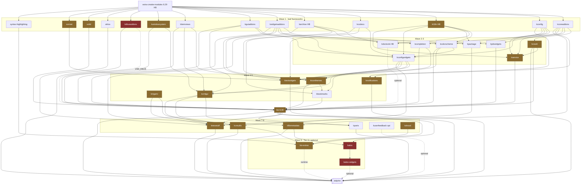

## Dependency Graph & Framework Availability

**Scope of evidence.** Everything below is grounded in the three local checkouts. Repos are abbreviated **D** = `upstream/dolphin` (v26.11.70, commit `5e457ee9`), **K** = `upstream/kio` (KF `6.30.0`, dep floor `6.29.0`), **X** = `upstream/kio-extras` (v26.11.70). Claims about KF6 modules I do **not** have checked out (KCMUtils, KNewStuff, KXmlGui, Sonnet, …) are marked **[inferred]** and are reasoned from KF6 6.x layering + the `.kde-ci.yml` manifests I did read; treat those edges as ~90% confidence, not as read evidence.

---

### 1. Direct dependencies declared by Dolphin

#### 1.1 Qt 6 modules

| Qt6 module | Req/Opt | Declared at | What needs it |
|---|---|---|---|
| `Core` | REQUIRED | `CMakeLists.txt:57-63` | everything |
| `Gui` | REQUIRED | `CMakeLists.txt:57-63` | `dolphinprivate` (`src/CMakeLists.txt:222`) |
| `Widgets` | REQUIRED | `CMakeLists.txt:57-63` | `dolphinvcs` (`src/CMakeLists.txt:34`) |
| `Concurrent` | REQUIRED | `CMakeLists.txt:57-63` | `dolphinprivate` (`src/CMakeLists.txt:220`); `kitemviews/private/kdirectorycontentscounter.cpp` |
| `DBus` | **REQUIRED** | `CMakeLists.txt:57-63` | `src/dbusinterface.cpp`, `src/CMakeLists.txt:477-480` (`qt_generate_dbus_interface`, 3× `qt_add_dbus_*`), `panels/terminal/terminalpanel.cpp:43` (KIOFuse) |
| `GuiPrivate` | **REQUIRED when Qt ≥ 6.10** | `CMakeLists.txt:65-67` | `find_package(Qt6GuiPrivate … REQUIRED)`. Only *linked* under `HAVE_X11` (`src/CMakeLists.txt:543-545`), but the `find_package` is unconditional. **KIOWidgets links it unconditionally** (`K src/widgets/CMakeLists.txt:130`). |
| `Multimedia`, `MultimediaWidgets` | REQUIRED **iff** Baloo found | `CMakeLists.txt:144-147` | `panels/information/mediawidget.cpp` |
| `Test` | test-only | `src/tests/CMakeLists.txt:7` | 21 `ecm_add_test` targets |
| `Xml`, `Network` | transitive via KIO | `K CMakeLists.txt:99` | `davjob.cpp` (QDom) |
| `Svg` | transitive via kio-extras | `X CMakeLists.txt:38` | svg thumbnailer |
| `Qml/Quick` | transitive **[inferred]** | via KCMUtils / KNewStuff / Kirigami | see §2 |

> Qt 6.11.1 satisfies every floor: Dolphin wants ≥ 6.4 (`D CMakeLists.txt:14`), **KIO wants ≥ 6.9.0** (`K CMakeLists.txt:98`), kio-extras ≥ 6.5 (`X CMakeLists.txt:10`).

#### 1.2 KF6 frameworks — REQUIRED block (`D CMakeLists.txt:73-94`)

| KF6 component | Consuming files (evidence) |
|---|---|
| `KCMUtils` | `settings/kcm/kcmdolphingeneral.h:10`, `kcmdolphinviewmodes.h:10`, `kcmdolphinnavigation.h:10` (`#include <KCModule>`); `settings/trash/trashsettingspage.cpp:9-10,18` (`KCModuleLoader::loadModule(KPluginMetaData("kcm_trash"))`) |
| `NewStuff` | **exactly one call site**: `settings/contextmenu/contextmenusettingspage.cpp:24,67` (`KNSWidgets::Button`). Linked as `KF6::NewStuffWidgets` (`src/CMakeLists.txt:232`) |
| `CoreAddons` | `src/CMakeLists.txt:488`; `KPluginFactory` in `dolphinpart.cpp:31`, `itemactions/*.cpp`, `views/versioncontrol/versioncontrolobserver.cpp:16` |
| `I18n` | 5 link sites; every `i18n()` call in the tree |
| `DBusAddons` | `src/main.cpp:24,184,186,234` (`KDBusService`); `src/CMakeLists.txt:491` |
| `Bookmarks` | linked as `KF6::BookmarksWidgets` (`src/CMakeLists.txt:493`); `dolphinbookmarkhandler.cpp` |
| `Config` | linked as `KF6::ConfigCore` (`src/CMakeLists.txt:231`); 8× `kconfig_add_kcfg_files` (`src/CMakeLists.txt:203-213,441-443,471-475`) |
| `KIO` | 3 libs consumed: `KIOCore`, `KIOWidgets`, `KIOFileWidgets` (`src/CMakeLists.txt:226-228`) — the backbone |
| `Parts` | `src/CMakeLists.txt:233`; `dolphinpart.cpp`, `panels/terminal/terminalpanel.cpp:16,167-170` (`KParts::ReadOnlyPart` from `kf6/parts/konsolepart`) |
| `Solid` | `panels/places/placespanel.cpp:31,189-265`, `statusbar/mountpointobservercache.cpp:13-14,47-48`, `trash/dolphintrash.cpp`, `userfeedback/placesdatasource.cpp` |
| `IconThemes` | `src/CMakeLists.txt:225`; `main.cpp:73` (`KIconTheme::initTheme()`) |
| `Completion` | `src/CMakeLists.txt:229`; `filterbar/filterbar.cpp`, URL navigator |
| `TextWidgets` | `src/CMakeLists.txt:230` |
| `Notifications` | `src/CMakeLists.txt:492`; `trash/dolphintrash.cpp`, `dolphinnavigatorswidgetaction.cpp` |
| `Crash` | `src/CMakeLists.txt:540`; `main.cpp:23,130` |
| `WindowSystem` | `src/CMakeLists.txt:234`; `main.cpp:28,195-197`, `dolphinmainwindow.cpp` (+`KStartupInfo`), `dbusinterface.cpp`, `global.cpp` |
| `WidgetsAddons` | `src/CMakeLists.txt:235` |
| `Codecs` | `src/CMakeLists.txt:236`; `views/dolphinremoteencoding.cpp:20` (`KCharsets`) |
| `GuiAddons` | `src/CMakeLists.txt:224,489` |
| `ColorScheme` | `src/CMakeLists.txt:239`; `dolphinmainwindow.cpp`, `selectionmode/backgroundcolorhelper.cpp`, `admin/bar.cpp`, `filterbar/filterbar.cpp` |
| `FileMetaData` | `find_package` at `CMakeLists.txt:120-125` with **`TYPE REQUIRED`**; `search/dolphinquery.cpp`, `kitemviews/kfileitemmodel.cpp`, `search/selectors/filetypeselector.cpp` |

⚠️ **Undeclared-but-linked:** `KF6::XmlGui` is linked at `D src/CMakeLists.txt:653` and `:668` (the two `kconf_update_bin` helpers) but **never appears in any `find_package(KF6 … COMPONENTS)`**. It only resolves because `KF6PartsConfig.cmake` / `KF6KCMUtilsConfig.cmake` `find_dependency` it **[inferred]**. This is latent build fragility if you ever trim Parts/KCMUtils.

#### 1.3 KF6/other — OPTIONAL

| Component | Type | Declared | Effect if absent |
|---|---|---|---|
| `KF6DocTools` | OPTIONAL | `D CMakeLists.txt:106-108`; used `doc/CMakeLists.txt:9`, `CMakeLists.txt:231-233` | no handbook; also disables `kio_help` worker (`K src/kioworkers/help/CMakeLists.txt:2`) |
| `KF6UserFeedback` | OPTIONAL | `D CMakeLists.txt:96-104` | `HAVE_KUSERFEEDBACK` off → `src/userfeedback/*` and telemetry settings page dropped (`src/CMakeLists.txt:451-462,503-509`) |
| `PackageKitQt6` | RECOMMENDED | `D CMakeLists.txt:110-118` | `HAVE_PACKAGEKIT` off → `dolphinpackageinstaller.cpp`, `servicemenuinstaller.cpp` lose install path |
| `KF6Baloo` + `KF6BalooWidgets` | OPTIONAL (both) | `D CMakeLists.txt:127-150` | `HAVE_BALOO` off → **drops** information panel, tooltips, `kbaloorolesprovider`, Qt Multimedia dep, and 2 tests (`src/CMakeLists.txt:192-201,427-449`, `src/tests/CMakeLists.txt:68-79`) |
| `SeleniumWebDriverATSPI` | OPTIONAL | `appiumtests/CMakeLists.txt:8-17` | irrelevant — `appiumtests` early-returns unless `CMAKE_SYSTEM_NAME MATCHES "Linux"` (`:4-6`) |

---

### 2. Transitive KF6 closure & topological build order

Edges I **read**: KIO's are fully grounded in `K CMakeLists.txt:58-90` and `K KF6KIOConfig.cmake.in`, plus per-target links (`K src/core/CMakeLists.txt:190-200`, `src/gui/CMakeLists.txt:93-105`, `src/widgets/CMakeLists.txt:111-131`, `src/filewidgets/CMakeLists.txt:1,104-116`). Everything else is **[inferred]** from KF6 6.x layering, cross-checked against the CI manifests.

Note `K src/widgets/CMakeLists.txt:127` and `src/filewidgets/CMakeLists.txt:112` link **`KF6::IconWidgets`**, which KIO never `find_package`s — it ships from the same `kiconthemes` source repo as `KF6::IconThemes`, so build ordering is unaffected, but a naive "one CMake package = one repo" script will get this wrong.

#### 2.1 Topologically ordered build list

Waves are parallel-safe internally. **T** = tier (§3). **HB** = already a Homebrew arm64 bottle.

| # | Wave | Source repo (KDE) | Provides (CMake pkgs) | Depends on (KF6 only) | T | HB |
|---|---|---|---|---|---|---|
| 0 | W0 | `extra-cmake-modules` | ECM 6.29.0 | — | 1 | ✅ 6.29.0 |
| 1 | W1 | `kcoreaddons` | KF6CoreAddons | ECM | 1 | ❌ |
| 2 | W1 | `kconfig` | KF6Config (Core/Gui) | ECM | 1 | ❌ |
| 3 | W1 | `ki18n` | KF6I18n | ECM | 2 | ✅ 6.29.0 |
| 4 | W1 | `kcodecs` | KF6Codecs | ECM | 1 | ❌ |
| 5 | W1 | `karchive` | KF6Archive | ECM | 1 | ✅ 6.29.0 |
| 6 | W1 | `kwidgetsaddons` | KF6WidgetsAddons | ECM | 1 | ❌ |
| 7 | W1 | `kguiaddons` | KF6GuiAddons | ECM | 1 | ❌ |
| 8 | W1 | `kitemviews` | KF6ItemViews | ECM | 1 | ❌ |
| 9 | W1 | `kwindowsystem` | KF6WindowSystem | ECM | 2 | ❌ |
| 10 | W1 | `kdbusaddons` | KF6DBusAddons | ECM | **3** | ❌ |
| 11 | W1 | `attica` | KF6Attica | ECM | 1 | ❌ |
| 12 | W1 | `solid` | KF6Solid | ECM | 2 | ❌ (`brew solid` is an **unrelated** 3-D collision lib, v3.5.8) |
| 13 | W1 | `sonnet` | KF6Sonnet | ECM | 2 | ❌ |
| 14 | W1 | `syntax-highlighting` | KF6SyntaxHighlighting | ECM | 1 | ❌ |
| 15 | W2 | `kcrash` | KF6Crash | CoreAddons | 2 | ❌ |
| 16 | W2 | `kcolorscheme` | KF6ColorScheme | Config, GuiAddons, I18n | 1 | ❌ |
| 17 | W2 | `kcompletion` | KF6Completion | Config, WidgetsAddons | 1 | ❌ |
| 18 | W2 | `kjobwidgets` | KF6JobWidgets | CoreAddons, WidgetsAddons | 1 | ❌ |
| 19 | W2 | `kdoctools` | KF6DocTools | Archive, I18n | 1 | ✅ 6.29.0 |
| 20 | W2 | `kpackage` | KF6Package | Archive, CoreAddons, I18n | 1 | ❌ |
| 21 | W3 | `kconfigwidgets` | KF6ConfigWidgets | Codecs, Config, ColorScheme, GuiAddons, I18n, WidgetsAddons | 1 | ❌ |
| 22 | W3 | `kservice` | KF6Service | Config, CoreAddons, Crash, I18n | 2 | ❌ |
| 23 | W4 | `kiconthemes` | KF6IconThemes, **KF6IconWidgets** | Archive, ColorScheme, ConfigWidgets, I18n, ItemViews, WidgetsAddons | 2 | ❌ |
| 24 | W4 | `ktextwidgets` | KF6TextWidgets | Completion, ConfigWidgets, I18n, WidgetsAddons, **Sonnet**, Codecs | 2 | ❌ |
| 25 | W4 | `knotifications` | KF6Notifications | Config, CoreAddons | 2 | ❌ |
| 26 | W4 | `kirigami` | KF6Kirigami / KirigamiPlatform | (Qt Quick, qtsvg) | 2 | ❌ |
| 27 | W5 | `kbookmarks` | KF6Bookmarks, KF6BookmarksWidgets | Codecs, Config, ConfigWidgets, CoreAddons, IconThemes, WidgetsAddons | 1 | ❌ |
| 28 | W5 | `kxmlgui` | KF6XmlGui | Config, ConfigWidgets, CoreAddons, GuiAddons, I18n, IconThemes, ItemViews, WidgetsAddons, WindowSystem | 2 | ❌ |
| 29 | **W6** | **`kio`** | KF6KIO (Core/Gui/Widgets/FileWidgets) | Bookmarks, ColorScheme, Completion, Config, CoreAddons, Crash, GuiAddons, I18n, IconThemes, ItemViews, JobWidgets, Service, Solid, WidgetsAddons, WindowSystem, DocTools*, DBusAddons† | 2 | ❌ |
| 30 | W7 | `kparts` | KF6Parts | KIO, XmlGui, JobWidgets, I18n, Config, CoreAddons, Service, WidgetsAddons | 1 | ❌ |
| 31 | W7 | `kcmutils` | KF6KCMUtils | ConfigWidgets, CoreAddons, I18n, ItemViews, GuiAddons, XmlGui, **Kirigami/Qt Quick** | 2 | ❌ |
| 32 | W7 | `kfilemetadata` | KF6FileMetaData | Archive, CoreAddons, I18n (+ exiv2/taglib/poppler/ffmpeg optional) | 2 | ❌ |
| 33 | W8 | `knewstuff` | KF6NewStuff{Core,Widgets,Quick} | Attica, Archive, Config, CoreAddons, I18n, **KIO**, Kirigami, Package, Service, WidgetsAddons, XmlGui | 2 | ❌ |
| 34 | W8 | `kuserfeedback` *(opt)* | KF6UserFeedback | (Qt Widgets/Qml/Charts) | 1 | ❌ |
| 35 | W8 | `kdnssd` *(smb only)* | KF6DNSSD | ECM | 2 | ❌ |
| 36 | W9 | `baloo` *(opt)* | KF6Baloo | CoreAddons, Config, I18n, **KIO**, FileMetaData, IdleTime, Crash + **LMDB** | **3** | ❌ |
| 37 | W9 | `baloo-widgets` *(opt)* | KF6BalooWidgets | Baloo, KIO, FileMetaData | **3** | ❌ |
| 38 | W9 | `kio-extras` *(opt)* | workers | KIO, Archive, Config, CoreAddons, I18n, Solid, SyntaxHighlighting, KCMUtils (+DNSSD, DocTools) | 2/3 | ❌ |
| 39 | W10 | **`dolphin`** | — | all of the above | — | — |

\* `KF6DocTools` optional in KIO (`K CMakeLists.txt:62,93-96`). † `KF6DBusAddons` only when `USE_DBUS=ON` (`K CMakeLists.txt:113-114`) — **defaults OFF on Apple** (`K CMakeLists.txt:107-111`), but Dolphin itself hard-requires it (`D CMakeLists.txt:73,79`).

Also required outside KF6: `breeze-icons` (runtime icon theme; `D src/main.cpp:73` `KIconTheme::initTheme()`), and `breeze` widget style, which `D src/main.cpp:88-90` explicitly requests **on macOS specifically**:
```cpp
#if defined(Q_OS_MACOS) || defined(Q_OS_WIN)
    QApplication::setStyle(QStringLiteral("breeze"));
#endif
```

#### 2.2 Dependency graph



---

### 3. Tier classification

**Tier 1 — portable, pure Qt, no expected macOS work (16):**
`extra-cmake-modules`, `kcoreaddons`, `kconfig`, `kcodecs`, `karchive`, `kwidgetsaddons`, `kguiaddons`, `kitemviews`, `attica`, `kcolorscheme`, `kcompletion`, `kjobwidgets`, `kdoctools`, `kpackage`, `kconfigwidgets`, `kbookmarks`, `syntax-highlighting`, `kparts`, `kuserfeedback`.
Justification: none of these have `if(APPLE)` / X11 / D-Bus code paths reachable in the default configuration, and four of them (`extra-cmake-modules`, `karchive`, `ki18n`, `kdoctools`) already ship **as arm64 Homebrew bottles built against `qtbase` 6.11.1** — direct proof the toolchain works.

**Tier 2 — builds, but Linux-leaning runtime behaviour:**

| Framework | Why Tier 2 |
|---|---|
| `ki18n` | needs external `gettext` + `iso-codes` at build/runtime (Homebrew `ki18n` formula deps are exactly `gettext, iso-codes, qtbase, qtdeclarative`). macOS has no glibc `libintl`; catalogs resolve via `XDG_DATA_DIRS`, which does not exist on macOS. |
| `kwindowsystem` | on macOS this is largely a stub: `D src/main.cpp:195-197` branches only on `isPlatformWayland()`/`isPlatformX11()` — both false on macOS, so the window-activation path silently no-ops. |
| `solid` | needs the IOKit/DiskArbitration backend rather than udev/UDisks2. `D panels/places/placespanel.cpp:211-265` drives mount/unmount through `Solid::StorageAccess`; correctness on macOS is unverified. |
| `kcrash` | its Linux path hands off to DrKonqi/coredumpd; on macOS it must fall back to the plain handler. Called unconditionally at `D src/main.cpp:130`. |
| `kservice` | KSycoca DB build depends on `.desktop` files under XDG dirs; on macOS there is no system `applications/` tree. Required by KIOCore (`K src/core/CMakeLists.txt:199`). |
| `kiconthemes` | resolves icons via XDG icon theme spec; without a bundled `breeze-icons` resource `KIconTheme::initTheme()` (`D src/main.cpp:73`) yields a blank UI. |
| `sonnet` / `ktextwidgets` | Sonnet needs a spell backend; on macOS that means the NSSpellChecker plugin, not hunspell. |
| `knotifications` | Linux backend is the FDO `org.freedesktop.Notifications` D-Bus service; macOS needs the UNUserNotification path, which requires the binary to live in a signed `.app`. |
| `kxmlgui` | Linux integrates `kglobalaccel`; menu-merging semantics (`KActionCollection`, used in `D dolphinmainwindow.cpp`, `dolphinpart.cpp`, `dolphinremoveaction.cpp`, `dolphinbookmarkhandler.cpp`) collide with the macOS global menu bar. |
| `kirigami` / `kcmutils` | pulls the whole `qtdeclarative` + Qt Quick stack for **three** `KCModule` subclasses (`D settings/kcm/*.h:10`) and one `KCModuleLoader` call (`D settings/trash/trashsettingspage.cpp:18`). Builds, but is a large, QML-heavy detour. |
| `knewstuff` | drags in Attica + KPackage + Kirigami + a second copy of KIO's plugin machinery for **one button** (`D settings/contextmenu/contextmenusettingspage.cpp:24,67`). "Get New Service Menus" is meaningless on macOS anyway. |
| `kfilemetadata` | `TYPE REQUIRED` (`D CMakeLists.txt:120-125`); its extractors optionally want exiv2/taglib/poppler/ffmpeg — all Homebrew-available (§5). |
| `kdnssd` | needed only for `kio_smb` (`X CMakeLists.txt:231`). Its KF6 backend is Avahi-oriented; a macOS mDNSResponder backend is not something I could verify. **Open question.** |
| **`kio` itself** | *already macOS-aware*: `K CMakeLists.txt:107-111` sets `USE_DBUS_DEFAULT OFF` on Apple; `K src/kiod/CMakeLists.txt:9-12,33-36` compiles `kiod_agent.mm` and links `-framework AppKit -framework CoreFoundation`; `K src/kioworkers/trash/CMakeLists.txt:60-62` links `-framework DiskArbitration -framework CoreFoundation`. But with `USE_DBUS=OFF`, `K src/CMakeLists.txt:8-11,23-26,33-35` **drops** `kiod`, `kssld`, `kpasswdserver`, `kioexec` and the Designer plugin, and `K src/kioworkers/remote/CMakeLists.txt:1` drops `remote:/`. |
| `kio-extras` | see §4 — no macOS CI at all. |

**Tier 3 — genuinely Linux/Plasma-specific, needs real work or must be cut:**

| Framework | Why Tier 3 |
|---|---|
| `kdbusaddons` | It is `REQUIRED` for Dolphin (`D CMakeLists.txt:79`) and `KDBusService` is constructed unconditionally in three branches of `D src/main.cpp:184,186,234`. With no session bus on macOS, this framework has no useful backend. KIO already treats D-Bus as optional-off on Apple; **Dolphin does not**. This is the single sharpest asymmetry in the graph. |
| `baloo` | needs LMDB, Linux inotify-based `baloo_file` indexer, D-Bus IPC, and `KIdleTime`. **Dolphin's own CI agrees**: `D .kde-ci.yml:30-34` requires `frameworks/baloo` and `libraries/baloo-widgets` **only** `on: ['Linux/Qt6','Linux/Qt6Next','FreeBSD/Qt6']` — deliberately excluded from `macOS/Qt6`. |
| `baloo-widgets` | same block, same exclusion. |
| `packagekit-qt` | same `D .kde-ci.yml:30-34` Linux/FreeBSD-only block; PackageKit is a Linux daemon with no macOS equivalent. **No Homebrew formula exists** (`brew search packagekit` → only `packetq`, `packages`). |
| *(not a framework)* `konsolepart` | `D panels/terminal/terminalpanel.cpp:167-170` loads `kf6/parts/konsolepart`. Konsole is not in the closure and not in `.kde-ci.yml`; `HAVE_TERMINAL` is TRUE on any non-Windows platform (`D CMakeLists.txt:153-157`), so the terminal panel *compiles* on macOS and *always* fails to load at runtime. |

---

### 4. KDE macOS CI / Craft coverage (read from the checkouts)

| Repo | `.kde-ci.yml` declares macOS? | `.gitlab-ci.yml` actually runs a macOS job? |
|---|---|---|
| **dolphin** | **Yes** — `'on': ['Linux/Qt6','Linux/Qt6Next','FreeBSD/Qt6','Windows/Qt6','macOS/Qt6']` (`D .kde-ci.yml:5`), covering 22 frameworks (`:7-28`) | **No.** `D .gitlab-ci.yml:5-19` includes `linux-qt6`, `linux-qt6-next`, `freebsd-qt6`, `windows-qt6`, `flatpak`, `craft-windows-x86-64-qt6` + lint templates. **There is no `macos-qt6.yml` and no `craft-macos-*` include.** |
| **kio** | **Yes** — `'on': ['Linux','FreeBSD','Windows','macOS','Android']` for 17 frameworks (`K .kde-ci.yml:4-22`), plus `kcrash`+`kdoctools` on macOS (`:24-28`). Note `kdbusaddons` and `kwallet` are **Linux/FreeBSD only** (`:30-34`). | **No.** `K .gitlab-ci.yml:5-14` = linux-qt6, linux-qt6-next, android-qt6, freebsd-qt6, windows-qt6, cppcheck, lints. No macOS. |
| **kio-extras** | **No.** `X .kde-ci.yml:6` = `['Linux','FreeBSD','Windows']` only. | **No.** `X .gitlab-ci.yml:5-9` = linux/linux-next/freebsd/windows. |

**Three conclusions:**

1. Dolphin's `.kde-ci.yml` *declares* a macOS dependency set — which is exactly the Tier 1+2 list minus Baloo/PackageKit — but **no CI pipeline consumes it**. The macOS lines are aspirational metadata, not a green build.
2. **Inconsistency worth flagging:** `D .kde-ci.yml:36-38` requires `network/kio-extras` on `macOS/Qt6`, but `X .kde-ci.yml` has no macOS target at all. Dolphin's macOS manifest depends on a repo that KDE does not test on macOS.
3. **KDE Craft**: the *only* Craft template in these repos is `craft-windows-x86-64-qt6.yml` (`D .gitlab-ci.yml:13`). There is no `craft-macos-arm64-qt6` include anywhere. Craft *does* have macOS blueprints upstream (and KDE ships Craft-built macOS bundles for e.g. Kdenlive, which is present in Homebrew as a **cask**, `kdenlive 26.04.3`), but **Dolphin is not among the Craft-built macOS apps** on the evidence in this tree. Any Craft-based path would be blazing a trail, not following one.

**Homebrew's KF6 coverage (measured, not assumed).** The brief says Homebrew has no kf6 formulae; that is *almost* right. I checked 56 candidate names via `brew info --json=v2`:

| Formula | Version | arm64 bottle | Deps |
|---|---|---|---|
| `extra-cmake-modules` | 6.29.0 | ✅ | — |
| `karchive` | 6.29.0 | ✅ `arm64_tahoe` | `openssl@3, qtbase, xz, zstd` |
| `ki18n` | 6.29.0 | ✅ `arm64_tahoe` | `gettext, iso-codes, qtbase, qtdeclarative` |
| `kdoctools` | 6.29.0 | ✅ `arm64_tahoe` | `docbook-xsl, karchive, qtbase` |
| `threadweaver` | 6.29.0 | ✅ `arm64_tahoe` | `qtbase` (not in Dolphin's closure) |

All 51 others (`kcoreaddons`, `kconfig`, `kio`, `kservice`, `kcrash`, `kwidgetsaddons`, `kguiaddons`, `kcodecs`, `kitemviews`, `kcompletion`, `kjobwidgets`, `kbookmarks`, `kiconthemes`, `kwindowsystem`, `kparts`, `kxmlgui`, `kconfigwidgets`, `kcolorscheme`, `knotifications`, `kdbusaddons`, `kcmutils`, `knewstuff`, `ktextwidgets`, `kfilemetadata`, `baloo`, `kpackage`, `kirigami`, `syntax-highlighting`, `attica`, `sonnet`, `kdnssd`, `kuserfeedback`, `breeze-icons`, …) → **NONE**.

⚠️ **Trap:** `brew info solid` resolves to *"Collision detection library for geometric objects in 3D space"* v3.5.8 (`github.com/dtecta/solid3`). It is **not** KF6 Solid. Any script that naively `brew install`s framework names will silently install the wrong package.

✅ **Good news for a hybrid:** Homebrew's `qt` 6.11.1 is now a **meta-formula** depending on 38 split formulae including `qtbase 6.11.1`, `qtdeclarative 6.11.1`, `qtsvg`, `qtmultimedia`, `qttools`. The four KF6 bottles link `qtbase` — *the same* `qtbase` — so mixing Homebrew KF6 bottles with a source-built KF6 stack does **not** produce two Qt installs.

---

### 5. Non-KF6 third-party dependencies

| Dep | Needed for | Declared at | Homebrew formula | Available (arm64)? | Notes |
|---|---|---|---|---|---|
| Qt 6 | everything | `D CMakeLists.txt:57` | `qt` / `qtbase` | ✅ 6.11.1, `arm64_tahoe` | meta-formula → split modules; KIO floor is 6.9.0 (`K:98`) |
| ECM | build system | `D CMakeLists.txt:23` | `extra-cmake-modules` | ✅ 6.29.0 | exactly meets KIO's `find_package(ECM 6.29.0)` (`K:9`) — **no headroom** |
| gettext + iso-codes | KI18n | Homebrew `ki18n` deps | `gettext`, `iso-codes` | ✅ 1.0 / ⚠️ 4.20.1 **no bottle** | `iso-codes` builds from source (fast, but not a bottle) |
| libxml2 / libxslt / docbook-xsl | KDocTools | `D CMakeLists.txt:106` | `libxml2`,`libxslt`,`docbook-xsl` | ✅ 2.15.3 / 1.1.45 / 1.79.2 | or just take the `kdoctools` bottle |
| **libssh** | `kio_sftp` | `X CMakeLists.txt:122`, `X sftp/CMakeLists.txt:52` | `libssh` | ✅ **0.12.2** | floor is 0.9.8 ✅; `check_symbol_exists(sftp_aio_begin_read)` at `X sftp/CMakeLists.txt:7` will pass on 0.12 → `HAVE_SFTP_AIO` |
| **QCoro6** | `kio_sftp` (hard req when libssh found) | `X CMakeLists.txt:208` | `qcoro6` | ✅ **0.13.0**, `arm64_tahoe` | deps `qtbase, qtdeclarative, qtwebsockets` |
| **libsmbclient / samba** | `kio_smb` | `X CMakeLists.txt:114`, `X cmake/FindSamba.cmake:23-25` | `samba` | ⚠️ 4.24.6 bottle exists | `FindSamba` needs `libsmbclient.h` + `smbc_set_context` + `smbc_option_set` (`X CMakeLists.txt:112-113`). Whether the Homebrew bottle ships `libsmbclient.h`/`libsmbclient.dylib` is **unverified — open question.** Moot in practice: see below. |
| **KDSoapWSDiscoveryClient** | `kio_smb` | `X smb/CMakeLists.txt:6` (`REQUIRED`) | — | ❌ **no `kdsoap` formula** | plus upstream `kdsoap-ws-discovery-client`; `X .kde-ci.yml:26-31` marks it Linux/FreeBSD-only |
| **exiv2** | KFileMetaData / `KExiv2Qt6` jpeg thumbs | `X thumbnail/CMakeLists.txt:45-50,127-128` | `exiv2` | ✅ 0.28.8 | `KExiv2Qt6` itself is `graphics/libkexiv2` (`X .kde-ci.yml:22`) — **another from-source KDE repo** |
| **taglib** | audio thumbnails | `X thumbnail/CMakeLists.txt:39,285-293` | `taglib` | ⚠️ 2.3.1 | CMake asks for `find_package(Taglib 1.11)`; Homebrew ships **2.x**. `FindTaglib.cmake` is not in `X cmake/` → comes from ECM. Version-compat **open question**; `taglib@1` does not exist. |
| **OpenEXR** | EXR thumbnails | `X thumbnail/CMakeLists.txt:9-18,184-211` | `openexr` (+`imath`) | ✅ 3.4.14 / 3.2.2 | `find_package(OpenEXR 3.0 CONFIG)` matches |
| **poppler** | PDF thumbs (via KFileMetaData / kdegraphics-thumbnailers) | **not in this kio-extras tree** | `poppler-qt6` | ✅ 26.08.0 (keg-only) | PDF/video thumbnailers moved to `kdegraphics-thumbnailers` / `ffmpegthumbs` — separate repos, not in the local closure |
| **ffmpeg** | video thumbs (`ffmpegthumbs`) | **not in this kio-extras tree** | `ffmpeg` | ✅ 9.0.1 | same — separate repo |
| **libmtp** | `kio_mtp` | `X CMakeLists.txt:129` | `libmtp` | ✅ 1.1.23 | but gated `Libmtp_FOUND AND USE_DBUS` (`X:217`) → **dead on macOS** |
| **libimobiledevice + libplist** | `kio_afc` (Apple File Conduit!) | `X CMakeLists.txt:134,141` | `libimobiledevice`, `libplist` | ✅ 1.4.0 / 2.7.0 | **not** D-Bus gated (`X:234-236`) — the one kio-extras worker that is *more* relevant on macOS than Linux |
| gperf | `kio_man` | `X CMakeLists.txt:180` | `gperf` | ✅ 3.3 | UNIX-only branch, fine |
| TIRPC | `kio_nfs` | `X CMakeLists.txt:185` | — | ❌ | macOS has RPC in libc; `FindTIRPC` will likely fail → no NFS worker |
| shared-mime-info | KIO mimetype DB (runtime) | — | `shared-mime-info` | ✅ 2.5.1 | Qt's `QMimeDatabase` needs the compiled `mime.cache` |
| dbus | `KDBusService` (`D main.cpp:184`) | `D CMakeLists.txt:62,79` | `dbus` | ✅ 1.16.2 | you would have to **ship and launch a private session bus inside the .app** |
| libappimage | AppImage thumbs | `X thumbnail/CMakeLists.txt:20` | — | ❌ | irrelevant on macOS |
| X11 | XCursor thumbs | `X thumbnail/CMakeLists.txt:28-37` | — | n/a | pass `-DWITHOUT_X11=ON` |
| **PackageKitQt6** | service-menu installer | `D CMakeLists.txt:110-118` | — | ❌ | Linux-only by nature; `HAVE_PACKAGEKIT` stays false |
| LMDB, KIdleTime | Baloo | — | — | n/a | Baloo is Tier 3, out of scope |

#### The kio-extras D-Bus cliff

`X CMakeLists.txt:107-111` sets `USE_DBUS_DEFAULT OFF` on Apple, and then:

| Worker | Gate | Result on macOS default config |
|---|---|---|
| `sftp` | `if (libssh_FOUND)` (`X:207`) | ✅ builds |
| `afc` | `if(IMobileDevice_FOUND AND PList_FOUND)` (`X:234`) | ✅ builds |
| `thumbnail`, `archive`, `filter`, `info`, `fish`, `man` | ungated (or gperf-gated) | ✅ builds |
| **`smb`** | `if(SAMBA_FOUND AND USE_DBUS)` (`X:230`) | ❌ **never built** |
| **`mtp`** | `if (Libmtp_FOUND AND USE_DBUS)` (`X:217`) | ❌ never built |
| `filenamesearch` | `if (NOT WIN32 AND NOT APPLE AND USE_DBUS)` (`X:213`) | ❌ explicitly excluded on Apple |
| `activities`, `recentlyused` | `if (NOT WIN32 AND USE_DBUS)` (`X:96`) | ❌ never built |

So **SMB network browsing does not exist on macOS today** without either forcing `USE_DBUS=ON` (which then also demands `kdbusaddons`, `kdnssd`, and the unavailable `KDSoapWSDiscoveryClient`) or patching the gate.

---

### 6. Recommendation: **manual CMake superbuild (`ExternalProject`) with a Homebrew-supplied base layer**

**Recommended: a hybrid — Homebrew for Qt + ECM + all leaf C libraries + the four existing KF6 bottles; a single pinned `ExternalProject_Add` superbuild for the ~26 KF6 frameworks that Homebrew lacks, installed into one private prefix.**

Rejected alternatives:

- **KDE Craft.** Craft's macOS blueprints exist upstream, but the evidence in-tree is discouraging: the only Craft template referenced anywhere is `craft-windows-x86-64-qt6.yml` (`D .gitlab-ci.yml:13`), and neither `kio` nor `kio-extras` has *any* macOS pipeline. Craft would also duplicate Qt 6.11.1 (it builds its own), giving you two Qt stacks on disk and a real risk of mixed-Qt link errors when you also need Homebrew-only libs (`libssh`, `qcoro6`, `libimobiledevice`). Craft's patch story is a per-blueprint `patch()` in Python — workable, but it puts your local Dolphin/KIO patches inside a foreign build system rather than beside your source. Its one genuine advantage — `craft --package` producing a signed `.dmg` — is a Phase-4 concern you can reach with `macdeployqt` + a `BundleUtilities`/`install_name_tool` pass.
- **Pure Homebrew.** Non-starter: 51 of 56 frameworks are missing, and writing that many formulae (in a tap, with bottles) is more work than the superbuild while giving you *less* patch control (`brew edit` diffs are not reviewable artifacts).
- **Pure from-source everything.** Wasteful: Homebrew already gives you arm64 bottles for `qtbase 6.11.1`, `extra-cmake-modules 6.29.0`, `karchive/ki18n/kdoctools 6.29.0`, `libssh 0.12.2`, `qcoro6 0.13.0`, `exiv2`, `taglib`, `openexr`, `libimobiledevice`, `libplist`, `shared-mime-info`, `dbus`. Rebuilding those buys nothing.

**Why the hybrid wins on each axis:**

| Axis | Verdict |
|---|---|
| Reproducibility | Each `ExternalProject_Add` pins an exact git tag (`v6.29.0`). Homebrew side pins via a checked-in `Brewfile.lock.json`. Both are diffable text in *your* repo. |
| arm64 support | Every formula I checked has an `arm64_tahoe` bottle (only `iso-codes` lacks one). Source builds inherit `CMAKE_OSX_ARCHITECTURES=arm64` from one toolchain file. |
| App-bundle packaging | You control `CMAKE_INSTALL_PREFIX` and `CMAKE_INSTALL_RPATH` for all 26 frameworks from day one, so `@rpath/…` is correct *before* `macdeployqt` runs. Craft and Homebrew both fight you here (Homebrew hardcodes `/opt/homebrew` install names). |
| Contributor onboarding | `brew bundle && cmake --preset macos && cmake --build --preset macos`. No Craft bootstrap, no Python environment. |
| **Carrying local patches** | Decisive. You will need patches — at minimum to make `KDBusService` conditional in `D src/main.cpp:184-234`, to add `KF6XmlGui` to `D CMakeLists.txt:73-94`, and to un-gate `kio_smb` from `USE_DBUS` (`X CMakeLists.txt:230`). With `ExternalProject_Add(… PATCH_COMMAND git apply ${CMAKE_SOURCE_DIR}/patches/kio-0001-*.patch)`, every patch is a reviewable file in your repo that rebases cleanly against a pinned tag and can be submitted upstream verbatim. |

**Concrete shape:**

```
third_party/
  superbuild/CMakeLists.txt       # ExternalProject_Add × 26, DEPENDS = §2.1 wave order
  versions.cmake                  # KF6_TAG "v6.29.0"  (>= KIO's KF_DEP_VERSION, K:4)
  patches/{kio,dolphin,kio-extras}/*.patch
Brewfile                          # qt extra-cmake-modules libssh qcoro6 exiv2 taglib
                                  # openexr libimobiledevice libplist shared-mime-info
                                  # gettext iso-codes docbook-xsl gperf dbus
toolchain-macos-arm64.cmake       # CMAKE_OSX_ARCHITECTURES=arm64, CMAKE_PREFIX_PATH=$(brew --prefix);$KF6_PREFIX
```

**Phase-0 build ladder (start narrow, prove the toolchain, then widen):**

1. `-DKIOCORE_ONLY=ON` (`K CMakeLists.txt:40`) — this needs only waves 1–3 (CoreAddons, Config, I18n, Codecs, Archive, Crash, Service, Solid). ~8 frameworks. Fastest possible "KIO listing a directory on macOS" proof.
2. Drop to full KIO (`USE_DBUS=OFF`, the Apple default at `K:107-111`) — adds waves 4–6, ~20 frameworks.
3. Add Dolphin with `KCMUtils`/`NewStuff` **patched out** (3 `KCModule` subclasses + 1 `KNSWidgets::Button`) — this removes Kirigami, KPackage, Attica and the entire `qtdeclarative`/Qt Quick branch from the graph, cutting ~5 frameworks and a very large build.
4. Only then reconsider KCMUtils/KNewStuff/Baloo, if the AppKit shell still wants them.

Pin the whole KF6 stack at **6.29.0 or newer** — non-negotiable, because `K CMakeLists.txt:4` sets `KF_DEP_VERSION 6.29.0` and `K:9` requires `ECM 6.29.0`. Homebrew's ECM is exactly 6.29.0, with zero headroom: if Homebrew ships ECM 6.30 before you pin KF6 to 6.30, nothing breaks, but the reverse (Homebrew rolls back, or you pin KF6 above the Homebrew ECM) does.
