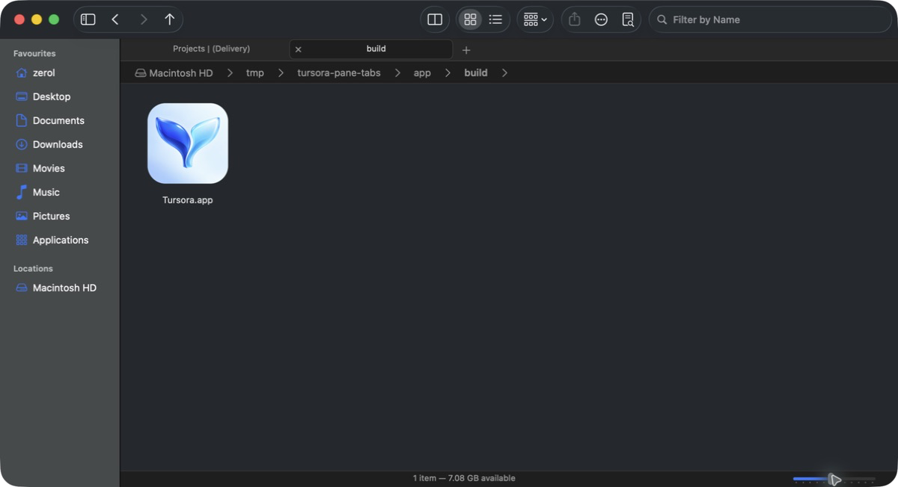

# The square edge on the app icon

A screenshot from the user shows the app icon with an abrupt square outer edge; the outer corners of the older local PNG / ICNS are opaque pixels too. That is the direct basis for this round's fix. The old prompt filled the whole square canvas with background and assumed the system would clip the rounded corners afterwards; that cannot serve as the delivery rule for the `.icns` we currently package by hand.

## The pipeline and the fix

Tursora uses `CFBundleIconFile` to point at the packaged `AppIcon.icns`. Apple's [Icon Composer documentation](https://developer.apple.com/documentation/Xcode/creating-your-app-icon-using-icon-composer) describes the flow in which layered artwork is brought into Icon Composer / Xcode and that pipeline generates the assets for each platform and appearance. The automatic clipping described there applies to the flow it describes; this app does not use that pipeline, so it cannot be inferred from it that an opaque `.icns` delivered by hand would automatically get the same treatment.

This round keeps the original two-pane fin motif and gradient and moves to a repeatable export:

- `app/Resources/AppIcon-artwork.png` holds the original square artwork, with the foreground's proportion and position unchanged.
- `app/tools/render-icon.swift` uses CoreGraphics to clip a rounded base plate out of a transparent 1024 × 1024 canvas: the rectangle's origin is `(80, 80)`, its width and height are both `864`, it extends to `(944, 944)`, and both corner radii are `192`. The artwork is still drawn across the whole 1024 × 1024 canvas and only the background outside it is clipped; no stroke, shadow or second base layer was added.
- The generated `app/Resources/AppIcon.png` has a transparent outer margin, transparent corner regions and an anti-aliased boundary. The dimensions above are this app's export choice and are not claimed to equal Apple's system mask curve.
- `app/tools/make-icon.sh` re-exports the PNG first, then uses `sips` / `iconutil` to produce the 16–1024 px icon family. `make-app.sh` calls it before the Swift build, so every packaging run regenerates the assets from the artwork and then copies the generated `AppIcon.icns`; the README and the product page use the same transparent PNG.
- The brand, hero and download icons on the product page dropped their rectangular CSS border, `box-shadow` and `border-radius` in favour of a `drop-shadow` that follows the PNG's alpha, so that a transparent export is not given a square frame again by the page's styling.

Two image-generation edits were tried during the fix, but their output left residue along the alpha edge; neither was adopted or added to the release assets. The final assets are generated from the saved artwork and the fixed clipping geometry. The historical prompt is kept in `app/Resources/icon-prompt.txt`, with its outdated automatic-mask assumption clearly marked.

## Verification status

- Done: locating the opaque corner problem in the user's screenshot and in the old icon; checking the current export script and packaging path.
- The final static site build passed: 5 assets, 36 references; the icon was observed at 1280 × 720 on the desktop and at 390 × 844 on a narrow screen, with no extra square frame. After the app screenshots were updated, the page and the image lightbox were checked again: the image proportions are correct, focus returns after closing, and there is no horizontal overflow on a narrow screen.
- Regressions implemented: `IconAssetsSmokeTests` decodes the actual PNG / ICNS and, after normalising the pixel layout, checks the 1024 px dimensions, a transparent outer margin all the way round, transparent corners, an opaque body and its inset extent, and the partial-alpha edge; it also checks each ICNS representation for transparent corners, its centre and its size coverage. The checks do not depend on the in-place bitmap byte order, and they do not treat any particular radius as an immutable product constant.
- Full smoke run: **1,500 checks passing three rounds in a row**, all exit 0 with empty stderr. The logs are at `/private/tmp/tursora-pane-tabs-verification/final/smoke-{1,2,3}.{out,err}`; the source hashes were unchanged after the tests.
- The final release build succeeded, and strict codesign, the Info.plist lint and the consistency check on the embedded ICNS all passed. ICNS SHA-256: `4a3b178240c5c5559ddb59793ab1e27a8c5ab5f0775ace3aa380bfaef621b7b4`.
- On a real machine: opening the app's own `app/build` directory in the packaged app and showing `Tursora.app` in icon view, the path the system actually reads the icon from renders a transparent outer edge and smooth rounded corners, with no old square frame. This observation verifies the icon in the current release package; it does not amount to verifying other installed copies or the Dock's historical cache. The test app has exited, preferences and the directory view store have been restored, and the shared verification lock has been released.

