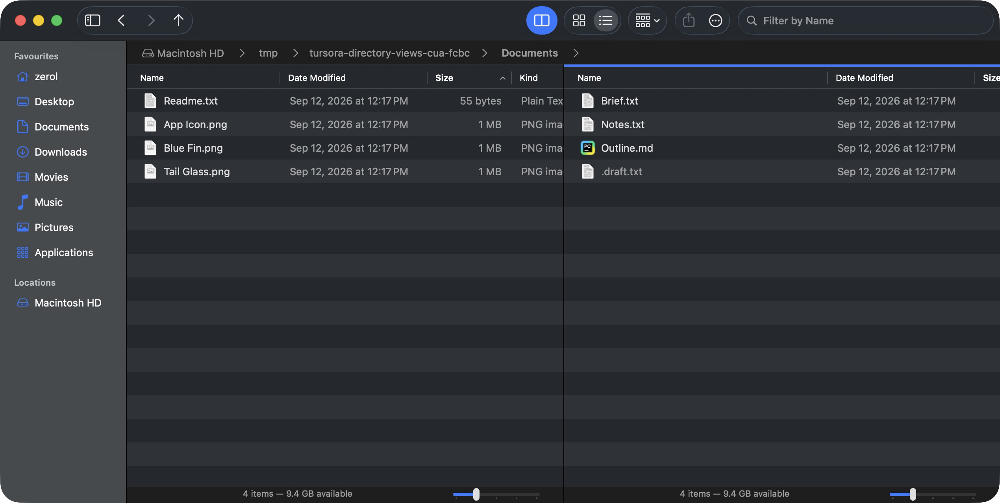

# Per-directory view properties: verification record (2026-09-12)

This record covers the separate branch `codex/directory-view-properties`, based on `fbb6762`; it does not depend on the search or operation-progress PRs. For the Dolphin source pin, the identity policy and the separate adversarial review see the [research record](directory-view-properties.md).

## Automated verification

- `swift build` passes. The new `DirectoryViewPropertiesSmokeTests` first check storage, rebuilding, bad fields and a bad version, then real windows / tabs / splits / menus / settings, a late directory load, a symlink changing target, and the ZIP boundary.
- Before the packaged-app layout fix, the full suite **passed three consecutive rounds with 844 checks**, all three exiting 0 with stderr of 0 bytes. Those stage logs are at `app/build/verification-directory-views/pre-cua-{1,2,3}.{out,err}` in this worktree; generated logs are not under version control.
- Throughout the smoke run, Python holds an exclusive `fcntl.flock` on `/private/tmp/tursora-shared-verification.lock`, and the Tursora preferences are exported before the run and restored after it. In smoke mode the shared view library uses a separate temporary library and never touches the user's Application Support library.
- Exploratory failures do not count towards the three rounds: an ENOTDIR in the enumeration of a symlinked root directory was found and fixed; the old ZIP test was changed to use an explicit default; the old Favorites grouping test now waits for a new pane's first load before setting anything, and switches to the mode actually under test after navigating.
- The separate review fixed a symlink configuration written to the wrong target, filter / selection bleeding across after the target changed, and an autosave failure passing silently. The assertions added for these problems are included in the 844 above.

On a real machine it turned out that when the unified policy changed an old Kind-grouped icon pane into a list, the transitional state expanded the old groups, which shifted the view horizontally and left the Name column out of sight. The fix applies the final model first and mounts the view afterwards, restoring the list's previous horizontal position once the layout is done; dedicated regressions for a narrow split and for deliberate horizontal scrolling were added. After the fix it was rebuilt, and the **full smoke test passed three consecutive rounds with 854 checks**, each exiting 0 with stderr of 0 bytes; the final logs are `app/build/verification-directory-views/final-{1,2,3}.{out,err}` in this worktree. The final release bundle was rebuilt and passed `codesign --verify --deep --strict --verbose=2`; the logs are `release-build.log` and `codesign.log` in the same directory.

## Packaging and the real machine

The final release bundle `app/build/Tursora.app` was used for the on-machine recheck, driven through CUA, with the screenshots saved by the native window numbers of this task's process. The test uses only `/private/tmp/tursora-directory-views-cua-fcbc`, created by this task, and writes no test files into the user's real directories. The same shared exclusive lock is held for the whole recheck; the preferences and the user's view library are backed up first, then restored at the end when the lock is released. Only the processes started by this task are quit (PID 72925 for the final recheck, PID 73531 after the restart).

- **Directory round trip and splits**: Artwork uses Icons, Kind grouping and 128 px icons (slider 5); Documents uses List, Size ascending, list slider 1, and shows `.draft.txt`. Coming back to Artwork restores it as it was; after creating a split and entering Documents, the two sides keep their different settings.
- **Discoverable entry points**: View → Folder View Settings was actually opened, and both Use Current Settings as Default and Restore This Folder to Default were run; the policy selector in Settings also switches between Remember Each Folder and Use One View for All Folders.
- **Unified policy and the layout regression**: after making the Documents style the default and switching to the unified policy, both sides became lists; the Name column is visible on both and the horizontal scroll value is 0 on both sides. Switching back to the per-directory policy restores Artwork to Kind-grouped icons at slider 5, while Documents stays a list.
- **A real restart**: the same release bundle was quit with ⌘Q and started again, Artwork was entered again, then a split was created and Documents entered. Artwork restores the saved icons / grouping / zoom; Documents reads the saved default, since the previous step had restored the folder default, and comes back as List / Size / zoom 1 / hidden files shown. This verifies view persistence and claims nothing about restoring the previous window or tab session.
- **Settings layout**: the policy names and their explanations are fully readable. Both experimental features are off in the README settings screenshot; afterwards the user's original experiment switches and view library were restored.

Per-directory views after the restart:

The Name column stays visible on both sides under the unified policy:

The entry point for directory view settings:

## Known limits

Memory is keyed by normalized path; moving or renaming does not follow the inode, and a change of mount point does not follow the volume UUID. Finder alias bookmarks are not resolved by this feature; a symlink shares the properties of its resolved target. ZIP pages and other explicitly marked virtual pages take only the default plus changes made temporarily during that visit, and cannot write an extraction path into the library. No session restore, recursive apply, or memory of column widths / column order was added. Real remote-volume identity scenarios have not been verified on a real machine.

## Integration with the latest main branch

The initial commit of PR #1 is `eac9ffc`. Main then gained the product page and maintenance tidy-up commit `ae5e47a`; the initial PR could not start CI because of a documentation conflict, so that main-branch commit was merged into this feature branch, keeping the documentation and the historical evidence of both sides. Neither the search nor the operation-progress feature was merged, and remote main was not modified.

A separate read-only review confirmed that cleaning up the always-true parameter of the archive reading helper and deleting the unused constant in PlacesModel do not change the view property logic. The tabs description on the product page was corrected at the same time, to distinguish persisted sorting from the temporary history / selection / filter; the static site build passes, with the 5 assets and 36 references checked.

After the integration, debug, release and strict codesign all passed, and the full smoke test **passed three consecutive rounds with 854 checks** again, each exiting 0 with stderr of 0 bytes. The shared exclusive lock is still used, and the preferences are restored at the end. The logs are `app/build/verification-directory-views/integrated-{1,2,3}.{out,err}`, `integrated-debug-build.log`, `integrated-release-build.log`, `integrated-codesign.log`. The integration did not touch the application's interface code, and the separate review also confirmed that the two model cleanups change no behaviour, so the on-machine operations and the three screenshots from the feature stage above are carried over and the integrated bundle was not driven again. An extra on-machine run that had been queued was cancelled before the shared lock was acquired, so that instance of the application was never started and no user preference was changed.

The [GitHub Build 34683581745](https://github.com/zerolfx/Tursora/actions/runs/34683581745) for integration commit `d309d87` succeeded. The `Tursora-macOS-arm64-4ec50ec818cf7d81f8272dea6ae1d003d5767fbe` artifact of that run (referenced by the PR merge test) was downloaded, and both `shasum -a 256 -c SHA256SUMS.txt` and strict codesign of the unpacked bundle passed; only the artifact was checked — it was not installed, run or released. The CI logs and the downloaded files are kept under the ignored `app/build/verification-directory-views/`.
