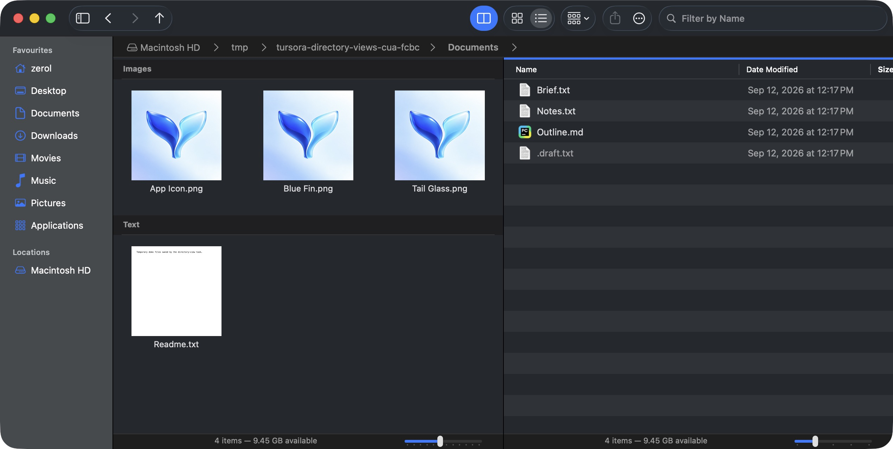
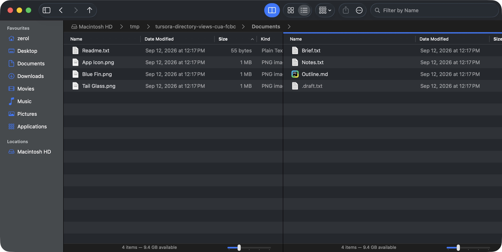

# 每目录视图属性：验证记录（2026-09-12）

本记录对应独立分支 `codex/directory-view-properties`，基线 `fbb6762`；不依赖搜索或操作进度 PR。Dolphin 源码 pin、身份策略和独立对抗性 review 见[研究记录](directory-view-properties.md)。

## 自动验证

- `swift build` 通过。新 `DirectoryViewPropertiesSmokeTests` 先检查存储、重建、坏字段和坏版本，再检查真实窗口 / 标签 / 分栏 / 菜单 / 设置、迟到目录加载、symlink 换目标及 ZIP 边界。
- 实机布局修复前，完整 suite **844 项连续三轮通过**，三轮均 exit 0、stderr 为 0 bytes。这些阶段日志位于本 worktree 的 `app/build/verification-directory-views/pre-cua-{1,2,3}.{out,err}`；生成日志不进入版本控制。
- smoke 全程由 Python 持有 `/private/tmp/tursora-shared-verification.lock` 的排他 `fcntl.flock`，运行前后导出 / 恢复 Tursora 偏好。共享视图库在 smoke 模式使用独立临时库，不接触用户的 Application Support 库。
- 探索失败不计入三轮：发现 symlink 根目录枚举的 ENOTDIR 并修复；旧 ZIP 测试改为使用显式默认；旧 Favorites 分组测试等待新 pane 初次加载后再设置，并在导航后切换实际待测模式。
- 独立 review 修复了错误目标的 symlink 配置写入、目标更换后的过滤 / 选择串入，以及自动保存失败无提示。针对这些问题新增的断言包含在上述 844 项中。

实机发现统一策略将旧 Kind 图标 pane 改为列表时，过渡状态展开旧分组导致横向偏移，Name 列不可见。修复为先应用最终模型，再挂载视图，并在布局后恢复原有列表横向位置；增加窄分栏和主动横向滚动的专项回归。修复后重新构建，**854 项完整 smoke 连续三轮通过**，均 exit 0、stderr 0 bytes；最终日志为本 worktree 的 `app/build/verification-directory-views/final-{1,2,3}.{out,err}`。最终 release 包已重建并通过 `codesign --verify --deep --strict --verbose=2`；日志为同目录的 `release-build.log`、`codesign.log`。

## 打包与实机

使用最终发布包 `app/build/Tursora.app` 完成实机复查，操作通过 CUA，截图通过本任务进程的原生窗口编号保存。测试仅使用本任务创建的 `/private/tmp/tursora-directory-views-cua-fcbc`，不向用户真实目录写测试文件。复查期间持续持有同一共享排他锁；先备份偏好与用户视图库，结束后恢复并释放锁。只退出本任务启动的进程（最终复查 PID 72925，重启后 PID 73531）。

- **目录往返与分栏**：Artwork 使用 Icons、Kind 分组、128 px 图标（滑块 5）；Documents 使用 List、Size 升序、列表滑块 1，并显示 `.draft.txt`。返回 Artwork 后恢复原样；新建分栏并进入 Documents 后，两侧保留不同设置。
- **可发现入口**：实际打开 View → Folder View Settings，执行 Use Current Settings as Default 与 Restore This Folder to Default；Settings 的策略选择器也能切换 Remember Each Folder / Use One View for All Folders。
- **统一策略与布局回归**：将 Documents 样式设为默认后切到统一策略，两侧均成为列表；Name 列都可见，两侧横向滚动条值均为 0。切回逐目录策略后，Artwork 恢复 Kind 图标分组和滑块 5，Documents 保持列表。
- **真实重启**：通过 ⌘Q 退出并重新启动同一发布包，重新进入 Artwork，再创建分栏进入 Documents。Artwork 恢复已保存的图标 / 分组 / 缩放；Documents 在前一步恢复目录默认后读取已保存默认，恢复列表 / Size / 缩放 1 / 隐藏文件。此处验证视图持久化，没有声称恢复上次窗口或标签会话。
- **设置排版**：策略名称和说明完整可读。README 设置截图中的两个实验功能均关闭；完成后恢复用户原有实验开关和视图库。

重启后逐目录视图：

统一策略下两侧 Name 列保持可见：

目录视图设置入口：

## 已知边界

按规范化路径记忆；移动 / 改名不跟随 inode，换挂载点不跟随卷 UUID。Finder alias bookmark 不在本功能解析；symlink 按解析目标共享属性。ZIP 页与其他明确标记的虚拟页只采用默认和当次临时变更，不能把解压路径写入库。没有新增会话恢复、递归应用、列宽 / 列顺序记忆。真实远程卷身份场景没有实机验证。
