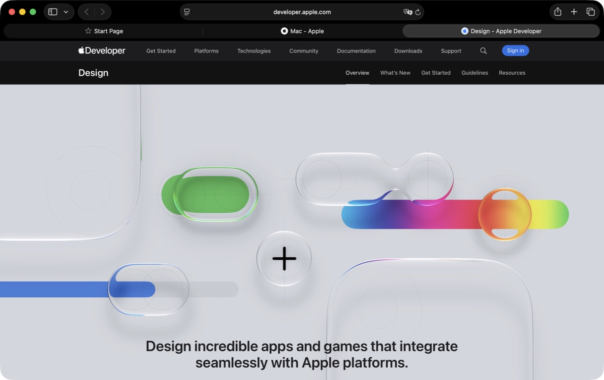

# Tab bar and light / dark appearance

## Apple references and the scope of the evidence

This round takes **Safari's separate tab bar** as the main visual reference. On 2026-09-12 two temporary Apple pages were opened in Safari on this machine, making three tabs together with the original start page, the dark interface was looked at directly, and the temporary tabs were then closed to restore the original page. Observed: the tabs sit below the address toolbar; background tabs share one continuous base strip; the current tab is a soft, capsule-shaped light surface; titles are centred; several tabs divide the available width equally. Safari's control for adding a tab sits in the toolbar above, while Tursora puts it in the tab bar itself, where a file workflow will find it — beside the tabs it adds to while they leave the strip part-empty, and at the right end once they fill it (D79, 2026-09-14; it was always at the right end when this round was written); no claim is made to reproduce Safari's layout or web page tinting exactly.



Finder is a secondary comparison: it also supports `⌘T`, and creating a second tab is enough to show the tab bar. Measured on this machine in dark mode it likewise has a continuous base strip, a lighter current tab and centred titles; closing the temporary tab restored the original window. No size or material parameters of these applications' private controls were obtained.

Apple's own documentation provides references for two further applications:

- [Safari tab settings](https://support.apple.com/en-au/guide/safari/ibrw1045/mac): Separate places the tabs below the toolbar; Compact turns the active tab into the address and search field. Every Tursora pane has its own address bar, so the layered arrangement of the former was adopted.
- [Organising Safari tabs](https://support.apple.com/en-au/guide/safari/ibrwbb6e21e4/mac): when the tabs exceed the visible width they can be scrolled sideways. Tursora keeps a readable width, scrolls once they overflow, and offers a textual menu entry point.
- [Closing Safari tabs](https://support.apple.com/en-gb/guide/safari/ibrwd0cea393/mac) and [system window tabs](https://support.apple.com/en-gb/guide/mac-help/mchla4695cce/mac): the close control appears on hover, which reduces permanent visual noise.
- [Terminal tab settings](https://support.apple.com/en-asia/guide/terminal/trmltab/mac): the title can express the directory, the path and the process, and can also be customised. Tursora carries on the directory / search / split titles and the full-path tooltip.
- [Apple's appearance adaptation guide](https://developer.apple.com/documentation/uikit/supporting-dark-mode-in-your-interface) and [AppKit semantic colours](https://developer.apple.com/documentation/appkit/ui-element-colors): use semantic colours and template images to adapt to the appearance; once converted to a CGColor they have to be re-resolved during the update cycle. The first document sits at a UIKit URL but explicitly includes instructions for AppKit / NSView.

Safari has the dark-mode observation on a real machine described above; the Terminal reference this round is the official documentation. Neither claims to have measured their exact pixel parameters. The new corner radii, spacing and colour blend ratios are Tursora's own design choices.

The Finder wording evidence was checked by extracting read-only resources:

```sh
strings /System/Library/CoreServices/Finder.app/Contents/Resources/Base.lproj/MenuBar.nib
plutil -convert json -o - /System/Library/CoreServices/Finder.app/Contents/Resources/en.lproj/LocalizableMerged.strings
```

The first contains `New Tab`, `Show All Tabs`, `Hide Tab Bar` and `New Window as Tab`; the second has `FR13 = New Tab`, `FV17 = Open in New Tab`, `FV18 = Open in New Tab and Close`, `N151.1 = Open in New Tab` and `N151.2 = Open in New Tabs`. This round does not change the seven Dolphin context-menu strings, and does not call the textual overflow menu a Finder-style thumbnail overview.

## Boundaries of the product description

Tabs themselves are a common capability that Finder and Safari already have, so they are no longer a separate selling point on the README / product page. The technical documentation keeps the shortcut, menu and behaviour descriptions; the product description focuses on workflows such as split panes and a separately editable path per pane.

## Implementation conventions

The tab bar uses a neutral base strip and a soft selected surface; the same amount of space is reserved on either side of the title, and the close button appears on hover without pushing the text around. When there are too many tabs the bar scrolls sideways, selecting a tab brings it into view, and the overflow menu lists every title.

**Revised 2026-09-14 (D79).** A tab used to grow to fill whatever room the strip had, and the new-tab button was always pinned to the trailing edge. A tab now settles at 240 pt, the cap yielding to a title that needs more room up to 480 pt while every tab keeps one width, and the button follows the tabs whenever they leave the strip part-empty. The rail behind the tabs is drawn from the same viewport, so it hugs the tabs too.

The application follows the system light / dark appearance by default and does not write a global appearance preference. Tab drawing resolves semantic colours live; the completion panel, the active pane indicator line and the transfer task cards also refresh their layer colours when the appearance changes. The split title keeps both names in physical order with no parentheses added for the inactive side; the active side is expressed by the pane indicator line. **Revised 2026-09-14 (D78):** the two names were one string joined by a `|` character until the owner asked for a real divider; they are now two fields with a hairline drawn between them down the height of the tab. `TabTitle.plain` still produces `Left | Right` for the Rename Tab sheet and the All Tabs menu, which is why the strings quoted below are unchanged; the tab tooltip was always built from the panes' paths and is untouched. Filtering, grouping, dragging and the seven tab context-menu actions are kept. Every Reveal in Finder entry point is removed from the file area and the sidebar; the existing Reveal in Enclosing Folder in search results still navigates inside Tursora.

## Verification status

In the screenshot stage of this round, before the Dock work and the later input-method adjustments, the full smoke over the combined sources **passed three rounds in a row with 2,024 checks per round**, all three with exit 0 and empty stderr. That figure is the total for the combined suite, this topic included; the earlier three-round result of 1,500 checks represents the previous stage only, and the final result for the later Dock / input-method stage is in the [Dock research record](dock-menu.md).

`TabAppearanceSmokeTests.swift` covers narrow and wide window geometry, centred titles and the close target, hover not pushing the text around, overflow scrolling and the visibility of the current tab, stale menu targets, and clicks after scrolling, drag and drop between split panes, reordering and reload cancellation. The light / dark and active / inactive colour checks include text contrast, the pixels actually drawn, and updates to existing text controls.

`AppearanceSmokeTests.swift` verifies the light → dark → light layer redraw on views actually installed in a window, covering the completion panel while it is open and after it has been hidden and reopened, the active pane indicator line and the transfer card borders; it does not rely on merely checking colour constants in the source.

A release bundle was produced in that screenshot stage, with the build log at `/private/tmp/tursora-tabs-appearance-verification/release-final.log`; the root task confirmed that strict codesign, the Info.plist lint and the consistency check of the icon resources inside the bundle all passed. The packaged app was then driven under the real system dark appearance and under a light appearance applied to the application process only, without changing the system appearance preference. The check ran from an initial 560 px wide window up to a 1200×720 window and actually saw the centred titles and neutral base strip of selected / unselected tabs, the `Left | Right` split title, the active pane indicator line and the dark path completion panel. That observation predates D78 and D79: the drawn divider, the soft width cap and the following new-tab button are verified by the smoke checks in `TabAppearanceSmokeTests`, and **have not been looked at in the packaged app yet**. The current screenshots from the real machine are [dark split panes](../images/features/split-panes.png), [light split panes](../images/features/split-panes-light.png), [the tab bar](../images/features/tabs.png) and [path editing and completion](../images/features/path-navigation.png). The transparency treatment of the screenshot corners and the check against the native interior pixels are in the [transparent screenshot record](screenshot-transparency.md).

The accessibility tree of the sidebar's actual context menu contains `Open`, `Open in New Tab`, `Open in Other Pane`, `Remove from Favourites` and `Reset Favourites`, with no Reveal in Finder. The current [sidebar screenshot](../images/features/favorites.png) shows the menu closed, so it cannot be used as proof of the menu's contents. All of the above are native checks of the release bundle from the 2,024-check stage; they do not replace the final build and verification after the later Dock / input-method adjustments, and no claim is made that every overflow, drag-and-drop and menu boundary was re-tested on a real machine.
